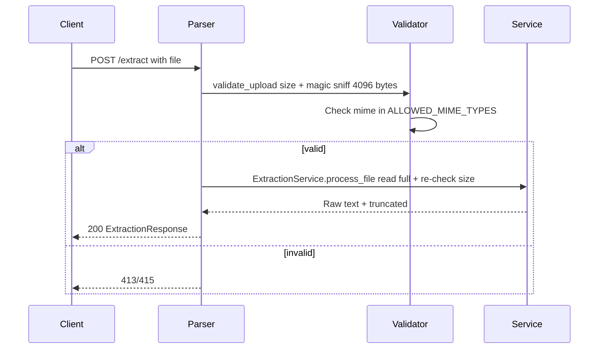
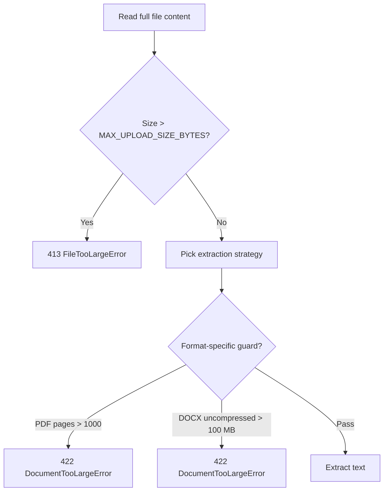

# Validation

This document explains how the Document Parser service checks that uploaded files are valid and safe to process.

## Why Validation Matters

Validation protects the service by:

- **Preventing abuse** -- Rejects oversized files before they consume resources
- **Ensuring safety** -- Detects zip bombs and malicious files
- **Maintaining performance** -- Fails fast on invalid input
- **Providing clear errors** -- Tells the client exactly what went wrong

## How Validation Works

Validation happens in two stages:

### Stage 1: Upload Validation (Fast)

When a file is uploaded, the service immediately checks:

1. Check the file's declared size against `MAX_UPLOAD_SIZE_BYTES` (10 MiB)
2. Read the first 4096 bytes to detect the actual MIME type using `python-magic`
3. Check if the MIME type is in `ALLOWED_MIME_TYPES`
4. If valid, proceed to extraction



### Stage 2: Extraction Validation (Defense-in-depth)

During extraction, the service re-checks the file size:

1. Read full file content
2. Re-check size against `MAX_UPLOAD_SIZE_BYTES`
3. Pick extraction strategy based on MIME type
4. Apply format-specific guards (PDF page count, DOCX uncompressed size)



**Why two stages?**
- Stage 1 catches most bad files **immediately** (no processing needed)
- Stage 2 is a safety net for files that pass stage 1 but are still problematic

## Validation Rules

### File Size

| Rule | Value | Error |
|------|-------|-------|
| Maximum upload size | 10 MiB (10,485,760 bytes) | `413 FileTooLargeError` |

Checked twice:
- At upload (client-supplied `Content-Length` header) -- fast rejection
- After reading full content in the thread pool -- defense-in-depth

### MIME Type

| Rule | Value | Error |
|------|-------|-------|
| Allowed formats | PDF, DOCX, TXT | `415 UnsupportedFileTypeError` |

Detection: `python-magic` reads first 4096 bytes and detects the **actual** MIME type (not trusting the file extension or client-provided content type).

### Format-Specific Guards

| Format | Guard | Limit | Error |
|--------|-------|-------|-------|
| PDF | Maximum pages | 1000 | `422 DocumentTooLargeError` |
| DOCX | Maximum uncompressed size | 100 MB (104,857,600 bytes) | `422 DocumentTooLargeError` |
| TXT | Maximum text length | 1M chars | Truncates output (not an error) |

### Timeout

| Rule | Value | Error |
|------|-------|-------|
| Extraction timeout | 30 seconds | `504 ExtractionTimeoutError` |

The extraction runs in a thread pool with an `asyncio.wait_for` timeout. If the extraction takes longer than `EXTRACTION_TIMEOUT_SECONDS`, the request is killed.

## Error Response Format

When validation fails, the service returns a JSON error body:

```json
{
  "detail": "File size 15728640 exceeds limit of 10.0MB"
}
```

**Important:** For `ExtractionError` (status 422), the internal error detail is hidden and replaced with a safe generic message: `"Could not extract text from this document."`. This prevents leaking internal implementation details.

## Error Branches

| Invalid | Status | What Happens |
|---------|--------|--------------|
| Size > 10 MiB (at upload) | `413` | Rejected immediately, no sniffing |
| MIME not in allowed list | `415` | Rejected after MIME sniff |
| Size > 10 MiB (in thread pool) | `413` | Defense-in-depth rejection |
| Timeout > 30s | `504` | Extraction killed, partial result discarded |
| PDF pages > 1000 | `422` | Rejected during extraction |
| DOCX uncompressed > 100 MB | `422` | Rejected during extraction (zip bomb) |
| All PDF pages unreadable | `422` | No usable text extracted |
| Some PDF pages unreadable | `200` | Partial text returned with `truncated: true` |

## Examples

### Valid Request

```bash
curl -F file=@sample.pdf http://localhost:8000/api/v1/extract
```

```json
{
  "text": "Extracted text...",
  "truncated": false,
  "filename": "sample.pdf",
  "content_type": "application/pdf",
  "text_length": 1234
}
```

### File Too Large

```bash
curl -F file=@huge.pdf http://localhost:8000/api/v1/extract
```

```json
{
  "detail": "File size 15728640 exceeds limit of 10.0MB"
}
```

### Unsupported Format

```bash
curl -F file=@image.png http://localhost:8000/api/v1/extract
```

```json
{
  "detail": "Unsupported media type: image/png"
}
```

### Timeout

```bash
curl -F file=@complex.pdf http://localhost:8000/api/v1/extract
```

```json
{
  "detail": "Document extraction timed out after 30.0 seconds"
}
```

## Next Steps

- [Extraction Strategies](../concepts/extraction-strategies.md) - How files are parsed
- [API Reference](api.md) - Complete API documentation
- [Configuration](../getting-started/configuration.md) - Tune validation limits
