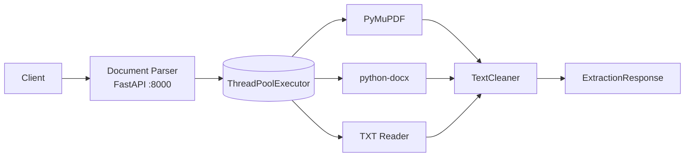
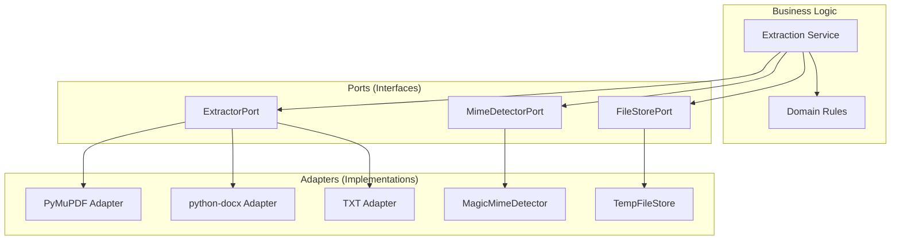
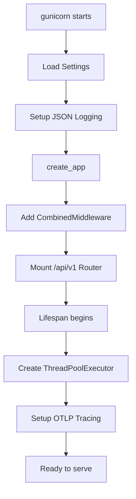
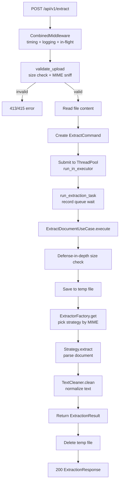
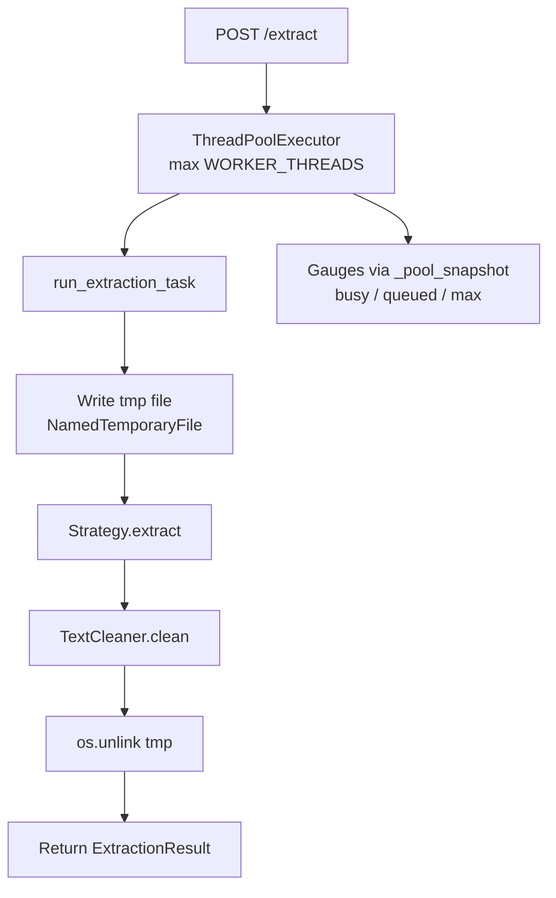
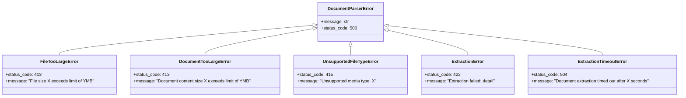

# Architecture

This document explains how the Document Parser service is structured and why it's designed this way.

## Overview

The Document Parser service extracts clean text from PDF, DOCX, and TXT files. It's built as a **stateless** Python FastAPI service with no database -- it receives a file, extracts text, cleans it, and returns the result.



**Why stateless?**
- No database means no connection management, no migrations, no connection pooling
- Every request is independent -- no shared state between requests
- Easy to scale horizontally -- just add more instances
- Simple deployment -- no external dependencies beyond the service itself

## How the Code is Organized

The service uses **hexagonal architecture** (also called "ports and adapters"). This means:

- **Business logic** is in the center (the "hexagon")
- **External systems** (file formats, thread pool) connect through "ports"
- Each external system has an "adapter" that connects it to the business logic



**Why this pattern?**
- Easy to test (can swap real parsers with fakes)
- Easy to add new formats (just add a new adapter)
- Business logic stays clean and focused

## Project Structure

```
document-parser/
├── app/
│   ├── main.py                    # Entry point (calls create_app)
│   ├── core/
│   │   ├── factory.py             # create_app() - wires FastAPI + middleware
│   │   ├── lifespan.py            # ThreadPoolExecutor lifecycle + tracing setup
│   │   ├── exceptions.py          # Re-exports from domain.exceptions
│   │   ├── metrics.py             # Re-exports from infrastructure.metrics
│   │   ├── logging.py             # Re-exports from infrastructure.logging
│   │   ├── tracing.py             # OpenTelemetry tracing setup
│   │   └── config/
│   │       ├── __init__.py        # Lazy settings proxy
│   │       ├── settings.py        # Pydantic Settings model (all env vars)
│   │       ├── provider.py        # get_settings() - dev/prod config loading
│   │       └── aws.py             # AWS Secrets Manager + SSM loading
│   ├── api/
│   │   ├── deps.py                # validate_upload() - MIME sniff + size check
│   │   ├── middleware.py           # Combined logging + metrics + in-flight middleware
│   │   ├── exception_handlers.py  # document_parser_exception_handler()
│   │   └── v1/
│   │       ├── router.py          # APIRouter combining extract + health
│   │       ├── dependencies.py    # DI wrappers (validate_upload, settings, etc.)
│   │       ├── endpoints/
│   │       │   ├── extract.py     # POST /api/v1/extract endpoint
│   │       │   └── health.py      # GET /health, /ready, /metrics endpoints
│   │       └── schemas/
│   │           ├── extraction.py  # ExtractionResponse, HealthCheck models
│   │           └── health.py
│   ├── domain/
│   │   ├── entities.py            # ExtractionResult dataclass
│   │   ├── exceptions.py          # DocumentParserError hierarchy (6 classes)
│   │   ├── cleaner.py             # TextCleaner - normalize whitespace, control chars
│   │   └── extraction/
│   │       ├── service.py         # ExtractionService + run_extraction_task
│   │       ├── strategies.py      # Re-exports of strategies + factory
│   │       └── cleaner.py         # Alias for domain cleaner
│   ├── application/
│   │   ├── dto.py                 # ExtractCommand dataclass
│   │   ├── ports/
│   │   │   ├── extractor.py       # ExtractorPort (ABC interface)
│   │   │   ├── file_store.py      # FileStorePort interface
│   │   │   ├── mime_detector.py   # MimeDetectorPort interface
│   │   │   └── executor.py        # ExecutorPort interface
│   │   └── use_cases/
│   │       └── extract_document.py # ExtractDocumentUseCase
│   └── infrastructure/
│       ├── parsers/
│       │   ├── factory.py         # ExtractorFactory (MIME -> strategy mapping)
│       │   ├── pdf.py             # PdfExtractor (PyMuPDF)
│       │   ├── docx.py            # DocxExtractor (python-docx)
│       │   └── txt.py             # TxtExtractor (UTF-8/Latin-1)
│       ├── executor/
│       │   └── extraction_pool.py # ThreadPoolExecutor management + pool metrics
│       ├── storage/
│       │   └── tempfile_store.py  # TempFileStore (tempfile + cleanup)
│       ├── mime/
│       │   └── magic_detector.py  # MagicMimeDetector (python-magic)
│       └── observability/
│           ├── metrics.py         # All Prometheus metrics (17+ metrics)
│           ├── logging.py         # JSON logger to stdout
│           └── tracing.py         # OpenTelemetry OTLP tracing
├── tests/                         # Test files
├── load/                          # k6 load test scripts
├── infra/                         # Docker Compose files
├── Dockerfile                     # Multi-stage build
├── gunicorn.conf.py               # Gunicorn config
├── pyproject.toml                 # Dependencies (Poetry)
└── docs/                          # This documentation
```

## How the Service Starts

When the service starts, it:

1. **Loads configuration** - `get_settings()` reads from env vars, applies dev/prod defaults
2. **Sets up logging** - JSON formatter to stdout at configured `LOG_LEVEL`
3. **Creates FastAPI app** - `create_app()` wires middleware, exception handler, router
4. **Lifespan begins**:
   - Creates `ThreadPoolExecutor(max_workers=WORKER_THREADS)`
   - Stores pool on `app.state.extraction_pool`
   - Registers pool for metrics tracking
   - Sets up OTLP tracing (if `OTEL_EXPORTER_OTLP_ENDPOINT` configured)
5. **Starts gunicorn** - Binds to `PORT` (default 8000) with `WORKERS` uvicorn workers



## Request Flow

When a file is submitted for extraction:



## Thread Pool

The service uses a `ThreadPoolExecutor` to handle extraction in parallel:



- Pool size: `WORKER_THREADS` env or `os.cpu_count()` (default 4)
- Readiness: `busy < max` AND `queued < READINESS_MAX_QUEUE_DEPTH (50)`
- Timeout: `EXTRACTION_TIMEOUT_SECONDS` (default 30s) via `asyncio.wait_for`
- Context propagation: `contextvars.copy_context()` + `ctx.run()` to thread

## Exception Hierarchy



| Exception | Status | When |
|-----------|--------|------|
| `DocumentParserError` | 500 | Base class (internal error) |
| `FileTooLargeError` | 413 | Upload exceeds `MAX_UPLOAD_SIZE_BYTES` |
| `DocumentTooLargeError` | 413 | PDF pages > 1000 or DOCX uncompressed > 100 MB |
| `UnsupportedFileTypeError` | 415 | MIME not in `ALLOWED_MIME_TYPES` |
| `ExtractionError` | 422 | Corrupt or unreadable document |
| `ExtractionTimeoutError` | 504 | Extraction exceeds `EXTRACTION_TIMEOUT_SECONDS` |

## Key Components

### FastAPI App
- Receives HTTP requests via gunicorn + uvicorn workers
- Registers `DocumentParserError` exception handler (hides internal details for `ExtractionError`)
- Single `CombinedMiddleware` handles logging, metrics timing, and in-flight tracking

### ExtractorFactory
- Class-level dict maps MIME types to singleton extractor instances
- `application/pdf` -> `PdfExtractor`, `application/vnd.openxmlformats...` -> `DocxExtractor`, `text/plain` -> `TxtExtractor`
- Raises `ExtractionError` for unknown MIME types

### TextCleaner
- Pure regex pipeline: normalize line endings, strip control chars, fix hyphenated breaks, remove page markers, dedupe spaces, collapse newlines
- Applied to every extraction result before returning

### ThreadPool
- Runs extraction in background threads
- `mark_extraction_started/finished` tracks busy count under lock
- `_pool_snapshot()` reads `_work_queue.qsize()` + `_max_workers` + `_shutdown`
- `is_extraction_pool_healthy()` checks `not _shutdown`

## Why This Design?

| Benefit | Explanation |
|---------|-------------|
| **Testability** | Can test business logic without real files |
| **Flexibility** | Can add new file formats by adding a strategy |
| **Scalability** | Stateless -- scale horizontally with more instances |
| **Maintainability** | Clear separation of concerns |
| **Simplicity** | No database, no caching, no async processing needed |
| **Safety** | Defense-in-depth size checks, zip bomb guards, timeout protection |

## Next Steps

- [Extraction Strategies](extraction-strategies.md) - How different file formats are parsed
- [Text Cleaning](text-cleaning.md) - How raw text is cleaned
- [Configuration](../getting-started/configuration.md) - Learn about settings
- [API Reference](../components/api.md) - See the complete API
