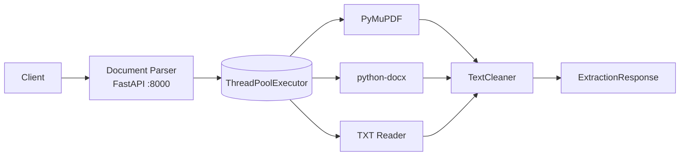
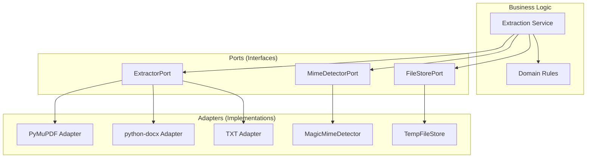
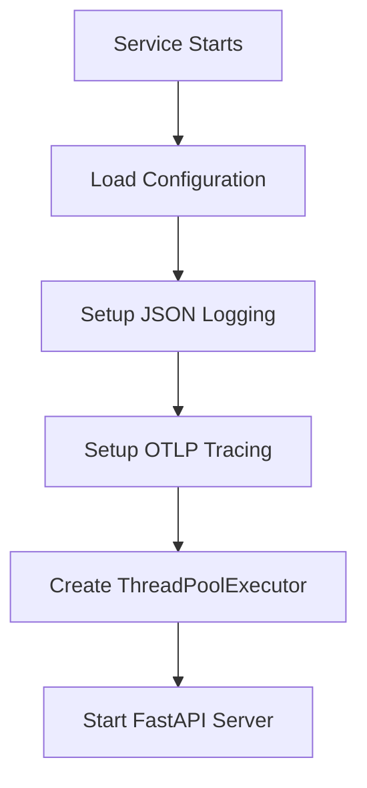
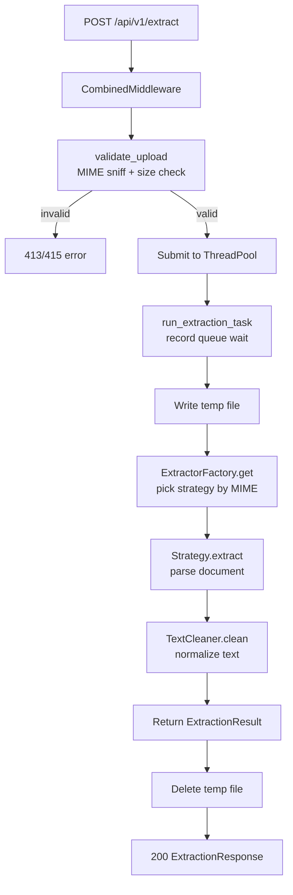
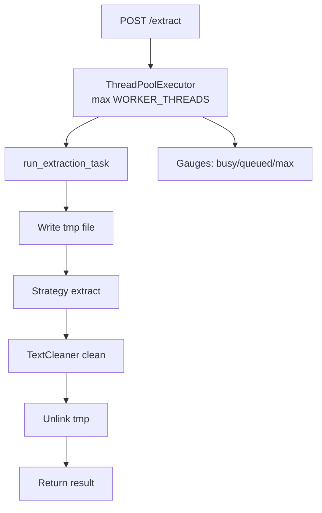

# Architecture

This document explains how the Document Parser service is structured and why it's designed this way.

## Overview

The Document Parser service extracts clean text from PDF, DOCX, and TXT files. It's built as a **stateless** Python FastAPI service with no database -- it receives a file, extracts text, cleans it, and returns the result.



**Why stateless?**
- No database means no connection management, no migrations, no connection pooling
- Every request is independent -- no shared state between requests
- Easy to scale horizontally -- just add more instances
- Simple deployment -- no external dependencies beyond the service itself

## How the Code is Organized

The service uses **hexagonal architecture** (also called "ports and adapters"). This means:

- **Business logic** is in the center (the "hexagon")
- **External systems** (file formats, thread pool) connect through "ports"
- Each external system has an "adapter" that connects it to the business logic



**Why this pattern?**
- Easy to test (can swap real parsers with fakes)
- Easy to add new formats (just add a new adapter)
- Business logic stays clean and focused

## Project Structure

```
document-parser/
├── app/
│   ├── main.py                    # Entry point
│   ├── core/
│   │   ├── factory.py             # create_app() - wires FastAPI + middleware
│   │   ├── lifespan.py            # ThreadPoolExecutor lifecycle
│   │   ├── exceptions.py          # Exception hierarchy
│   │   ├── metrics.py             # Prometheus metrics
│   │   ├── logging.py             # JSON logger
│   │   ├── tracing.py             # OpenTelemetry tracing
│   │   └── config/
│   │       ├── settings.py        # Pydantic Settings model
│   │       ├── provider.py        # get_settings() - dev/prod config loading
│   │       └── aws.py             # AWS Secrets Manager + SSM
│   ├── api/
│   │   ├── deps.py                # validate_upload() - MIME sniff + size check
│   │   ├── middleware.py           # Logging + metrics + in-flight middleware
│   │   ├── exception_handlers.py  # Error handler
│   │   └── v1/
│   │       ├── router.py          # APIRouter combining extract + health
│   │       ├── endpoints/
│   │       │   ├── extract.py     # POST /api/v1/extract
│   │       │   └── health.py      # GET /health, /ready, /metrics
│   │       └── schemas/
│   │           └── extraction.py  # Pydantic response models
│   ├── domain/
│   │   ├── entities.py            # ExtractionResult dataclass
│   │   ├── exceptions.py          # DocumentParserError hierarchy
│   │   ├── cleaner.py             # TextCleaner
│   │   └── extraction/
│   │       ├── service.py         # ExtractionService orchestrator
│   │       └── strategies.py      # Re-exports of strategies + factory
│   ├── application/
│   │   ├── dto.py                 # ExtractCommand dataclass
│   │   ├── ports/
│   │   │   ├── extractor.py       # ExtractorPort (ABC interface)
│   │   │   ├── file_store.py      # FileStorePort interface
│   │   │   └── mime_detector.py   # MimeDetectorPort interface
│   │   └── use_cases/
│   │       └── extract_document.py # ExtractDocumentUseCase
│   └── infrastructure/
│       ├── parsers/
│       │   ├── factory.py         # ExtractorFactory (MIME -> strategy)
│       │   ├── pdf.py             # PdfExtractor (PyMuPDF)
│       │   ├── docx.py            # DocxExtractor (python-docx)
│       │   └── txt.py             # TxtExtractor
│       ├── executor/
│       │   └── extraction_pool.py # ThreadPoolExecutor management
│       ├── storage/
│       │   └── tempfile_store.py  # TempFileStore
│       ├── mime/
│       │   └── magic_detector.py  # MagicMimeDetector
│       └── observability/
│           ├── metrics.py         # Prometheus metrics
│           ├── logging.py         # JSON logger
│           └── tracing.py         # OpenTelemetry tracing
├── tests/                         # Test files
├── load/                          # Load test scripts
├── infra/                         # Docker Compose
└── docs/                          # This documentation
```

## How the Service Starts

When the service starts, it:

1. **Loads configuration** - Reads settings from environment variables
2. **Sets up logging** - JSON logger to stdout
3. **Sets up tracing** - OpenTelemetry OTLP exporter (if configured)
4. **Creates thread pool** - `ThreadPoolExecutor` with `WORKER_THREADS` threads
5. **Starts FastAPI** - Binds to `PORT` (default 8000)



## Request Flow

When a file is submitted for extraction:



## Thread Pool

The service uses a `ThreadPoolExecutor` to handle extraction in parallel:



- Pool size: `WORKER_THREADS` env or `os.cpu_count()` (default 4)
- Readiness: busy < max AND queued < 50
- Timeout: `EXTRACTION_TIMEOUT_SECONDS` (default 30s) via `asyncio.wait_for`

## Key Components

### FastAPI App
- Receives HTTP requests
- Validates uploads (MIME sniff, size check)
- Routes to extraction endpoint

### Extraction Service
- Orchestrates the extraction pipeline
- Manages temp file lifecycle
- Records metrics and traces

### ExtractorFactory
- Maps MIME types to extraction strategies
- `application/pdf` -> `PdfExtractor`
- `application/vnd.openxmlformats...` -> `DocxExtractor`
- `text/plain` -> `TxtExtractor`

### TextCleaner
- Normalizes whitespace
- Strips control characters
- Fixes hyphenated line breaks
- Deduplicates spaces
- Collapses excessive newlines

### ThreadPool
- Runs extraction in background threads
- Manages concurrency limits
- Tracks busy/queued/max for readiness

## Why This Design?

| Benefit | Explanation |
|---------|-------------|
| **Testability** | Can test business logic without real files |
| **Flexibility** | Can add new file formats by adding a strategy |
| **Scalability** | Stateless -- scale horizontally with more instances |
| **Maintainability** | Clear separation of concerns |
| **Simplicity** | No database, no caching, no async processing needed |

## Next Steps

- [Extraction Strategies](extraction-strategies.md) - How different file formats are parsed
- [Text Cleaning](text-cleaning.md) - How raw text is cleaned
- [Configuration](../getting-started/configuration.md) - Learn about settings
- [API Reference](../components/api.md) - See the complete API
