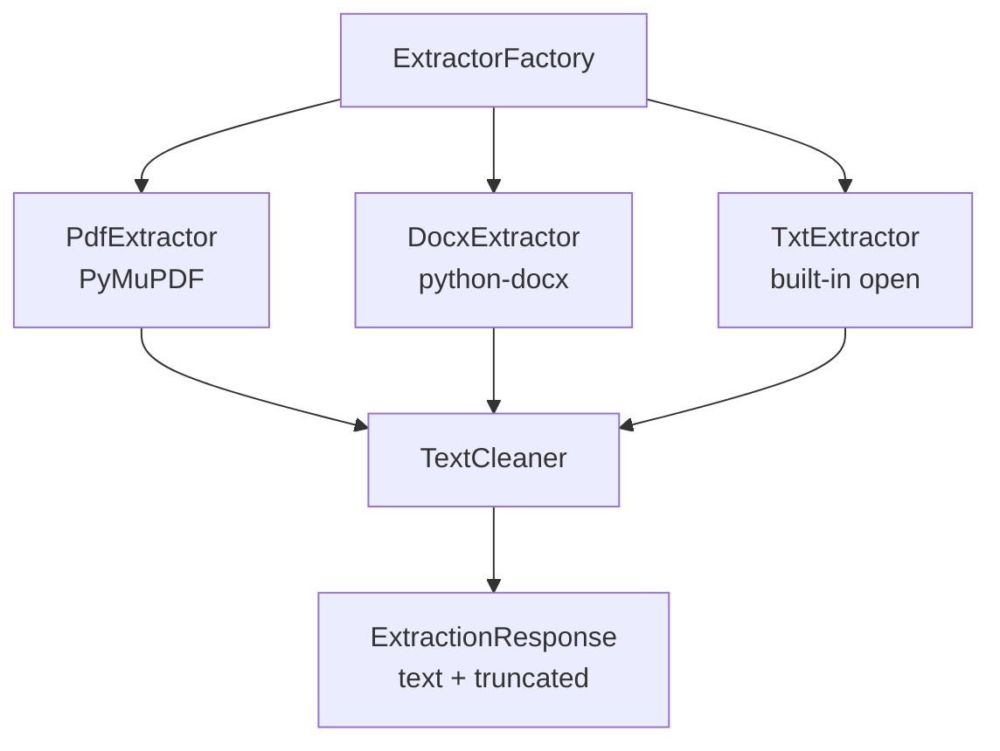
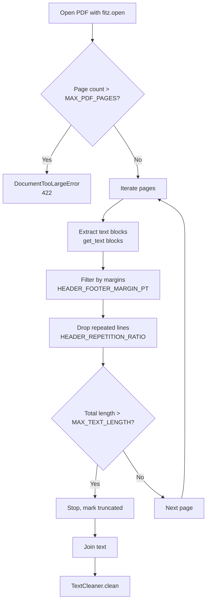
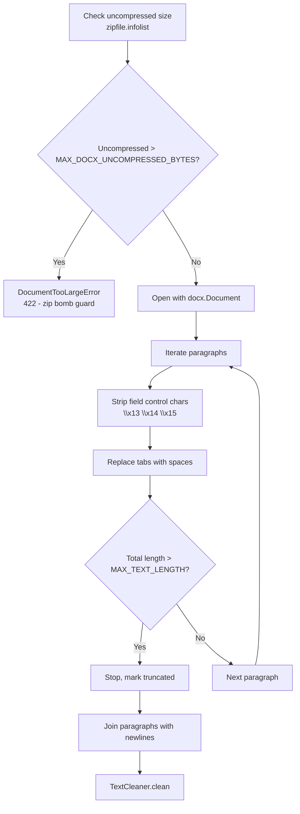
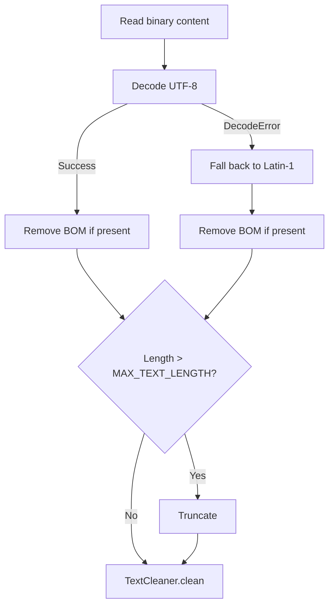

# Extraction Strategies

This document explains how the Document Parser service extracts text from different file formats. Each format has its own strategy optimized for that format's structure.

## What is a Strategy?

A strategy is a specialized text extractor for a specific file format. Instead of one giant function handling all formats, the service uses separate strategies for each format. This makes it easy to add new formats or fix format-specific issues without touching other code.



## How Strategies Are Selected

The `ExtractorFactory` picks the right strategy based on the file's **MIME type** (detected by `python-magic` reading the first 4096 bytes):

| MIME Type | Strategy | Library |
|-----------|----------|---------|
| `application/pdf` | `PdfExtractor` | PyMuPDF (`fitz`) |
| `application/vnd.openxmlformats-officedocument.wordprocessingml.document` | `DocxExtractor` | python-docx |
| `text/plain` | `TxtExtractor` | built-in `open()` |

If the MIME type doesn't match any strategy, the service raises an `ExtractionError` with status `422`.

## PDF Extraction

The PDF strategy uses **PyMuPDF** (also called `fitz`) to extract text from PDF files.



### What It Does

1. **Opens the PDF** with `fitz.open(file_path)`
2. **Checks page count** -- rejects PDFs with more than `MAX_PDF_PAGES` (default 1000) pages
3. **Iterates each page** and extracts text blocks via `page.get_text("blocks")`
4. **Filters text blocks** -- only keeps blocks where `b[6] == 0` (text type, not image)
5. **Strips header/footer margins** -- excludes blocks where `y1 <= MARGIN_PT` (top) or `y0 >= page_height - MARGIN_PT` (bottom)
6. **Drops repeated lines** -- counts how many pages each line appears on; lines appearing on `>= HEADER_REPETITION_RATIO * total_pages` pages are removed (catches page numbers, running headers)
7. **Enforces text length** -- stops accumulating when total exceeds `MAX_TEXT_LENGTH` (1M chars)
8. **Tracks unreadable pages** -- if all pages are unreadable, raises `ExtractionError`; if some are unreadable, returns `truncated=True`

### Safety Guards

| Guard | Default | What Happens |
|-------|---------|--------------|
| `MAX_PDF_PAGES` | 1000 | `422 DocumentTooLargeError` if exceeded |
| `HEADER_FOOTER_MARGIN_PT` | 40.0 | Strips text within 40 points of page edges |
| `HEADER_REPETITION_RATIO` | 0.8 | Drops lines on >= 80% of pages |
| `MAX_TEXT_LENGTH` | 1M chars | Stops extraction, returns partial with `truncated=True` |

## DOCX Extraction

The DOCX strategy uses **python-docx** to extract text from Word documents.



### What It Does

1. **Checks uncompressed size** -- DOCX files are ZIP archives; sums all `file_size` from `zipfile.infolist()` and compares against `MAX_DOCX_UNCOMPRESSED_BYTES` (100 MB) to detect zip bombs
2. **Opens with python-docx** -- `docx.Document(file_path)`
3. **Iterates paragraphs** -- extracts text from each paragraph
4. **Strips field control characters** -- removes `\x13`, `\x14`, `\x15` (Word field markers that cause display issues)
5. **Replaces tabs with spaces** for consistent output
6. **Enforces text length** -- stops when total exceeds `MAX_TEXT_LENGTH`

### Safety Guards

| Guard | Default | What Happens |
|-------|---------|--------------|
| `MAX_DOCX_UNCOMPRESSED_BYTES` | 100 MB (104,857,600) | `422 DocumentTooLargeError` if exceeded (zip bomb) |
| `MAX_TEXT_LENGTH` | 1M chars | Stops extraction, returns partial with `truncated=True` |

## TXT Extraction

The TXT strategy reads plain text files directly with encoding fallback.



### What It Does

1. **Reads binary content** from the file
2. **Decodes as UTF-8** -- removes BOM (`\ufeff`) if present
3. **Falls back to Latin-1** -- if UTF-8 decoding fails (handles legacy encodings)
4. **Enforces text length** -- truncates if needed

### Safety Guards

| Guard | Default | What Happens |
|-------|---------|--------------|
| `MAX_TEXT_LENGTH` | 1M chars | Truncates output |

## Truncation

When any strategy exceeds `MAX_TEXT_LENGTH` (1,000,000 characters):

- The strategy **stops extracting** and returns what it has so far
- The response includes `"truncated": true`
- The `text_length` field shows the actual length of the returned text

This prevents memory issues from extremely large documents.

## How to Add a New Format

To add support for a new file format:

1. **Create a new extractor** in `app/infrastructure/parsers/`:
   ```python
   from app.application.ports.extractor import ExtractorPort
   from app.domain.entities import ExtractionResult

   class CsvExtractor(ExtractorPort):
       def extract(self, file_path: str) -> ExtractionResult:
           # Your extraction logic here
           with open(file_path) as f:
               text = f.read()
           return ExtractionResult(text=text)
   ```

2. **Register it in the factory** (`app/infrastructure/parsers/factory.py`):
   ```python
   _map: dict[str, ExtractorPort] = {
       "application/pdf": PdfExtractor(),
       "text/csv": CsvExtractor(),
       # ...
   }
   ```

3. **Add the MIME type to the allowed list** in `app/core/config/settings.py`:
   ```python
   ALLOWED_MIME_TYPES: list[str] = [
       "text/csv",
       # ...
   ]
   ```

4. **Write tests** for the new extractor

## Next Steps

- [Text Cleaning](text-cleaning.md) - How extracted text is cleaned
- [Validation](../components/validation.md) - How files are validated before extraction
- [Configuration](../getting-started/configuration.md) - Tune extraction settings
