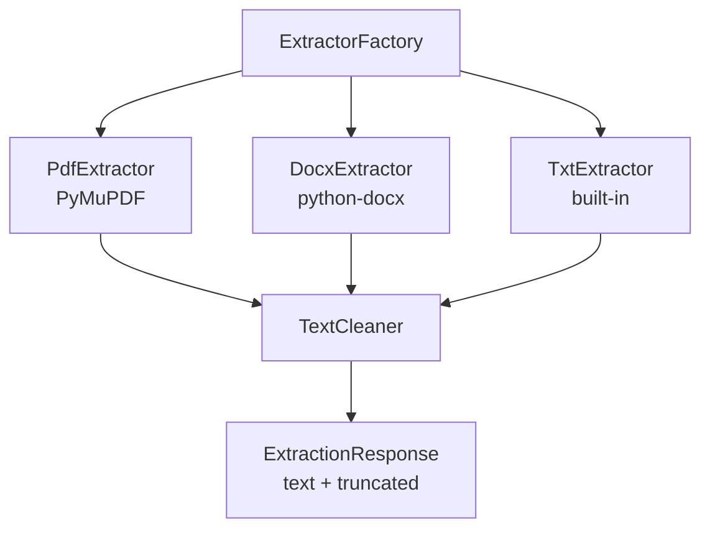
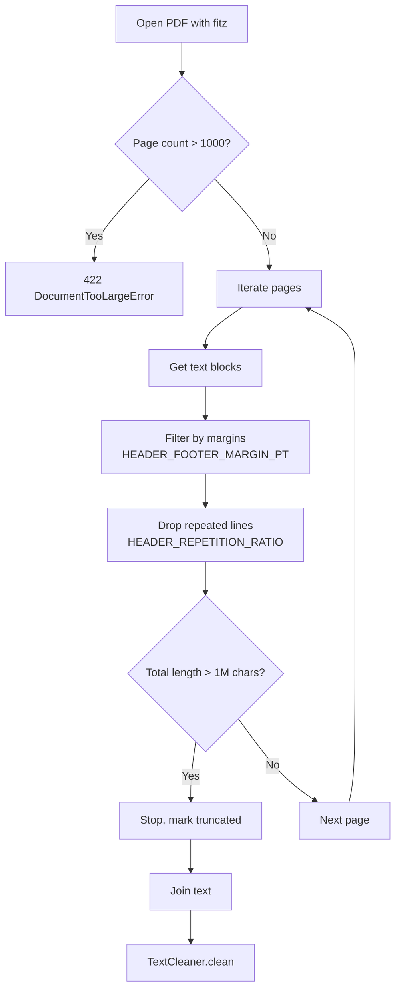
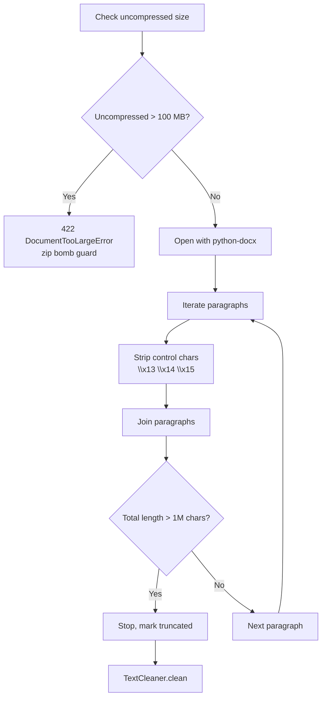
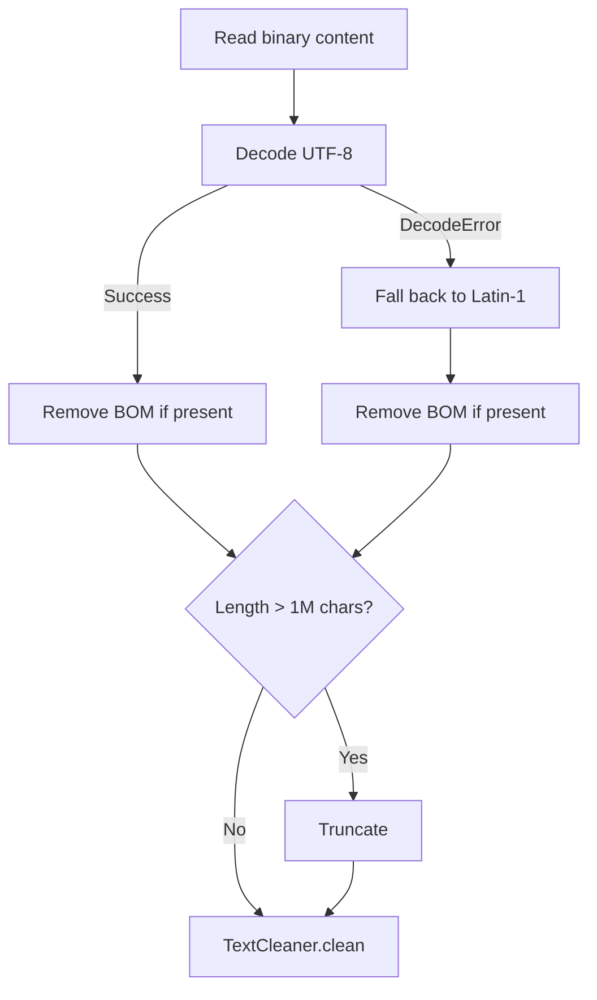

# Extraction Strategies

This document explains how the Document Parser service extracts text from different file formats. Each format has its own strategy optimized for that format's structure.

## What is a Strategy?

A strategy is a specialized text extractor for a specific file format. Instead of one giant function handling all formats, the service uses separate strategies for each format. This makes it easy to add new formats or fix format-specific issues.



## How Strategies Are Selected

The `ExtractorFactory` picks the right strategy based on the file's **MIME type** (detected by `python-magic`):

| MIME Type | Strategy | Library |
|-----------|----------|---------|
| `application/pdf` | `PdfExtractor` | PyMuPDF (`fitz`) |
| `application/vnd.openxmlformats-officedocument.wordprocessingml.document` | `DocxExtractor` | python-docx |
| `text/plain` | `TxtExtractor` | built-in `open()` |

If the MIME type doesn't match any strategy, the service returns a `415 Unsupported Media Type` error.

## PDF Extraction

The PDF strategy uses **PyMuPDF** (also called `fitz`) to extract text from PDF files.



### What It Does

1. **Opens the PDF** with `fitz.open(path)`
2. **Checks page count** -- rejects PDFs with more than 1000 pages (`MAX_PDF_PAGES`)
3. **Iterates each page** and extracts text blocks
4. **Filters header/footer margins** -- strips text near the top and bottom of each page (configurable via `HEADER_FOOTER_MARGIN_PT`, default 40pt)
5. **Drops repeated lines** -- removes lines that appear on too many pages (like page numbers or headers), controlled by `HEADER_REPETITION_RATIO` (default 0.8 = 80%)
6. **Enforces text length limit** -- stops extracting when total text exceeds `MAX_TEXT_LENGTH` (1M chars)
7. **Tracks unreadable pages** -- if all pages are unreadable, returns `422`; if some are unreadable, returns `200` with `truncated=true`

### Safety Guards

| Guard | Default | What Happens |
|-------|---------|--------------|
| `MAX_PDF_PAGES` | 1000 | `422` if exceeded |
| `HEADER_FOOTER_MARGIN_PT` | 40.0 | Strips text near page edges |
| `HEADER_REPETITION_RATIO` | 0.8 | Drops lines on >= 80% of pages |
| `MAX_TEXT_LENGTH` | 1M chars | Truncates output |

## DOCX Extraction

The DOCX strategy uses **python-docx** to extract text from Word documents.



### What It Does

1. **Checks uncompressed size** -- DOCX files are ZIP archives; if uncompressed content exceeds `MAX_DOCX_UNCOMPRESSED_BYTES` (100 MB), it's rejected as a potential zip bomb
2. **Opens with python-docx** -- `docx.Document(path)`
3. **Iterates paragraphs** -- extracts text from each paragraph
4. **Strips field control characters** -- removes `\x13`, `\x14`, `\x15` (Word field markers)
5. **Enforces text length limit** -- stops when total text exceeds `MAX_TEXT_LENGTH`

### Safety Guards

| Guard | Default | What Happens |
|-------|---------|--------------|
| `MAX_DOCX_UNCOMPRESSED_BYTES` | 100 MB | `422` if exceeded (zip bomb) |
| `MAX_TEXT_LENGTH` | 1M chars | Truncates output |

## TXT Extraction

The TXT strategy reads plain text files directly.



### What It Does

1. **Reads binary content** from the file
2. **Decodes as UTF-8** -- removes BOM (Byte Order Mark) if present
3. **Falls back to Latin-1** -- if UTF-8 decoding fails
4. **Enforces text length limit** -- truncates if needed

### Safety Guards

| Guard | Default | What Happens |
|-------|---------|--------------|
| `MAX_TEXT_LENGTH` | 1M chars | Truncates output |

## Truncation

When any strategy exceeds `MAX_TEXT_LENGTH` (1,000,000 characters):

- The strategy **stops extracting** and returns what it has so far
- The response includes `"truncated": true`
- The `text_length` field shows the actual length of the returned text

This prevents memory issues from extremely large documents.

## How to Add a New Format

To add support for a new file format:

1. **Create a new extractor** in `app/infrastructure/parsers/`:
   ```python
   class CsvExtractor:
       def extract(self, path: str) -> ExtractionResult:
           # Your extraction logic here
           ...
   ```

2. **Register it in the factory** (`app/infrastructure/parsers/factory.py`):
   ```python
   "text/csv": CsvExtractor,
   ```

3. **Add the MIME type to allowed list** in `app/core/config/settings.py`:
   ```python
   ALLOWED_MIME_TYPES: list[str] = ["text/csv", ...]
   ```

4. **Write tests** for the new extractor

## Next Steps

- [Text Cleaning](text-cleaning.md) - How extracted text is cleaned
- [Validation](../components/validation.md) - How files are validated before extraction
- [Configuration](../getting-started/configuration.md) - Tune extraction settings
