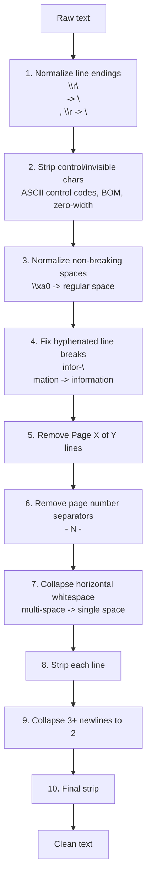
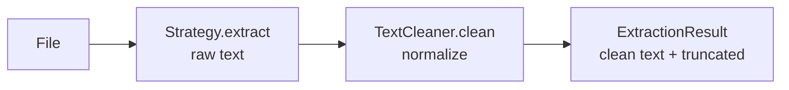

# Text Cleaning

This document explains how the Document Parser service cleans and normalizes extracted text. Cleaning ensures consistent, readable output regardless of the source format.

## Why Clean Text?

Raw text extracted from documents often contains noise:

- **Inconsistent line endings** -- `\r\n` (Windows) vs `\n` (Unix) vs `\r` (old Mac)
- **Control characters** -- invisible characters that cause display issues
- **Hyphenated line breaks** -- words split across lines like `infor- mation`
- **Page markers** -- "Page 1 of 10" lines that aren't content
- **Excessive whitespace** -- multiple spaces, tabs, trailing spaces
- **Too many blank lines** -- 3, 4, or more consecutive newlines

Cleaning removes this noise so the output is consistent and readable.

## What TextCleaner Does

The `TextCleaner` processes text through a 10-step regex pipeline:



### Step 1: Normalize Line Endings

Converts all line endings to Unix format (`\n`):

```
Before: Hello\r\nWorld\r\n
After:  Hello\nWorld\n
```

### Step 2: Strip Control Characters

Removes invisible characters using regex `[\x00-\x08\x0b\x0c\x0e-\x1f\x7f-\x9f\u200b\u200c\u200d\u2060\ufeff]`:

- ASCII control codes (except `\n` and `\t`)
- Zero-width characters (`\u200b`, `\u200c`, `\u200d`)
- Word joiner (`\u2060`)
- Byte Order Mark (`\ufeff`)

### Step 3: Normalize Non-Breaking Spaces

Replaces non-breaking space `\xa0` with a regular space:

```
Before: Hello\xa0World
After:  Hello World
```

### Step 4: Fix Hyphenated Line Breaks

When a word is split across lines with a hyphen, it's rejoined:

```
Before: The quick brown fo-
        x jumped over the lazy dog.
After:  The quick brown fox jumped over the lazy dog.
```

Uses regex `(-\n)(\w)` to match `-\n` followed by a word character.

### Step 5: Remove "Page X of Y" Lines

Removes lines like `Page 1 of 10` that are artifacts of page-based rendering:

```
Before: Some content here
        Page 1 of 10
        More content
After:  Some content here
        More content
```

Uses regex `(?i)page\s+\d+\s+of\s+\d+\n?`.

### Step 6: Remove Page Number Separators

Removes separator lines like `- 1 -` that appear between pages:

```
Before: End of page 1
        - 1 -
        Start of page 2
After:  End of page 1
        Start of page 2
```

Uses regex `\n\s*-\s*\d+\s*-\s*\n`.

### Step 7: Collapse Horizontal_whitespace

Multiple spaces and tabs are collapsed to a single space:

```
Before: Hello    world\t\tfrom     me
After:  Hello world from me
```

Uses regex `[ \t]+`.

### Step 8: Strip Each Line

Leading and trailing whitespace is removed from every line.

### Step 9: Collapse Excessive Newlines

More than 2 consecutive newlines are reduced to 2:

```
Before: Hello


        World
After:  Hello


        World
```

Uses regex `\n{3,}`.

### Step 10: Final Strip

Removes any leading or trailing whitespace from the entire text.

## Before and After Example

**Raw extracted text:**
```
Page 1 of 3\r\n
\r\n
The quick brown fox   jumped over\r\n
the lazy dog.\r\n
\r\n
\r\n
\r\n
infor-\rmation\r\n
- 1 -\r\n
\r\n
```

**After cleaning:**
```
The quick brown fox jumped over
the lazy dog.


information
```

## Where Cleaning Happens

Cleaning is the **last step** in the extraction pipeline:



Every extraction -- whether PDF, DOCX, or TXT -- passes through `TextCleaner.clean()` before the response is returned.

## Configuration

Text cleaning behavior is **hardcoded** and does not need configuration. The cleaning rules are designed to produce good output for all supported formats.

If you need different cleaning behavior, modify `app/domain/cleaner.py`.

## Related Documentation

- [Extraction Strategies](extraction-strategies.md) - How raw text is extracted
- [Architecture](architecture.md) - How the pipeline fits together
- [Configuration](../getting-started/configuration.md) - Service settings
