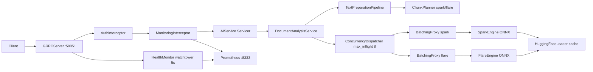
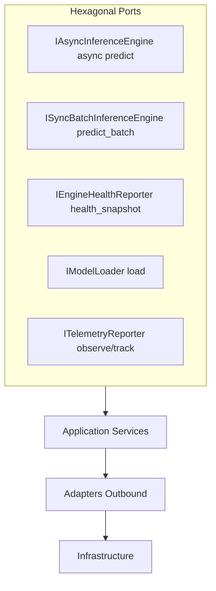
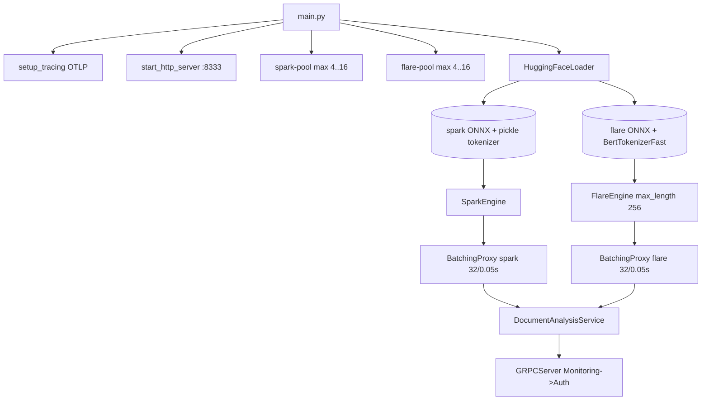
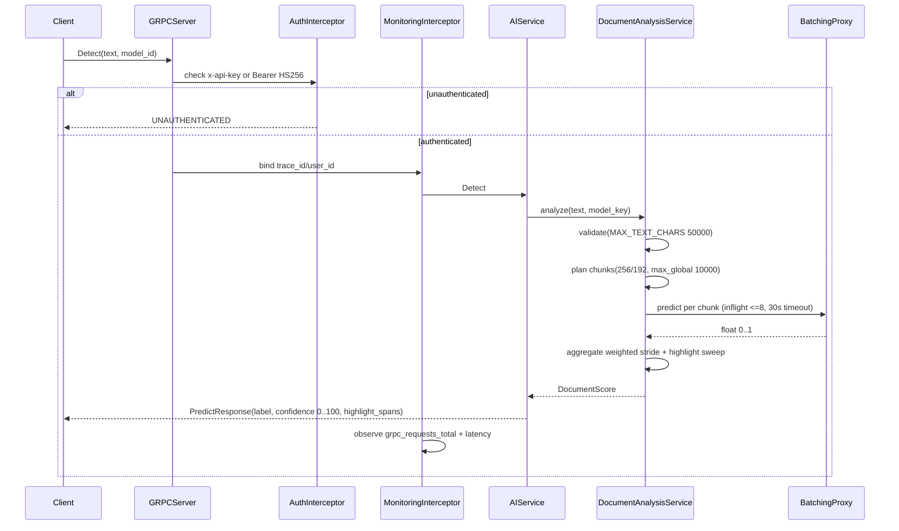
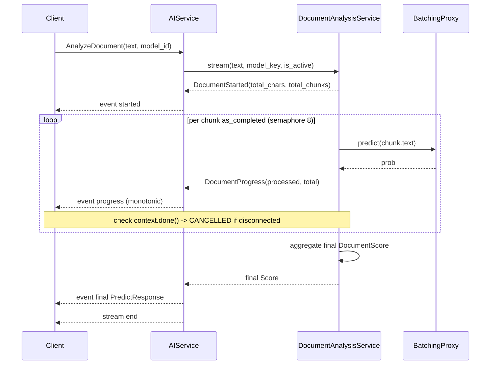
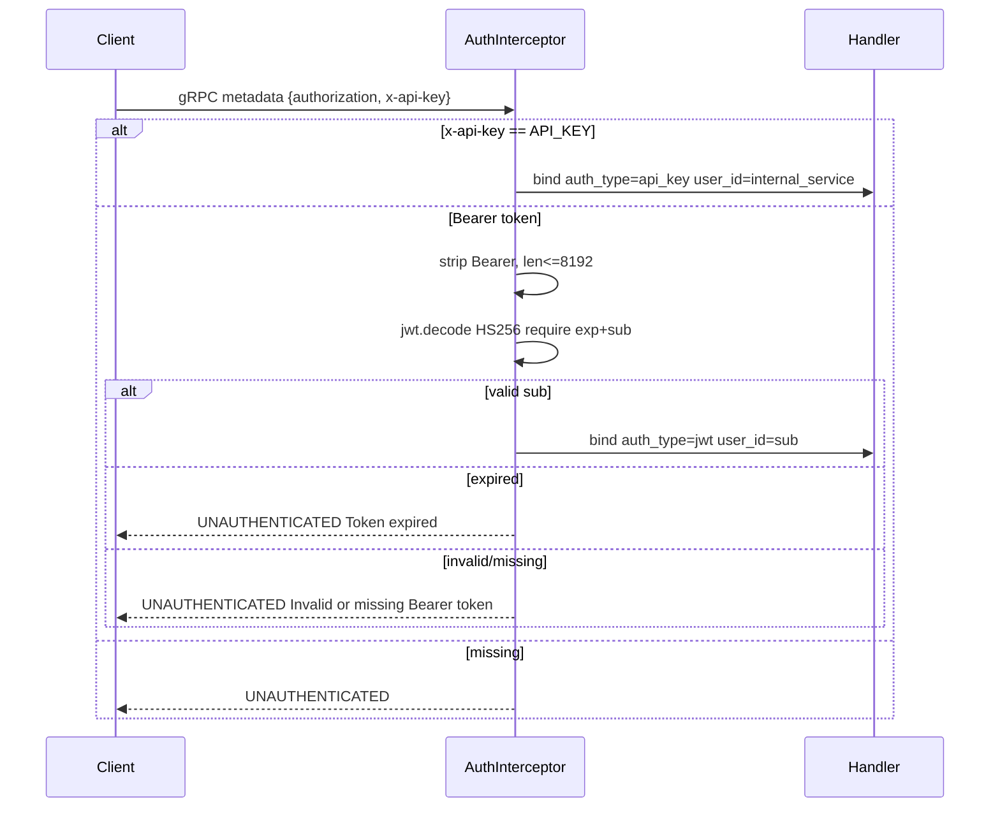
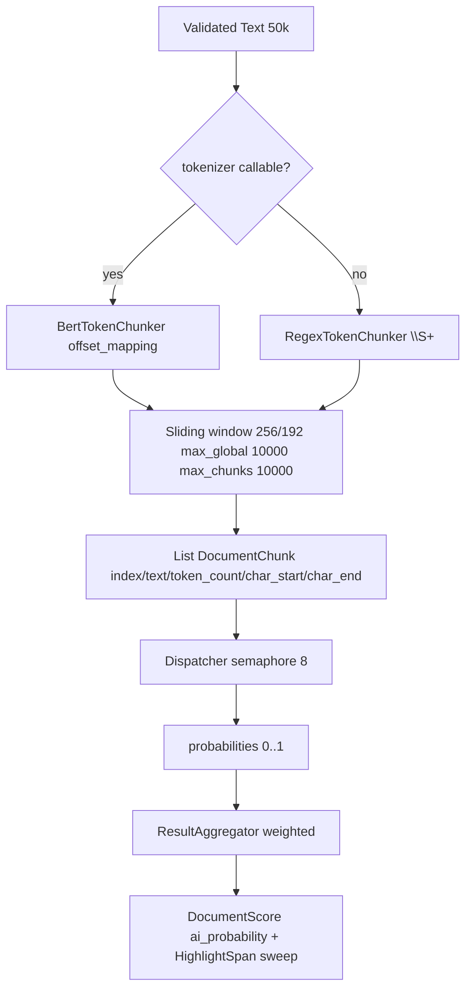
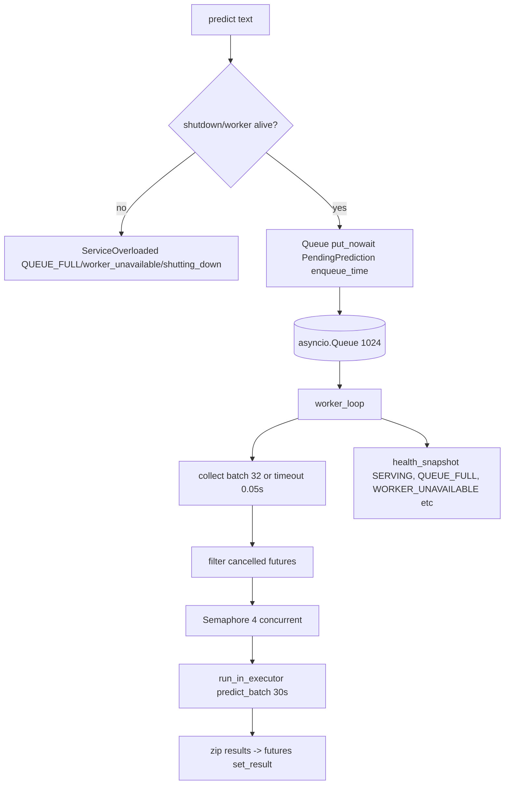
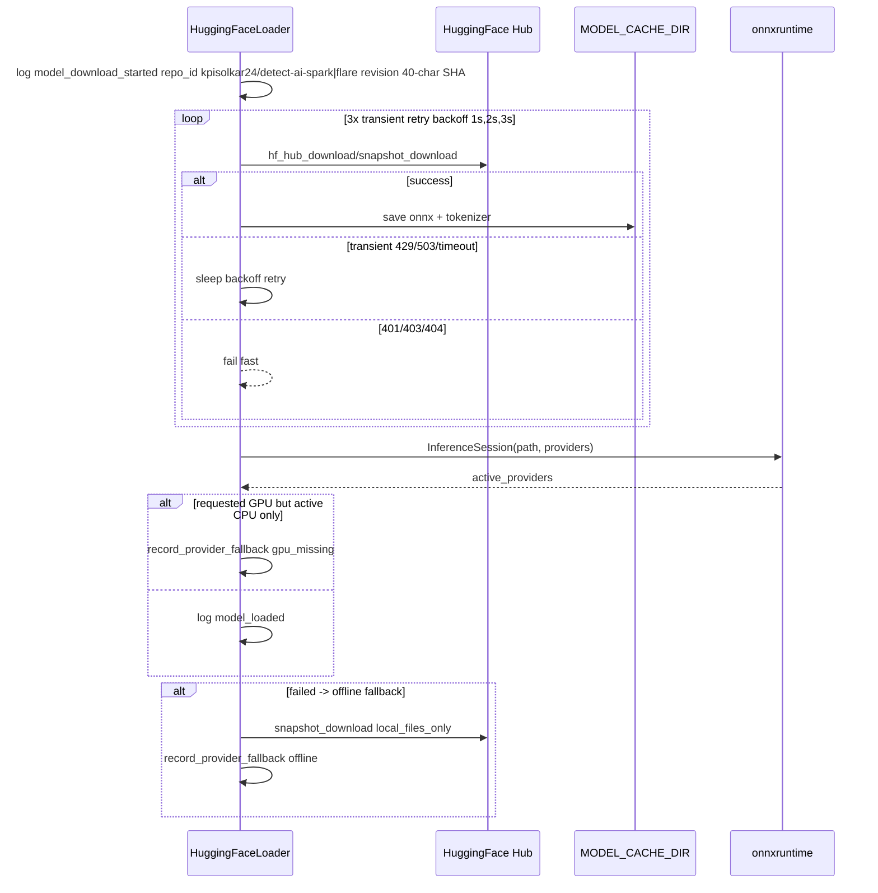
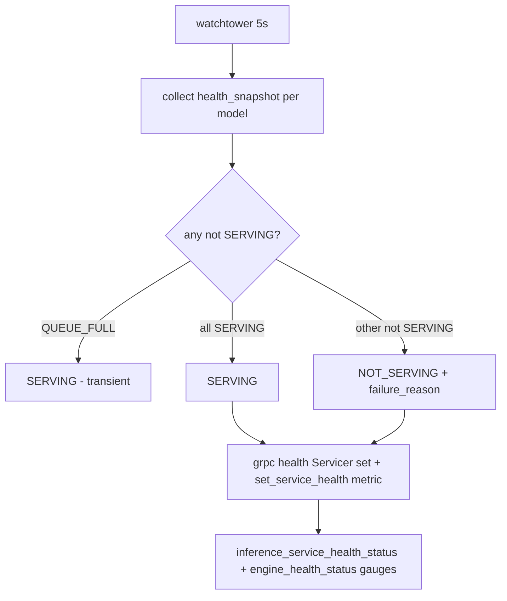

# Inference

Stateless Python gRPC service that runs dual ONNX models (Spark TF-IDF + Flare BERT) via batching proxy and chunked document analysis. No DB — JWT/`x-api-key` auth, server-streaming progress, health watchtower and per-model isolation.

## Overview

Stateless service exposing gRPC `AIService` (`protos/ai_service.proto`) with `Detect` (unary) and `AnalyzeDocument` (server-streaming `started` → `progress` → `final`). Handles `50k` char input, `256` token chunks with `192` stride, `10k` global token cap, via `ThreadPool` batching and weighted aggregation. Isolated `spark-pool`/`flare-pool` executors prevent slow-model starvation.

```text
POST gRPC  Detect(text, model_id)          -> PredictResponse
POST gRPC  AnalyzeDocument(text, model_id) -> stream AnalyzeDocumentEvent
```

## Packages

| Package | Purpose |
|---|---|
| `grpcio`, `grpcio-tools`, `grpcio-health-checking`, `protobuf` | gRPC server, health, codegen |
| `onnxruntime` / `onnxruntime-gpu` | ONNX inference (CPU base, GPU via `compose.gpu.yml`) |
| `transformers`, `huggingface-hub`, `tokenizers` | Flare BERT tokenizer + HF download |
| `scikit-learn`, `scipy`, `numpy` | Spark TF-IDF vectorizer |
| `pydantic`, `pydantic-settings` | Typed config + validation |
| `prometheus-client` | Metrics (`:8333`) |
| `opentelemetry-api`, `opentelemetry-sdk`, `opentelemetry-exporter-otlp-proto-http`, `opentelemetry-instrumentation-grpc` | Tracing |
| `structlog` | JSON structured logging |
| `PyJWT`, `circuitbreaker` | JWT auth, resilience |
| `pytest`, `pytest-asyncio`, `pytest-cov`, `coverage`, `ruff` | Tests/lint |

See `pyproject.toml` for full list and `poetry.lock` pins.

## Architecture







- Per-model isolation via `src/main.py:41` (`spark_workers = max(4, workers//2)`, `flare_workers = max(4, workers-flare)`).
- `BatchingProxy` per model (`queue 1024`, `batch 32`, `timeout 0.05s`, `max_concurrent_batches 4`) prevents cross-model head-of-line blocking.
- `DocumentAnalysisService` consults `health_snapshot()` before dispatch — `QUEUE_FULL` sheds via `RESOURCE_EXHAUSTED`, not `NOT_SERVING`.

## Request Flow

### Detect (unary)



### AnalyzeDocument (server-streaming)



- Stream order enforced in `servicers.py:94` via `StreamingPresenter` (`is_started`→`build_started`, `is_progress`→`build_progress`, `is_final`→`build_final`); unknown event → `InferenceError`.
- `request_is_active=lambda: not context.done()` guards dispatcher and per-chunk timeout `30s`.

## Authentication



* `health` (`/grpc.health.v1.Health/Check|Watch`) bypasses auth (`interceptors.py:38`).
* Failures counted via `grpc_auth_failures_total{method, reason}` (`missing_or_invalid_token`, `token_expired`).

## Chunking & Aggregation



* `ChunkPlanner` (`chunking.py:161`) validates `stride <= chunk_size`, `max_global_tokens >= chunk_size`; fallback single chunk for stripped non-empty text.
* `ResultAggregator` (`aggregation.py:16`) weights `i==0 ? token_count : min(stride, token_count)`; sweep merges adjacent `HighlightSpan` with same label (`AI >=0.5`) via length-weighted probability.

## BatchingProxy Internals



* Metrics: `model_batch_size`, `model_batch_queue_size` gauge, `model_batch_queue_wait_seconds`, `model_batch_processing_seconds` (30s timeout), `inference_batch_queue_rejected_total{reason}`, `inference_batch_errors_total{error_type}`.
* Shutdown: sentinel `_SHUTDOWN_SENTINEL`, drain pending futures with `ServiceOverloaded(shutting_down)`, `active_batches` gather with 35s timeout.

## Model Loading



* `RestrictedUnpickler` allows only `sklearn, scipy, numpy, builtins, collections, copyreg` for Spark pickle.
* Provider verification logs `gpu_provider_unavailable_falling_back_to_cpu` and metric `inference_engine_provider_fallback_total`.

## Health



* `HealthMonitor` (`health.py:17`) publishes `SERVING`/`NOT_SERVING` for `""` and `aidetection.AIService`; `QUEUE_FULL` never flips health — shed via `RESOURCE_EXHAUSTED` in `DocumentAnalysisService:336`.

## Configuration

```ini
# required
API_KEY=dev-secret-key-16chars-at-least   # >=16 chars, also AI_SERVICE_API_KEY
# optional (defaults shown, from src/infrastructure/config.py + infra/.env.example)
ENV=production
LOG_LEVEL=INFO
GRPC_PORT=50051
GRPC_MAX_WORKERS=50
METRICS_PORT=8333
MODEL_CACHE_DIR=./models
SPARK_MODEL_REVISION=9a48004391c71272d6fb1d164ed7c56e1fbfe360  # 40-char SHA
FLARE_MODEL_REVISION=e1911c0be59f4e10f0d120f639d1358e46bc2086  # 40-char SHA
BATCH_SIZE=32                          # 1..512, <= BATCH_QUEUE_MAX_SIZE
BATCH_TIMEOUT=0.05                     # 0..10 sec
BATCH_QUEUE_MAX_SIZE=1024              # 1..10000, >= BATCH_SIZE
INFERENCE_MAX_WORKERS=32               # 1..128, >= MAX_CONCURRENT_BATCHES
MAX_CONCURRENT_BATCHES=4               # 1..32
MAX_INFLIGHT_DOC_CHUNKS=8              # 1..64
MAX_TEXT_CHARS=50000                   # 1..200000 (alias MAX_TEXT_LENGTH)
MAX_GLOBAL_TOKENS=10000                # 1..100000, >= CHUNK_TOKEN_LIMIT
CHUNK_TOKEN_LIMIT=256                  # 1..2048
CHUNK_TOKEN_STRIDE=192                 # 1..2048, <= LIMIT
INFERENCE_PROVIDERS=CPUExecutionProvider # or CUDAExecutionProvider, TensorrtExecutionProvider, etc.
PORT_INFERENCE=50051
PORT_INFERENCE_METRICS=8333
OTEL_EXPORTER_OTLP_ENDPOINT=            # optional, disables tracing if empty
OTEL_SERVICE_NAME=inference             # optional
```

Validation (`config.py:114`): `STRIDE <= LIMIT`, `MAX_GLOBAL_TOKENS >= LIMIT`, `QUEUE_MAX_SIZE >= BATCH_SIZE`, `MAX_WORKERS >= MAX_CONCURRENT_BATCHES`, revisions must be lowercase 40-char hex, providers allow-listed.

## API

Proto: `protos/ai_service.proto` (`package aidetection;`).

```protobuf
syntax = "proto3";
package aidetection;

service AIService {
  rpc Detect (PredictRequest) returns (PredictResponse);
  rpc AnalyzeDocument (AnalyzeDocumentRequest) returns (stream AnalyzeDocumentEvent);
}

message PredictRequest {
  string text = 1;      // up to 50k chars, validated
  string model_id = 2;  // spark | flare, case-insensitive, truncated to 64, default spark
}

message AnalyzeDocumentRequest {
  string text = 1;
  string model_id = 2;
}

message AnalyzeDocumentStarted {
  int32 total_chars = 1;
  int32 total_chunks = 2;
}

message AnalyzeDocumentProgress {
  int32 processed_chunks = 1;
  int32 total_chunks = 2;
}

message AnalyzeDocumentEvent {
  oneof event {
    AnalyzeDocumentStarted started = 1;    // first event
    AnalyzeDocumentProgress progress = 2;  // monotonic, bounded
    PredictResponse final = 3;             // last event
  }
}

message HighlightSpan {
  int32 char_start = 1;
  int32 char_end = 2;
  float ai_confidence = 3;  // 0..100
}

message PredictResponse {
  string model_name = 1;                    // Spark | Flare
  string label = 2;                         // AI | Human
  bool is_ai_generated = 3;
  float confidence_score = 4;               // 0..100
  float human_confidence = 5;               // 0..100
  float ai_confidence = 6;                  // 0..100
  repeated HighlightSpan highlight_spans = 7;
}
```

### Endpoints

| Method | Request | Response | Notes |
|---|---|---|---|
| `grpc.health.v1.Health/Check` | `HealthCheckRequest` | `SERVING` / `NOT_SERVING` | Bypass auth, `Watch` also supported. Health watchtower 5s. |
| `GET :8333/metrics` | — | Prometheus text | `prometheus_client` scrape. |
| `AIService/Detect` | `PredictRequest(text, model_id)` | `PredictResponse` | Unary. |
| `AIService/AnalyzeDocument` | `AnalyzeDocumentRequest(text, model_id)` | `stream AnalyzeDocumentEvent` | Server-streaming: `started` → `progress*` → `final`. |

### Status Codes

| Code | When |
|---|---|
| `OK` | Valid `PredictResponse` (unary) or `final` event (stream). |
| `INVALID_ARGUMENT` | Unsupported `model_id`, empty chunks, bad offsets, `text` exceeds `MAX_TEXT_CHARS`/`MAX_GLOBAL_TOKENS`. |
| `RESOURCE_EXHAUSTED` | Batch queue full (`1024`), worker unavailable, circuit open — shed load, health stays `SERVING`. |
| `UNAUTHENTICATED` | Missing/invalid/expired `Bearer` or bad `x-api-key` (`interceptors.py:36`). |
| `CANCELLED` | Client `context.done()` / disconnect. |
| `INTERNAL` | Unexpected engine / aggregation error. |

**Validation notes**

* `model_id` truncated to `64` at `servicers.py:18`, then `lower().strip()`, defaults to `spark`.
* Log values truncated to `500` chars (`_MAX_TEXT_LOG_LEN=500`) to prevent injection; tokens limited to `8192` (`_MAX_TOKEN_LEN=8192`) to guard DoS.
* `text` validated via `InputValidator` (`MAX_TEXT_CHARS=50000`); `CHUNK_TOKEN_LIMIT=256`/`STRIDE=192` sliding window.

## Observability

Logs are JSON to stdout. Tracing is OTel if an OTLP endpoint is set. Metrics at GET /metrics for Prometheus.

Metrics configured:

- gRPC requests total — counts every request by method, code and model
- gRPC auth failures — counts rejected requests by method and reason
- gRPC latency — measures request latency by method and model
- Batch size distribution — tracks ONNX batch sizes by model
- Batch queue size — gauges items waiting in batch queue by model
- Batch queue wait — measures time items wait in queue by model
- Batch processing time — measures ONNX execution time by model
- AI confidence score — tracks predicted AI probability by model
- Service health status — shows gRPC health SERVING/NOT_SERVING
- Service health reason — shows failure reason (initializing, shutdown, queue_full etc)
- Engine health status — shows per-engine health by model and status
- Engine queue capacity — shows configured queue size by model
- Engine circuit open — shows remaining circuit open seconds by model
- Document input chars — tracks input size by operation and model
- Document chunk count — tracks planned chunks by operation and model
- Document inflight chunks — gauges concurrent chunk predictions
- Document requests total — counts document requests by operation, model and status
- Document chunks processed — counts successful chunks by operation and model
- Document chunks failed — counts failed chunks by operation, model and reason
- Batch queue rejected — counts queue-full rejections by model and reason
- Batch errors — counts batch errors by model and error type
- Provider fallback — counts GPU→CPU fallbacks by model, requested/active provider and trigger

Alerts configured:

- Inference down — service not up for more than 2 minutes
- High error rate — error rate above 5% for 5 minutes
- High latency — p95 latency above 2 seconds for 10 minutes
- Queue full — engine queue full for more than 1 minute
- Batch timeouts — more than 0.1 timeouts per second for 5 minutes
- Provider fallback — any GPU missing fallback

## Testing

```bash
make proto               # grpc_tools.protoc + sed fix + __init__.py
make test                # pytest tests/unit -v --cov=src --cov-report=term-missing
make test-coverage       # pytest --cov=src --cov-report=term-missing --cov-report=html --cov-report=xml tests/unit
make test-integration    # pytest tests/integration -v (needs HF cache or offline)
make lint                # ruff check .
```

Coverage omits `src/main.py` and `src/generated/*` (`pyproject.toml:53`). Tests use `API_KEY=ci-dummy-key-16chars-long`, `asyncio_mode=auto`.

## Docker

All Docker commands are wrapped with `make` for simplicity — no need to remember `docker build` or `compose` flags.

```bash
# Build the inference image
make inference-build

# Start the service locally on CPU (default, fast for development)
make inference-up

# Start with GPU acceleration (uses CUDA, needs nvidia runtime)
make inference-up GPU=1

# View live logs from the service
make inference-logs

# Check which containers are running
make inference-ps

# Stop the service
make inference-down

# Stop and clean up volumes (fresh start)
make inference-down-v

# Start in production mode (always restarts on failure)
make inference-up-prod GPU=1
```

* `infra/compose.yml:9` healthcheck `grpc_health_probe -addr=:50051` interval `30s` `start_period 10m` `start_interval 5s`; ports `50051:50051 8333:8333`; network `detectai_net`.
* `infra/compose.gpu.yml:2` overrides to `Dockerfile` + `CUDAExecutionProvider` with `deploy.resources.limits memory 16G cpus 8` and `nvidia` device.
* Env via `infra/.env.example` (also `AI_SERVICE_API_KEY` required). Root `infra/docker/prod/compose.yml:16` includes `services/inference/infra/compose.yml` for full stack.

## Proto Generation

```bash
make proto                     # poetry run python -m grpc_tools.protoc -I./protos ...
docker build ...               # also generates inside image (no host make needed)
```

Generated files in `src/generated/` (`ai_service_pb2.py`, `ai_service_pb2_grpc.py` with `from . import ai_service_pb2`) are committed for convenience but regenerated in CI (`service-inference.yaml:48`) and by `make test` (which depends on `proto`).

See [Load Testing](load/README.md) for `ramping-arrival-rate` vs `constant-vus` scenarios and `VUS/RPS/STAGES` tuning.

