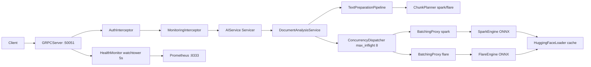

# Inference

Stateless Python gRPC service that runs dual ONNX models (Spark TF-IDF + Flare BERT) via batching proxy and chunked document analysis. No DB — JWT/`x-api-key` auth, server-streaming progress, health watchtower and per-model isolation.

## Overview

Stateless service exposing `AIService` (`protos/ai_service.proto`) with `Detect` (unary) and `AnalyzeDocument` (server-streaming `started` → `progress` → `final`). Handles `50k` char input, `256` token chunks with `192` stride, `10k` global token cap, via `ThreadPool` batching and weighted aggregation. Isolated `spark-pool`/`flare-pool` executors prevent slow-model starvation.

```text
POST gRPC  Detect(text, model_id)          -> PredictResponse
POST gRPC  AnalyzeDocument(text, model_id) -> stream AnalyzeDocumentEvent
```

## Packages

| Package | Purpose |
|---|---|
| `grpcio`, `grpcio-tools`, `grpcio-health-checking`, `protobuf` | gRPC server, health, codegen |
| `onnxruntime` / `onnxruntime-gpu` | ONNX inference (CPU base, GPU via `compose.gpu.yml`) |
| `transformers`, `huggingface-hub`, `tokenizers` | Flare BERT tokenizer + HF download |
| `scikit-learn`, `scipy`, `numpy` | Spark TF-IDF vectorizer |
| `pydantic`, `pydantic-settings` | Typed config + validation |
| `prometheus-client` | Metrics (`:8333`) |
| `opentelemetry-api`, `opentelemetry-sdk`, `opentelemetry-exporter-otlp-proto-http`, `opentelemetry-instrumentation-grpc` | Tracing |
| `structlog` | JSON structured logging |
| `PyJWT`, `circuitbreaker` | JWT auth, resilience |
| `pytest`, `pytest-asyncio`, `pytest-cov`, `coverage`, `ruff` | Tests/lint |

See `pyproject.toml` for full list.

## Architecture



Per-model isolation prevents slow-model starvation; see [Architecture](docs/concepts/architecture.md) for ports, startup DAG and class view.

## Configuration

```ini
ENV_TYPE=dev  # dev = compose .env, prod = AWS Secrets Manager + SSM
# required
API_KEY=dev-secret-key-16chars-at-least   # >=16 chars (prod: detectai/inference/secrets)
# optional (defaults, see docs/getting-started/configuration.md for full reference)
GRPC_PORT=50051
METRICS_PORT=8333
BATCH_SIZE=32
BATCH_TIMEOUT=0.05
MAX_TEXT_CHARS=50000
CHUNK_TOKEN_LIMIT=256
CHUNK_TOKEN_STRIDE=192
INFERENCE_PROVIDERS=CPUExecutionProvider
# HF_TOKEN=hf_...  # optional, for private HF repos (prod: same secret)
```

See `infra/.env.example` and `docs/getting-started/configuration.md` for all vars and validation rules.

## API

```text
gRPC  AIService/Detect              (PredictRequest)  -> PredictResponse
gRPC  AIService/AnalyzeDocument      (AnalyzeDocumentRequest) -> stream AnalyzeDocumentEvent
gRPC  grpc.health.v1.Health/Check    -> SERVING / NOT_SERVING
GET   :8333/metrics                  -> Prometheus
```

`model_id` is `spark|flare` case-insensitive, truncated to `64`, default `spark`. See `docs/components/api.md` for full proto and status codes (`OK`, `INVALID_ARGUMENT`, `RESOURCE_EXHAUSTED`, `UNAUTHENTICATED` etc).

## Observability

Logs are JSON to stdout. Tracing is OTel if an OTLP endpoint is set. Metrics at GET /metrics for Prometheus.

Metrics configured:

- gRPC requests total — counts every request by method, code and model
- gRPC auth failures — counts rejected requests by method and reason
- Batch queue size and batch processing time — track batching health
- Document chunks processed and failed — track per-chunk success

Alerts configured:

- Inference down — service not up for more than 2 minutes
- High error rate — error rate above 5% for 5 minutes
- Queue full — engine queue full for more than 1 minute

See `docs/operations/observability.md` for full metric list and PromQL.

## Testing

All test commands are wrapped with `make` — check `Makefile` for details.

```bash
# Generate gRPC code from proto
make proto

# Run unit tests
make test

# Run tests with coverage report
make test-coverage

# Run integration tests
make test-integration
```

See `docs/testing/overview.md` and `load/README.md` for load scenarios.

## Docker

All Docker commands are wrapped with `make` for simplicity.

```bash
# Build the inference image
make inference-build

# Start the service locally on CPU (default)
make inference-up

# Start with GPU acceleration (uses CUDA)
make inference-up GPU=1

# View live logs and running containers
make inference-logs
make inference-ps

# Stop the service
make inference-down
```

See `docs/concepts/architecture.md` for compose files and `infra/` details.

## Documentation

| Guide | What |
|---|---|
| [Quick Start](docs/getting-started/quickstart.md) | Get the service running in minutes |
| [Architecture](docs/concepts/architecture.md) | How the service is built and why |
| [Request Flows](docs/concepts/request-flows.md) | How requests move through the system |
| [Chunking](docs/concepts/chunking.md) | How text is split into chunks |
| [Batching](docs/concepts/batching.md) | How requests are batched for efficiency |
| [API Reference](docs/components/api.md) | How to call the service |
| [Authentication](docs/components/auth.md) | How authentication works |
| [Models](docs/components/models.md) | How ML models are loaded and used |
| [Health](docs/components/health.md) | Health checks and monitoring |
| [Configuration](docs/getting-started/configuration.md) | All settings and how to configure them |
| [Observability](docs/operations/observability.md) | Metrics, logs, and alerts |
| [Testing](docs/testing/overview.md) | How to test the service |

Full index: [docs/README.md](docs/README.md).
