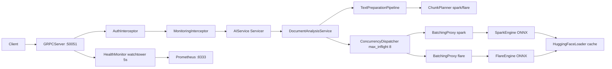
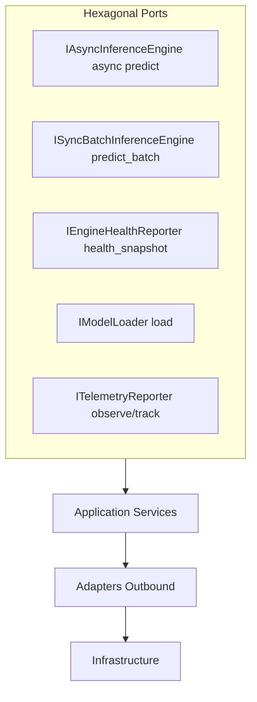
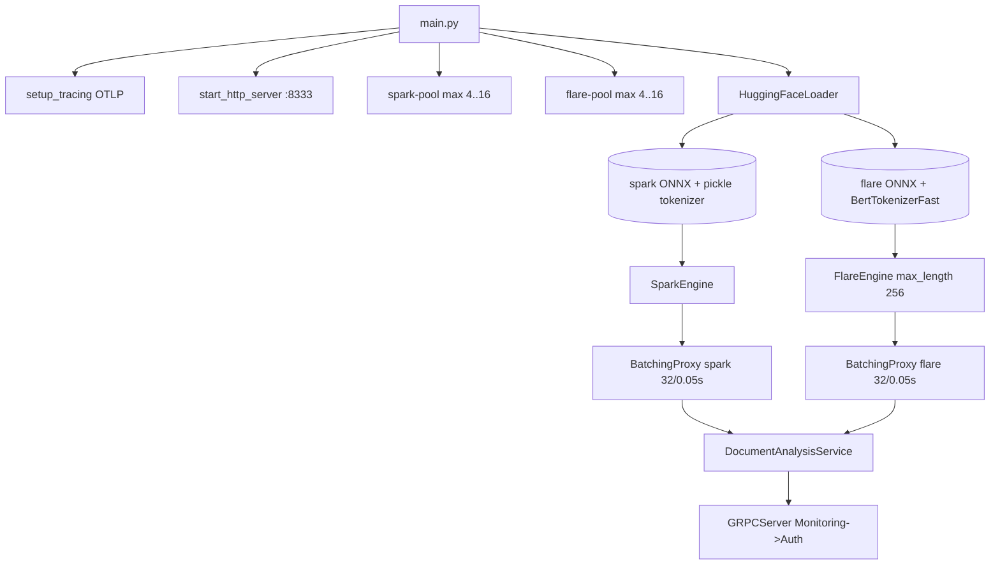
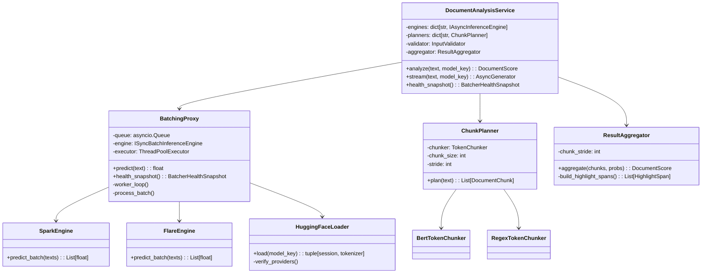

# Architecture

## High-level



Single gRPC port `50051`, metrics `8333`. Two isolated models prevent starvation. `QUEUE_FULL` sheds as `RESOURCE_EXHAUSTED`, not `NOT_SERVING`.

## Hexagonal ports



Ports live in `src/application/ports/outbound/`; adapters in `src/adapters/`; domain in `src/domain/`.

## Startup DAG



Per-model `ThreadPoolExecutor` sized in `src/main.py:41`:

```python
spark_workers = max(4, workers // 2)
flare_workers = max(4, workers - spark_workers)
```

`HuggingFaceLoader` runs in executor during startup (`run_in_executor`), then `BatchingProxy.start()` spawns `worker_loop`.

## Class view



* `BatchingProxy` implements both `IAsyncInferenceEngine` (for `DocumentAnalysisService`) and `IEngineHealthReporter` (for `HealthMonitor`).
* See `02-request-flows.md` for how `analyze`/`stream` use these classes, and `05-batching.md` for queue details.
