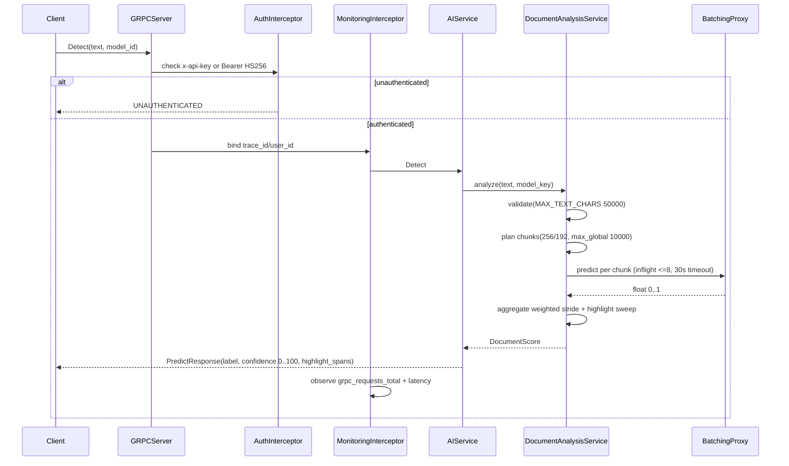
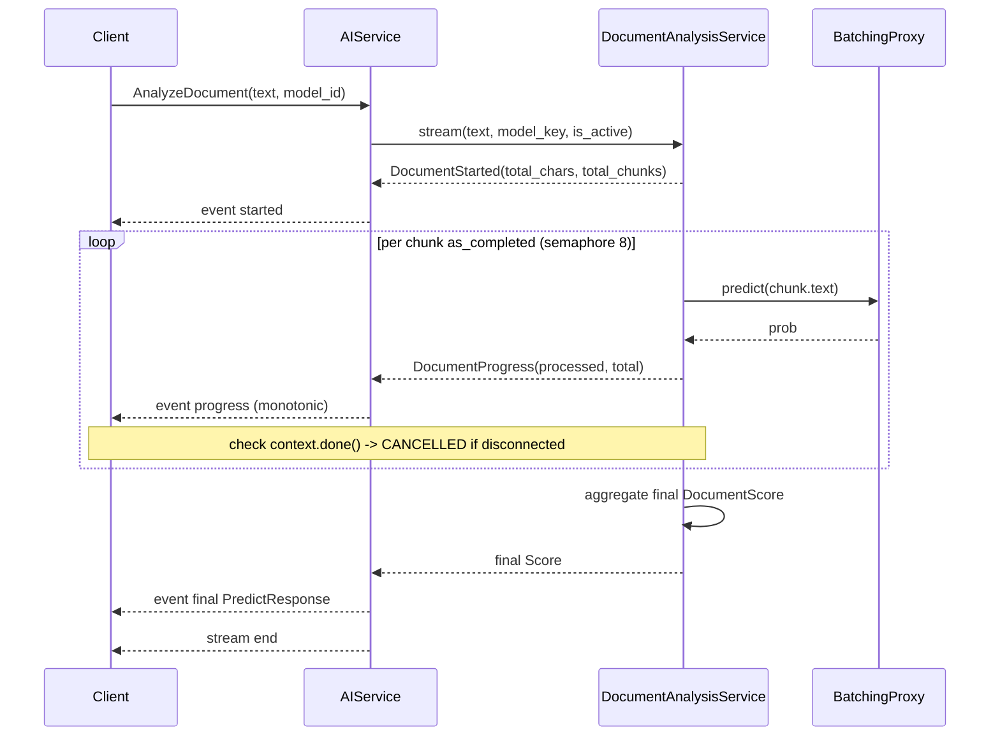

# Request Flows

## Detect (unary)



* `model_id` normalized at `servicers.py:18` (truncate 64 → `lower().strip()` → default `spark`), unknown → `INVALID_ARGUMENT`.
* `DocumentAnalysisService:328` checks `health_snapshot()` before dispatch; `QUEUE_FULL`/`WORKER_UNAVAILABLE` → `ServiceOverloaded` → `RESOURCE_EXHAUSTED`.
* Per-chunk `asyncio.wait_for(..., timeout=30s)` in `ConcurrencyDispatcher`.

## AnalyzeDocument (server-streaming)



Order enforced via `StreamingPresenter` (`servicers.py:94`):

```python
if presenter.is_started(event): yield build_started(...)
elif presenter.is_progress(event): yield build_progress(...)
elif presenter.is_final(event): yield build_final(...)
else: raise InferenceError
```

* `request_is_active=lambda: not context.done()` guards both `validate` and per-chunk `predict`; `asyncio.CancelledError` bubbles as `CANCELLED`.
* `progress` is strictly increasing (`1..total_chunks`), `total_chunks` matches `started`; client validates this in `load/lib/analyze.js:135`.

## Error branches

| Path | Code |
|---|---|
| Unknown `model_id` or bad offsets | `INVALID_ARGUMENT` |
| Queue full / worker dead / circuit open | `RESOURCE_EXHAUSTED` |
| Client disconnect | `CANCELLED` |
| Engine returned `NaN` or shape mismatch | `INTERNAL` (wrapped `InferenceError`) |
| Missing `started` or non-monotonic progress | Client-side `stream_check_failed` (k6) |

See `03-auth.md` for the `A` step and `07-health.md` for why `QUEUE_FULL` does not flip `SERVING`.
