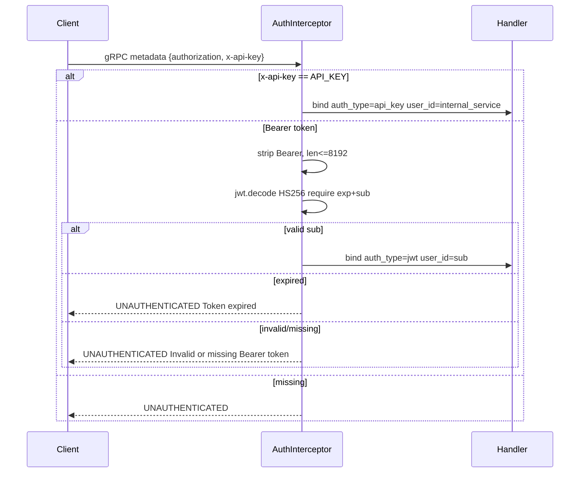
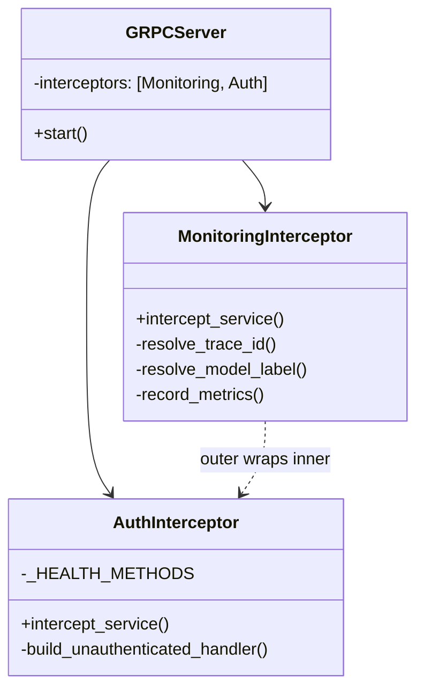

# Authentication

## Flow



Code at `src/adapters/inbound/grpc/interceptors.py:36`.

* Health `grpc.health.v1.Health/Check|Watch` bypasses auth (`_HEALTH_METHODS`).
* `x-api-key` is constant-time compared to `settings.API_KEY` (16+ chars, from `API_KEY` or `AI_SERVICE_API_KEY`).
* `Bearer` requires `HS256` with `exp` and `sub` claims; `_MAX_TOKEN_LEN=8192` prevents DoS, `_MAX_SUB_LEN=128`, `_MAX_TRACE_ID_LEN=128`.

## Context

On success, interceptor binds via `structlog.contextvars`:

```python
bind_contextvars(auth_type="jwt"|"api_key", user_id=sub, trace_id=...)
```

`MonitoringInterceptor` (outer) ensures auth failures are still counted in `grpc_requests_total`.

## Failure metrics

```text
grpc_auth_failures_total{method, reason}
  reason: missing_or_invalid_token | token_expired
```

Logs use `_truncate` to avoid injection; `Authorization` header never logged.

## Client example

```bash
# API key (internal)
grpcurl -H "x-api-key: $AI_SERVICE_API_KEY" ...

# JWT (load tests)
TOKEN=$(python load/scripts/generate_token.py --secret $AI_SERVICE_API_KEY)
grpcurl -H "authorization: Bearer $TOKEN" ...
```

`load/scripts/generate_token.py` builds `sub=k6-load-tester`, `iat` now, `exp=+3600s`.

## Class view



Order matters: `MonitoringInterceptor` outer → auth failures still observed.
