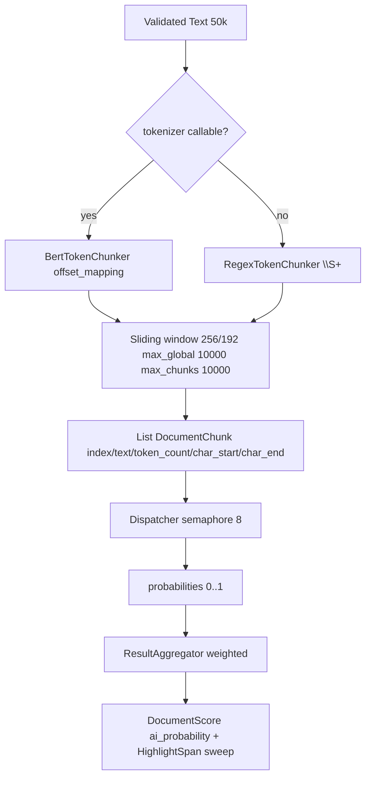
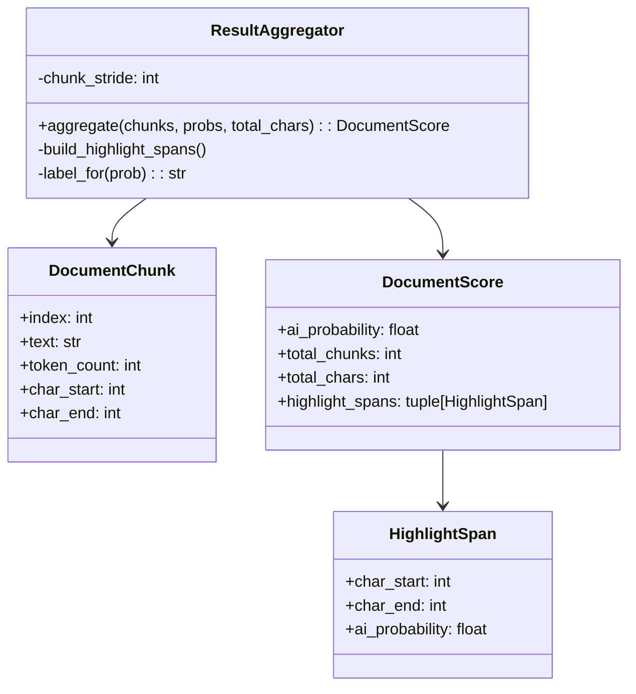

# Chunking & Aggregation

## Pipeline



Built in `src/application/services/chunking.py`.

## Tokenizers

* **BertTokenChunker** — calls HF tokenizer with `return_offsets_mapping=True`, filters zero-length offsets, maps token offsets to `char_start/char_end`. Used for `flare` (and any model with callable tokenizer).
* **RegexTokenChunker** — `re \S+` finditer, used for `spark` pickle tokenizer or fallback. Deterministic, no external deps.

Selection at `build_chunk_planner(tokenizer, ...)`:

```python
if callable(tokenizer): BertTokenChunker(tokenizer)
else: RegexTokenChunker()
```

## Sliding window

For `len(tokens) <= max_global_tokens` (`10000`):

* `step = stride = 192`, `window = chunk_size = 256`
* For `start in range(0, len, stride)`: `window = tokens[start:start+chunk_size]`, `char_start = window[0].start`, `char_end = window[-1].end`
* Stop when `start+chunk_size >= len`
* Safety cap `max_chunks=10000` → `InvalidInputError` if exceeded

If no offsets (empty text after tokenization) but `text.strip()` non-empty, fallback single chunk covering stripped text.

## Validation

`ChunkPlanner.__init__` ensures `stride <= chunk_size`, `chunk_size>0`, `max_global_tokens>0`. `plan()` raises `InvalidInputError` if `len(tokens) > max_global_tokens` or `len(chunks) > max_chunks`.

## Aggregation

`src/application/services/aggregation.py:16`



Weight: `i==0 ? token_count : min(stride, token_count)` → `ai_prob = sum(weight*prob)/sum(weight)`.

Highlight sweep: sort `chunks+probs` by `char_start`, collect boundaries, for each `[start,end)` average overlapping `probs`, merge adjacent spans with same `label_for(probs >=0.5)` via length-weighted probability.

See `05-batching.md` for how chunks are dispatched with `max_inflight=8`.
