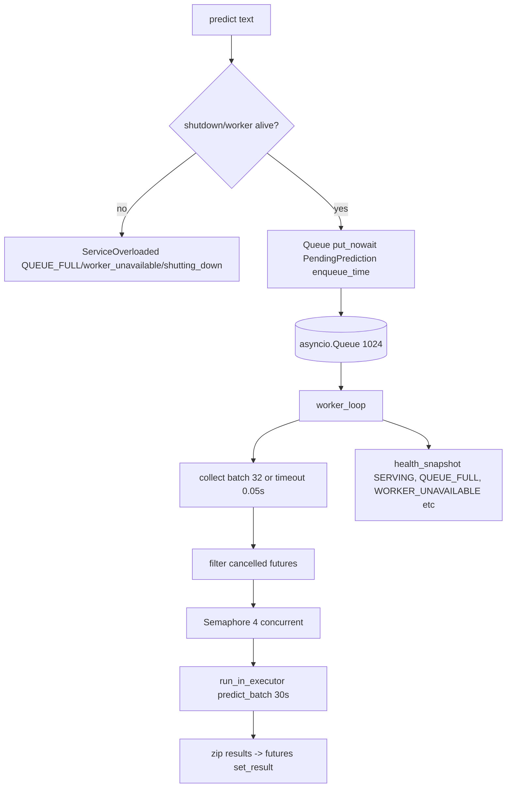
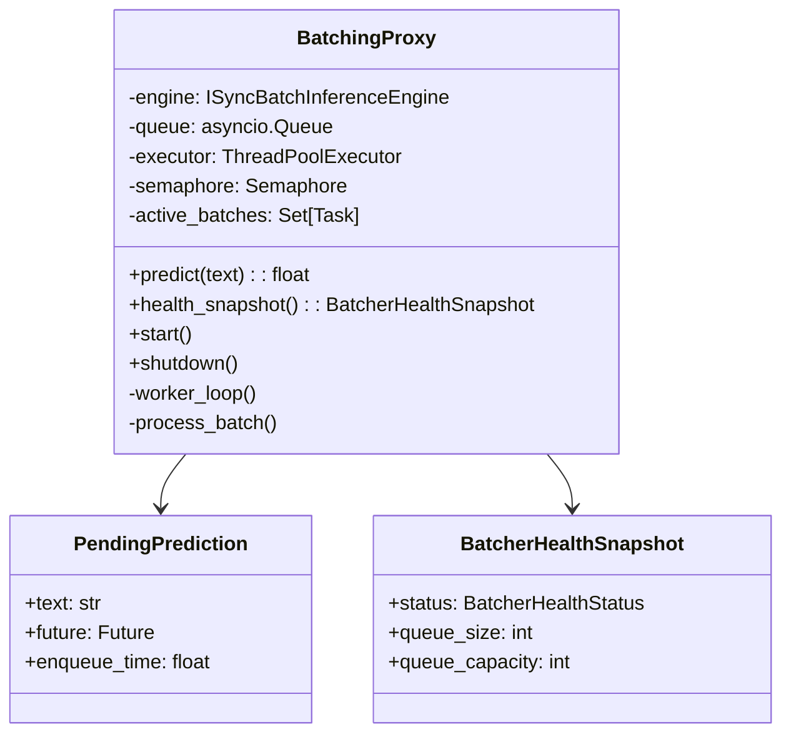

# Batching Internals

## Flow



Code at `src/adapters/outbound/inference/batcher.py:37`.

## Class view



## Worker loop

* Loops while `not shutdown_flag`, `await queue.get()`, handles `_SHUTDOWN_SENTINEL`.
* Collects up to `batch_size=32` items within `timeout=0.05s` (remaining time), records `model_batch_queue_wait_seconds`.
* Filters `future.done()/cancelled()` before GPU, observes `model_batch_size`.
* `process_batch_with_semaphore` limits `max_concurrent_batches=4` concurrent `run_in_executor` calls, each `30s` timeout via `asyncio.wait_for(..., timeout=30s)`.
* Validates `len(results)==len(futures)`, checks `finite 0..1`, else `InferenceError`, records `inference_batch_errors_total`.

## Health snapshot

```python
if shutdown_flag: SHUTTING_DOWN
elif worker_task is None: INITIALIZING
elif worker_task.done(): WORKER_UNAVAILABLE
elif queue.full(): QUEUE_FULL
else: SERVING
```

`QUEUE_FULL` does **not** flip gRPC `NOT_SERVING`; `DocumentAnalysisService` sheds with `RESOURCE_EXHAUSTED`.

## Shutdown

1. Set `shutdown_flag`, deliver `_SHUTDOWN_SENTINEL` (retry 5× if `QueueFull`, else cancel worker).
2. `await wait_for(worker_task, 5s)` else cancel.
3. `gather(active_batches, 35s)` else cancel.
4. Drain remaining queue, `dec` gauge, `record_queue_rejected(shutting_down)`, `set_exception(ServiceOverloaded)`.

Metrics: `model_batch_size`, `model_batch_queue_size`, `model_batch_queue_wait_seconds`, `model_batch_processing_seconds`, `inference_batch_queue_rejected_total`, `inference_batch_errors_total`.
