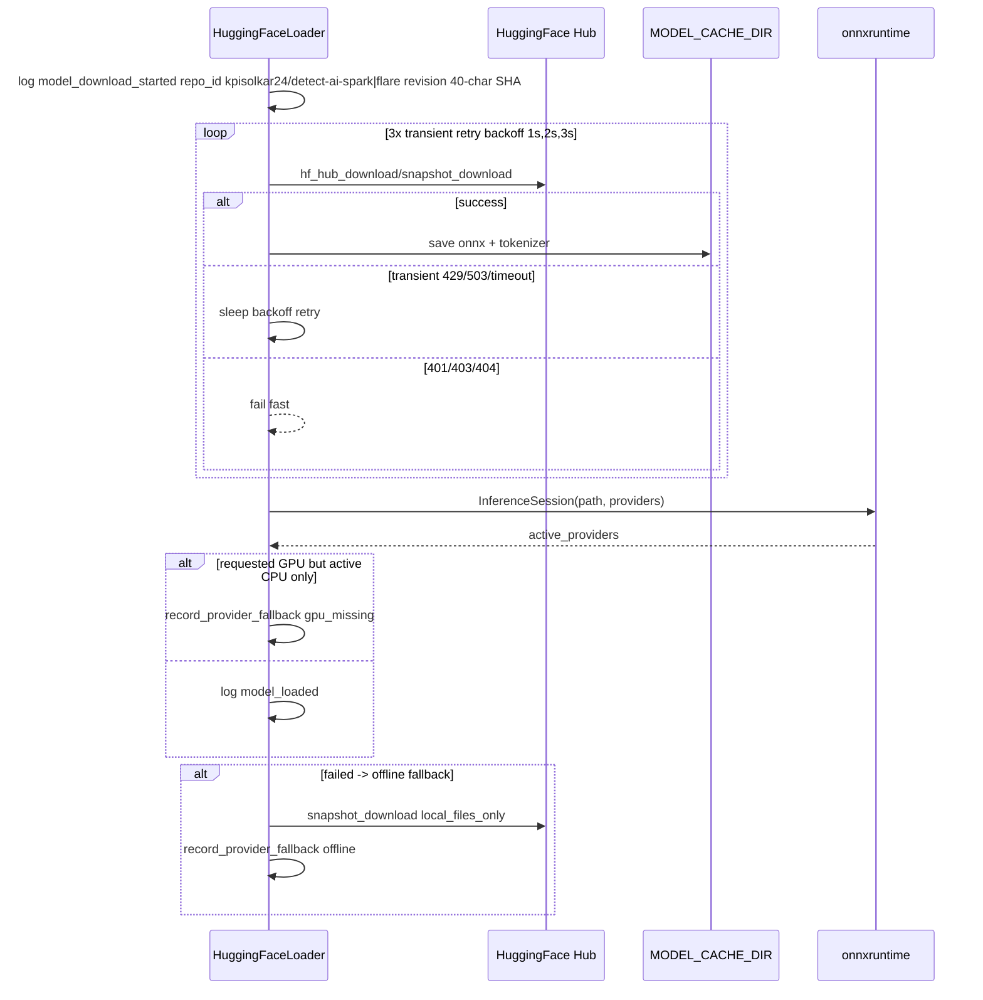
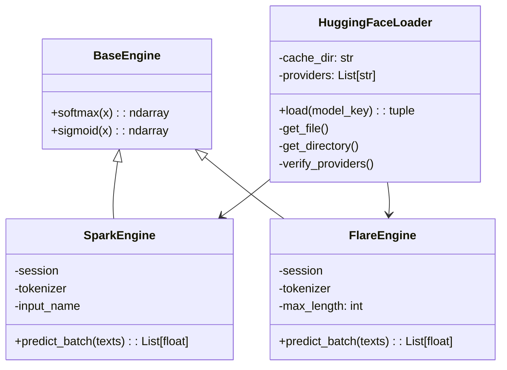

# Model Loading

## Sequence

Code at `src/adapters/outbound/inference/loader.py:62`.

## Repos

* `kpisolkar24/detect-ai-spark` — ONNX `detect-ai-spark.onnx` + `detect-ai-spark-tokenizer.pkl` (sklearn TF-IDF)
* `kpisolkar24/detect-ai-flare` — `model.onnx` + `BertTokenizerFast` via `snapshot_download`

Revisions pinned (`9a48004391c71272d6fb1d164ed7c56e1fbfe360`, `e1911c0be59f4e10f0d120f639d1358e46bc2086`) validated as lowercase 40-char SHA.

## Engines

* `SparkEngine:23` `tokenizer.transform(texts).toarray()` → ONNX; handles output shapes `(N,)`, `(N,1)`, `(N,2)` via `sigmoid`/`softmax`.
* `FlareEngine:19` `tokenizer(..., padding, truncation, max_length=256)` → ONNX int64 inputs.
* Both clip `probs 0..1`, raise `InferenceError` on shape mismatch.

## Security & resilience

* `RestrictedUnpickler` allows only `sklearn, scipy, numpy, builtins, collections, copyreg` for spark pickle.
* `_is_transient_error` detects `429/503/timeout/network`; `401/403/404` fail fast without retry.
* Provider verification: `requested GPU` but `active CPU` → warn `gpu_provider_unavailable_falling_back_to_cpu` + `inference_engine_provider_fallback_total{trigger=gpu_missing}`.
* Offline fallback via `local_files_only` if network fails.

## Env

`INFERENCE_PROVIDERS` comma or JSON array, allow-listed (`CPUExecutionProvider`, `CUDAExecutionProvider`, `TensorrtExecutionProvider`, `ROCMExecutionProvider`, `OpenVINOExecutionProvider`). `compose.gpu.yml` switches to `CUDAExecutionProvider`.
