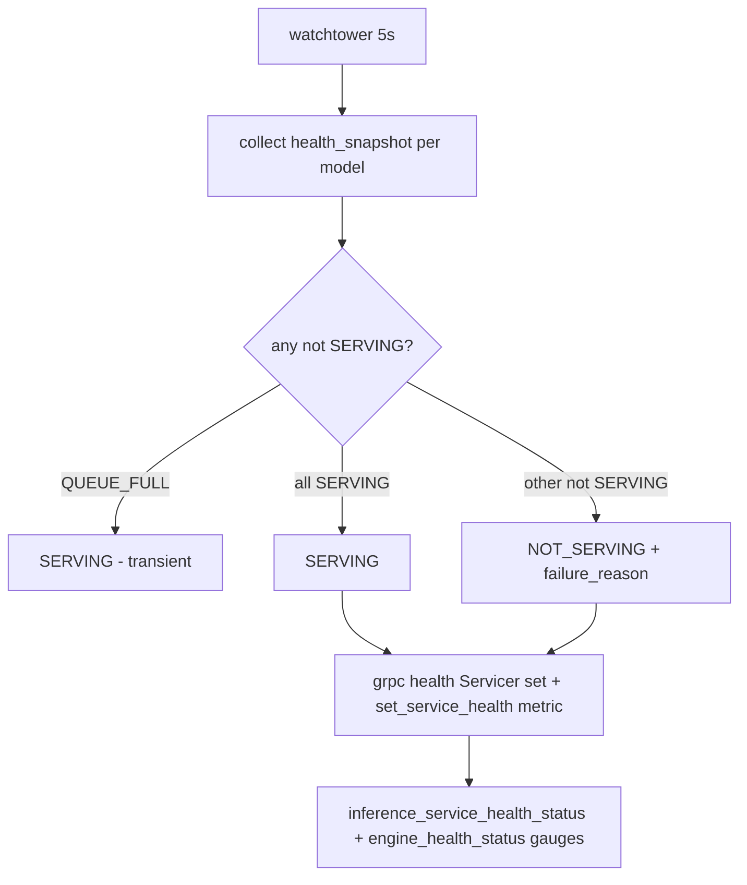
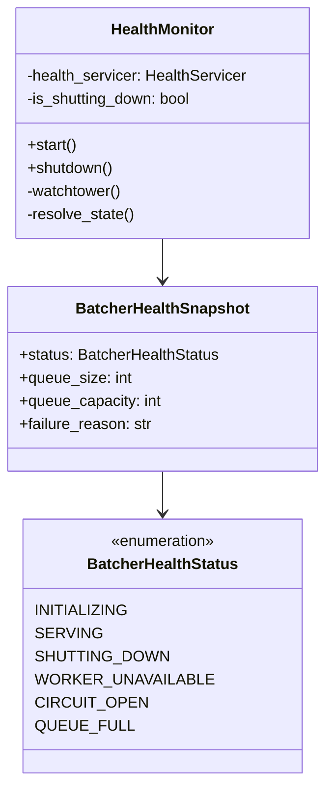

# Health

## Watchtower



Code at `src/adapters/inbound/grpc/health.py:17`, polled every `5s`.

## States



| `status` | `failure_reason` | gRPC | Shed? |
|---|---|---|---|
| `SERVING` | `none` | `SERVING` | — |
| `INITIALIZING` | `service_initializing` | `NOT_SERVING` | — |
| `SHUTTING_DOWN` | `shutdown_in_progress` | `NOT_SERVING` | `RESOURCE_EXHAUSTED` |
| `WORKER_UNAVAILABLE` | `batch_worker_stopped` | `NOT_SERVING` | `RESOURCE_EXHAUSTED` |
| `QUEUE_FULL` | `inference_queue_full` | `SERVING` (transient) | `RESOURCE_EXHAUSTED` via `health_shed` |
| `CIRCUIT_OPEN` | `inference_circuit_open` | `NOT_SERVING` | `RESOURCE_EXHAUSTED` |

`QUEUE_FULL` intentionally does **not** flip health; LB keeps sending traffic, service sheds quickly.

## Publish

```python
await gather(health_servicer.set("", state), health_servicer.set("aidetection.AIService", state))
set_service_health(state, reason)
set_engine_health(model, snapshot)  # per model gauges
```

Metrics `inference_service_health_status{status}`, `inference_service_health_reason{reason}`, `inference_engine_health_status{model,status}`.

## Startup / shutdown

* `GRPCServer.start()` awaits `health_monitor.start()` **before** `server.start()` → probes see `SERVING` immediately, avoid `NOT_FOUND`.
* `shutdown()` sets `_is_shutting_down`, publishes `NOT_SERVING shutdown_in_progress`, cancels watchtower, then `server.stop(grace=10)` → `analysis_service.shutdown()` (drains batchers).
