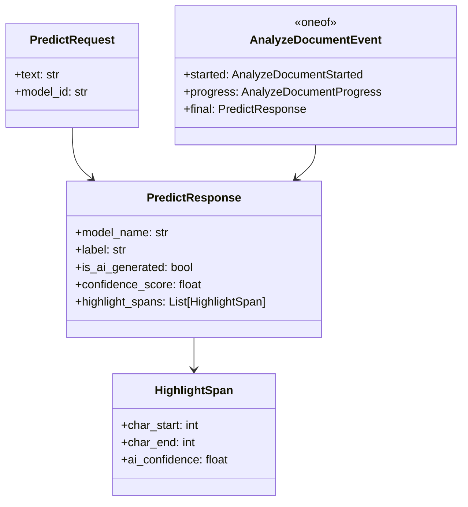

# API

Proto: `../protos/ai_service.proto` (`package aidetection;`).

## Proto

```protobuf
syntax = "proto3";
package aidetection;

service AIService {
  rpc Detect (PredictRequest) returns (PredictResponse);
  rpc AnalyzeDocument (AnalyzeDocumentRequest) returns (stream AnalyzeDocumentEvent);
}

message PredictRequest {
  string text = 1;      // up to 50k chars, validated
  string model_id = 2;  // spark | flare, case-insensitive, truncated to 64, default spark
}

message AnalyzeDocumentRequest {
  string text = 1;
  string model_id = 2;
}

message AnalyzeDocumentStarted {
  int32 total_chars = 1;
  int32 total_chunks = 2;
}

message AnalyzeDocumentProgress {
  int32 processed_chunks = 1;
  int32 total_chunks = 2;
}

message AnalyzeDocumentEvent {
  oneof event {
    AnalyzeDocumentStarted started = 1;    // first event
    AnalyzeDocumentProgress progress = 2;  // monotonic, bounded
    PredictResponse final = 3;             // last event
  }
}

message HighlightSpan {
  int32 char_start = 1;
  int32 char_end = 2;
  float ai_confidence = 3;  // 0..100
}

message PredictResponse {
  string model_name = 1;                    // Spark | Flare
  string label = 2;                         // AI | Human
  bool is_ai_generated = 3;
  float confidence_score = 4;               // 0..100
  float human_confidence = 5;               // 0..100
  float ai_confidence = 6;                  // 0..100
  repeated HighlightSpan highlight_spans = 7;
}
```

## Endpoints

| Method | Request | Response | Notes |
|---|---|---|---|
| `grpc.health.v1.Health/Check` | `HealthCheckRequest` | `SERVING` / `NOT_SERVING` | Bypass auth, `Watch` also supported. Health watchtower 5s. |
| `GET :8333/metrics` | — | Prometheus text | `prometheus_client` scrape. |
| `AIService/Detect` | `PredictRequest(text, model_id)` | `PredictResponse` | Unary. |
| `AIService/AnalyzeDocument` | `AnalyzeDocumentRequest(text, model_id)` | `stream AnalyzeDocumentEvent` | Server-streaming: `started` → `progress*` → `final`. |



## Status codes

| Code | When |
|---|---|
| `OK` | Valid `PredictResponse` (unary) or `final` event (stream). |
| `INVALID_ARGUMENT` | Unsupported `model_id`, empty chunks, bad offsets, `text` exceeds `MAX_TEXT_CHARS`/`MAX_GLOBAL_TOKENS`. |
| `RESOURCE_EXHAUSTED` | Batch queue full (`1024`), worker unavailable, circuit open — shed load, health stays `SERVING`. |
| `UNAUTHENTICATED` | Missing/invalid/expired `Bearer` or bad `x-api-key` (`interceptors.py:36`). |
| `CANCELLED` | Client `context.done()` / disconnect. |
| `INTERNAL` | Unexpected engine / aggregation error. |

## Validation notes

* `model_id` truncated to `64` at `servicers.py:18`, then `lower().strip()`, defaults to `spark`.
* Log values truncated to `500` chars (`_MAX_TEXT_LOG_LEN=500`) to prevent injection; tokens limited to `8192` (`_MAX_TOKEN_LEN=8192`) to guard DoS.
* `text` validated via `InputValidator` (`MAX_TEXT_CHARS=50000`); `CHUNK_TOKEN_LIMIT=256`/`STRIDE=192` sliding window.
* Stream order validated client-side in `load/lib/analyze.js:88` (see `../load/README.md`).

Generate code: `make proto` (`grpc_tools.protoc` + `sed` fix). Files in `src/generated/` committed for convenience but regenerated in CI.
