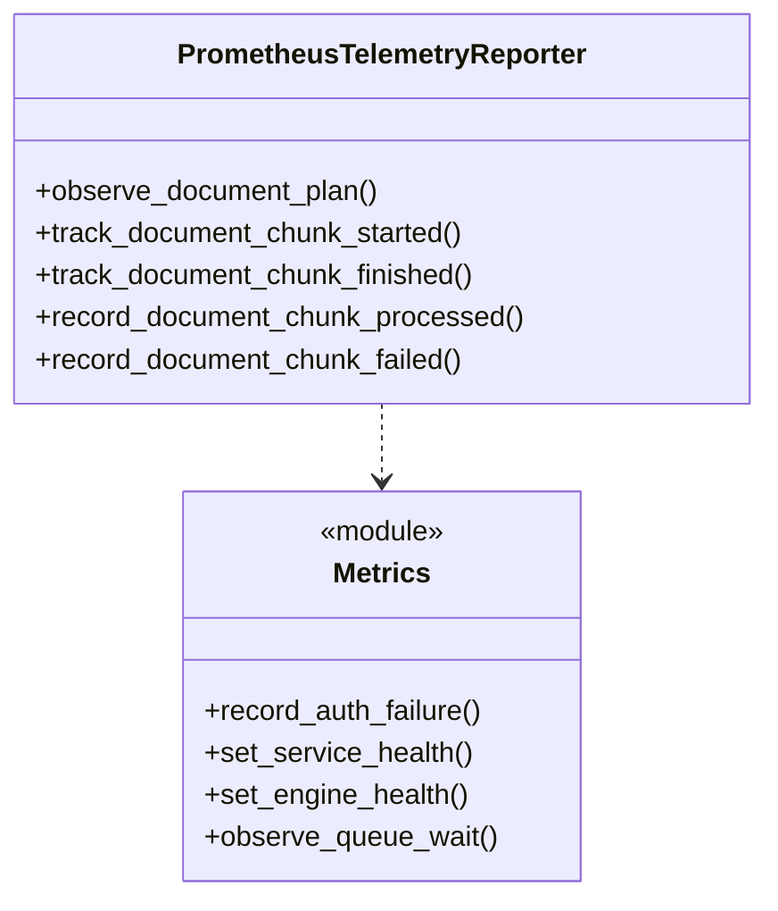

# Observability

Logs are JSON to stdout. Tracing is OTel if an OTLP endpoint is set. Metrics at `GET :8333/metrics` for Prometheus.

## Logs and tracing

* `src/infrastructure/log_setup.py:13` — `structlog` JSON via `ProcessorFormatter`, `contextvars` for `trace_id`/`user_id`/`auth_type`, `LOG_LEVEL` env.
* `src/infrastructure/tracing.py:17` — OTLP/HTTP exporter to `OTEL_EXPORTER_OTLP_ENDPOINT/v1/traces`, `GrpcAioInstrumentorServer` auto-instruments, fail-open if no endpoint or missing deps.

## Metrics

All `prometheus_client` at `:8333` (`start_http_server` in `src/main.py:34`). Safe `_safe_counter/_safe_gauge/_safe_histogram` avoid duplicate registration in tests.

| Metric | Type | Labels | Description |
|---|---|---|---|
| `grpc_requests_total` | Counter | `method, code, model` | Every gRPC request |
| `grpc_auth_failures_total` | Counter | `method, reason` | Rejected auth |
| `grpc_latency_seconds` | Histogram `0.005..10s` | `method, model` | Request latency |
| `model_batch_size` | Histogram `1..512` | `model` | ONNX batch sizes |
| `model_batch_queue_size` | Gauge | `model` | Items waiting |
| `model_batch_queue_wait_seconds` | Histogram | `model` | Time in queue |
| `model_batch_processing_seconds` | Histogram | `model` | ONNX execution time |
| `model_ai_confidence_score` | Histogram `0.1..1.0` | `model` | Predicted probability |
| `inference_service_health_status` | Gauge | `status` | `serving/not_serving` |
| `inference_service_health_reason` | Gauge | `reason` | `none`, `service_initializing` etc |
| `inference_engine_health_status` | Gauge | `model, status` | Per-engine health |
| `inference_engine_queue_capacity` | Gauge | `model` | Configured queue size |
| `inference_engine_circuit_open_seconds` | Gauge | `model` | Remaining open |
| `inference_document_input_chars` | Histogram `128..65536` | `operation, model` | Input size |
| `inference_document_chunk_count` | Histogram `1..512` | `operation, model` | Planned chunks |
| `inference_document_inflight_chunks` | Gauge | `operation, model` | Concurrent chunks |
| `inference_document_requests_total` | Counter | `operation, model, status` | Document requests |
| `inference_document_chunks_processed_total` | Counter | `operation, model` | Successful chunks |
| `inference_document_chunks_failed_total` | Counter | `operation, model, reason` | Failed chunks |
| `inference_batch_queue_rejected_total` | Counter | `model, reason` | Queue-full rejections |
| `inference_batch_errors_total` | Counter | `model, error_type` | Batch errors |
| `inference_engine_provider_fallback_total` | Counter | `model, requested, active, trigger` | GPU→CPU fallbacks |

Short version (README) groups these as bullet points.

## Dashboards and alerts

* `prometheus.yml` scrapes `ai-service:8333`; Grafana dashboards `04-inference-overview.json` etc use `grpc_requests_total`, `model_batch_queue_size`.
* Alerts derived (see `../README.md` Observability for short list):

| Alert | Expr |
|---|---|
| Inference down | `up{job=inference}==0` for `2m` |
| High error rate | `rate(grpc_requests_total{code!="OK"}[5m]) >0.05` |
| High latency | `histogram_quantile(0.95, grpc_latency_seconds) >2s` for `10m` |
| Queue full | `inference_engine_health_status{status="queue_full"}==1` for `1m` |
| Batch timeouts | `rate(inference_batch_errors_total{error_type="timeout"}[5m]) >0.1` |
| Provider fallback | `increase(inference_engine_provider_fallback_total[5m])>0` |

## Class view

