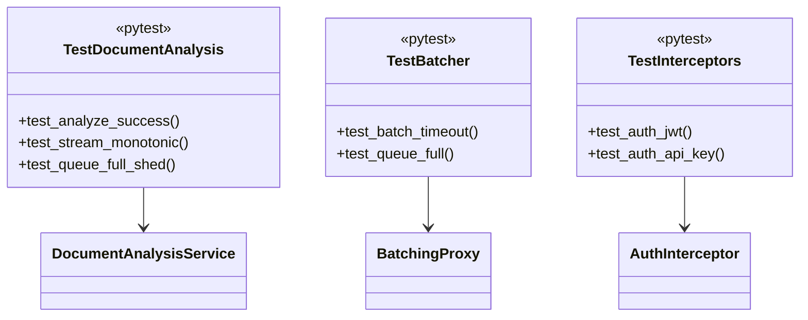

# Testing

## Commands

All `make` wrappers — see `../Makefile`:

```bash
# Generate gRPC code from proto
make proto

# Run unit tests (80 tests)
make test

# Run with coverage (html/xml)
make test-coverage

# Run integration tests (needs HF cache or offline)
make test-integration

# Check code style
make lint
```

## Unit

```
tests/unit/
  application/test_document_analysis.py
  domain/test_exceptions.py
  infrastructure/test_config.py, test_log_setup.py, test_tracing.py
  adapters/inbound/grpc/test_interceptors.py, test_servicer.py, test_server.py
  adapters/outbound/inference/test_batcher.py, test_engines.py, test_loader.py
```

`pyproject.toml` sets `asyncio_mode=auto`, `pythonpath=.`. Coverage omits `src/main.py` and `src/generated/*`, requires `70%` in CI.

Run: `API_KEY=ci-dummy-key-16chars-long poetry run pytest tests/unit --cov=src --cov-fail-under=70 -v`.

## Integration

`tests/integration/` needs `MODEL_CACHE_DIR` with spark/flare or offline fallback. CI runs with `API_KEY=ci-dummy-key-16chars-long` and real `grpc_tools.protoc` codegen.

## Load

See `../load/README.md` for `ramping-arrival-rate` vs `constant-vus`:

| Scenario | File | Executor | Thresholds |
|---|---|---|---|
| `smoke` | `scenarios/smoke.js` | `iterations:1` 1 VU | `rate==1` |
| `detect` | `scenarios/detect.js` | `ramping-arrival-rate` | `p95<1500 p99<2500 rate>=0.99` |
| `analyze` | `scenarios/analyze.js` | `constant-vus` 6 VUs 5m | `p95<5000 p99<10000` |
| `soak` | `scenarios/soak.js` | `constant-vus` 2 VUs 30m | `p95<7000 p99<12000` |

```bash
make load-test SCENARIO=detect GPU=0 VUS=20
make load-test SCENARIO=analyze GPU=1 VUS=8 DURATION=10m
```

Elegant `VUS/RPS/STAGES/DURATION/MAX_VUS` map to `INFERENCE_LOAD_*` envs; `generate_token.py` auto-creates `Bearer` from `AI_SERVICE_API_KEY`.

## Class under test


