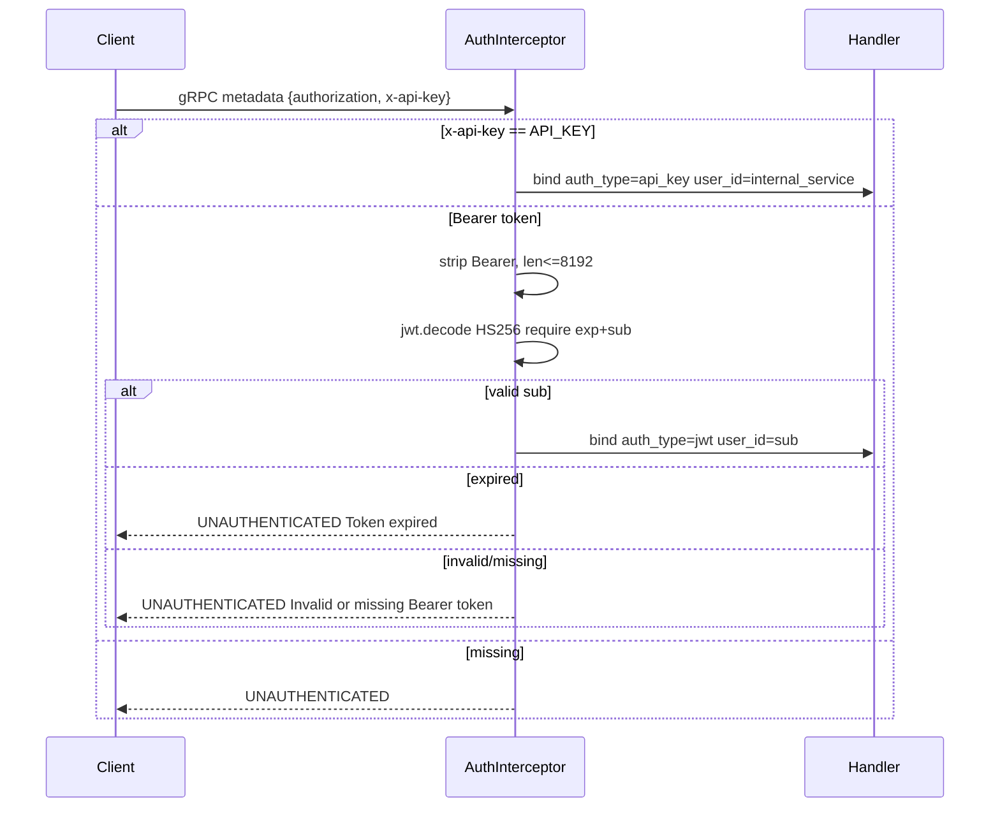

# Authentication

This document explains how the Inference service authenticates requests and how you can authenticate your API calls.

## What is Authentication?

Authentication is the process of verifying who you are. The Inference service needs to know you're allowed to use it before it will analyze your text.

## Why Authentication Matters

- **Security** - Prevents unauthorized use of the service
- **Usage tracking** - Knows who is making requests
- **Rate limiting** - Can limit usage per user
- **Audit trail** - Tracks who requested what analysis

## Authentication Methods

The service supports two authentication methods:

### Method 1: API Key (Internal Services)

API keys are simple strings used for internal service-to-service communication.

```bash
# Pass API key in x-api-key header
grpcurl -H "x-api-key: $AI_SERVICE_API_KEY" \
  -d '{"text": "Hello world"}' \
  localhost:50051 aidetection.AIService/Detect
```

**How it works:**
1. Client sends `x-api-key` header
2. Service compares it to the configured `API_KEY` using constant-time comparison
3. If match, request proceeds with `auth_type=api_key`
4. If no match, returns `UNAUTHENTICATED`

**Requirements:**
- API key must be at least 16 characters
- Compared using constant-time comparison (prevents timing attacks)
- Never logged (security)

### Method 2: JWT Token (Load Tests, External Clients)

JWT (JSON Web Token) tokens are used for more complex authentication scenarios.

```bash
# Generate a JWT token
TOKEN=$(python load/scripts/generate_token.py --secret $AI_SERVICE_API_KEY)

# Pass JWT in authorization header
grpcurl -H "authorization: Bearer $TOKEN" \
  -d '{"text": "Hello world"}' \
  localhost:50051 aidetection.AIService/Detect
```

**How it works:**
1. Client sends `authorization: Bearer <token>` header
2. Service validates the JWT:
   - Uses HS256 algorithm
   - Checks `exp` (expiration) claim
   - Checks `sub` (subject) claim
3. If valid, request proceeds with `auth_type=jwt` and `user_id=sub`
4. If invalid or expired, returns `UNAUTHENTICATED`

**Requirements:**
- Token must be HS256 signed
- Must have `exp` and `sub` claims
- Maximum token length: 8192 characters (prevents DoS)
- Maximum `sub` length: 128 characters

## Authentication Flow



## Health Check Bypass

The health check endpoint (`grpc.health.v1.Health/Check` and `Watch`) bypasses authentication. This allows load balancers and monitoring systems to check service health without credentials.

## Context Binding

On successful authentication, the service binds context variables for logging and tracing:

```python
bind_contextvars(auth_type="jwt"|"api_key", user_id=sub, trace_id=...)
```

## Failure Metrics

Failed authentication attempts are tracked:

```
grpc_auth_failures_total{method, reason}
  reason: missing_or_invalid_token | token_expired
```

## Generating JWT Tokens

The service includes a token generator for load testing:

```bash
# Generate a token with default settings
python load/scripts/generate_token.py --secret $AI_SERVICE_API_KEY

# Output: eyJhbGciOiJIUzI1NiIs...
```

**Token details:**
- `sub`: `k6-load-tester`
- `iat`: Current time
- `exp`: Current time + 3600 seconds (1 hour)
- Algorithm: HS256

## Security Notes

- `Authorization` header is never logged
- Log values are truncated to prevent injection
- API keys use constant-time comparison
- JWT tokens have length limits to prevent DoS

## Troubleshooting

### "UNAUTHENTICATED" Error

**Cause:** Missing or invalid credentials.

**Fix:**
- Check you're sending the correct header (`x-api-key` or `authorization`)
- Verify the API key is at least 16 characters
- For JWT, check the token hasn't expired

### "Token expired" Error

**Cause:** JWT token has passed its expiration time.

**Fix:**
- Generate a new token: `python load/scripts/generate_token.py --secret $AI_SERVICE_API_KEY`
- Tokens expire after 1 hour by default

### "Invalid or missing Bearer token" Error

**Cause:** JWT token is malformed or missing.

**Fix:**
- Ensure the token starts with `eyJ` (JWT format)
- Check the `authorization` header format: `Bearer <token>`
- Verify the token was generated with the correct secret

## Related Documentation

- [API Reference](api.md) - How to use the API
- [Configuration](../getting-started/configuration.md) - Auth settings
- [Architecture](../concepts/architecture.md) - How auth fits in the system
