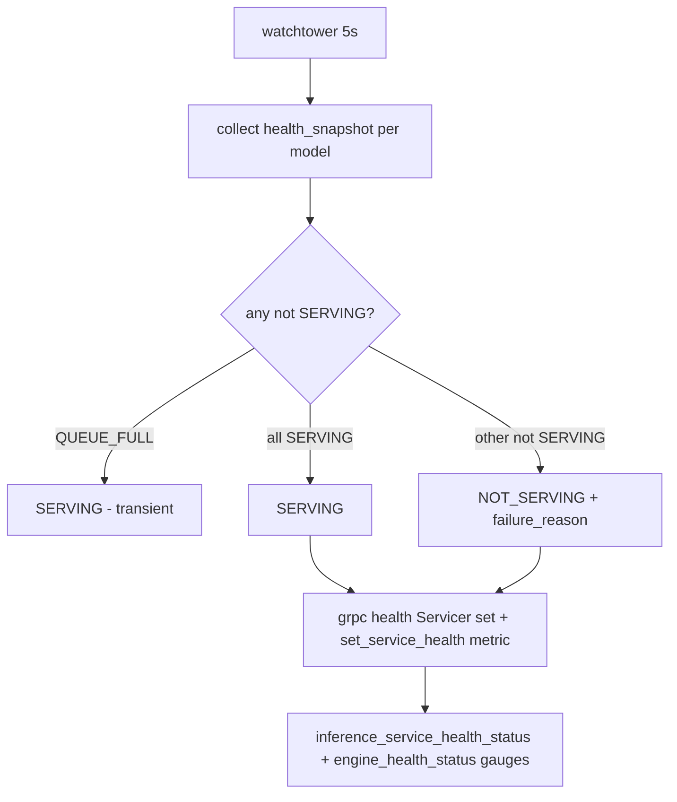
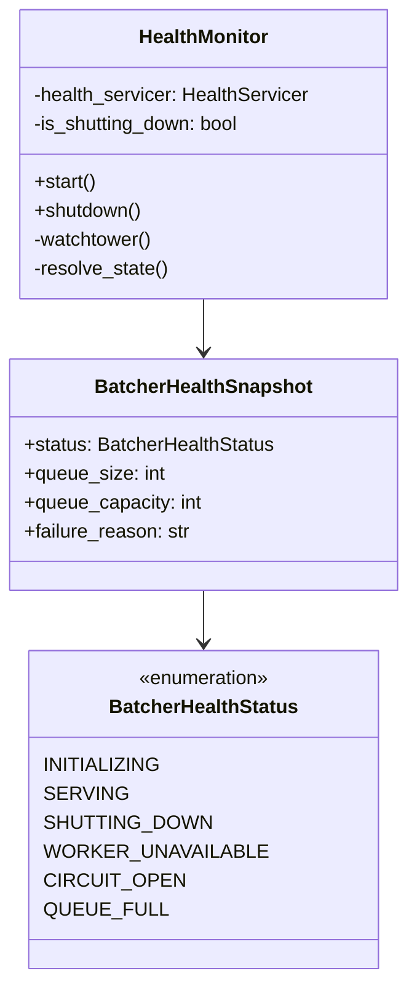

# Health Checks

This document explains how the Inference service monitors its own health and how you can check if it's working properly.

## Why Health Checks Matter

Health checks help you know:
- Is the service running?
- Can it process requests?
- Is it ready to handle traffic?

This is important for:
- **Monitoring** - Know when something goes wrong
- **Load balancing** - Route traffic only to healthy instances
- **Debugging** - Quickly identify what's broken

## How Health Checks Work

The service has a health monitor that polls every 5 seconds:



**What happens:**
1. Every 5 seconds, the monitor checks each model's health
2. If any model (except QUEUE_FULL) is not serving, the service reports `NOT_SERVING`
3. If all models are serving, the service reports `SERVING`
4. Health status is published to gRPC health service and metrics

## Health States

Each model reports one of these states:

| State | Meaning | gRPC Status | What Happens |
|-------|---------|-------------|--------------|
| `SERVING` | Normal operation | `SERVING` | Accepts predictions |
| `INITIALIZING` | Starting up | `NOT_SERVING` | Rejects predictions |
| `SHUTTING_DOWN` | Closing down | `NOT_SERVING` | Rejects predictions |
| `WORKER_UNAVAILABLE` | Worker crashed | `NOT_SERVING` | Rejects predictions |
| `QUEUE_FULL` | Too many waiting | `SERVING` (transient) | Rejects predictions |
| `CIRCUIT_OPEN` | Too many failures | `NOT_SERVING` | Rejects predictions |

**Important:** `QUEUE_FULL` intentionally does NOT flip health to `NOT_SERVING`. This keeps the load balancer sending traffic, and the service sheds load quickly with `RESOURCE_EXHAUSTED`.

## Health Check Classes



## Health Endpoints

| Endpoint | Port | What It Does |
|----------|------|--------------|
| `grpc.health.v1.Health/Check` | 50051 | gRPC health check |
| `grpc.health.v1.Health/Watch` | 50051 | gRPC health watch (streaming) |
| `/metrics` | 8333 | Prometheus metrics |

## External Health Check

```bash
# Check gRPC health
grpcurl -plaintext localhost:50051 grpc.health.v1.Health/Check

# Check metrics
curl http://localhost:8333/metrics
```

## Docker Health Checks

When running with Docker, the service includes health checks:

```yaml
# In docker-compose.yml
healthcheck:
  test: ["CMD", "grpc_health_probe", "-addr=:50051"]
  interval: 5s
  timeout: 3s
  retries: 12
  start_period: 10m
```

**What this means:**
- Check every 5 seconds
- Timeout after 3 seconds
- Fail after 12 consecutive failures
- Wait 10 minutes before first check (model loading time)

## Port Layout

| Service | Host Port | Container Port | Purpose |
|---------|-----------|----------------|---------|
| ai-service | 50051 | 50051 | gRPC API |
| ai-service | 8333 | 8333 | Prometheus metrics |

## Monitoring Health

### What to Monitor

| Metric | Warning | Critical |
|--------|---------|----------|
| Service up | Down > 1 min | Down > 2 min |
| Queue full | > 1 minute | > 5 minutes |
| Worker unavailable | Any occurrence | > 1 minute |
| Circuit open | > 30 seconds | > 2 minutes |

### Health Check Commands

```bash
# Check if service is responding
grpcurl -plaintext localhost:50051 grpc.health.v1.Health/Check

# Check metrics
curl http://localhost:8333/metrics

# Check Docker health status
docker ps --format "table {{.Names}}\t{{.Status}}"
```

## Startup and Shutdown

### Startup

The health monitor starts before the gRPC server:
1. `GRPCServer.start()` calls `health_monitor.start()` first
2. This ensures probes see `SERVING` immediately
3. Prevents `NOT_FOUND` errors during startup

### Shutdown

1. Sets `_is_shutting_down` flag
2. Publishes `NOT_SERVING shutdown_in_progress`
3. Cancels the watchtower task
4. Stops the gRPC server with 10-second grace period
5. Shuts down batchers

## Troubleshooting

### "Service reports NOT_SERVING"

**Possible causes:**
- Model is still loading (wait for startup to complete)
- Worker crashed (check logs)
- Queue is full (check queue metrics)
- Circuit is open (too many failures)

**Fix:**
- Check service logs for specific errors
- Verify model files are accessible
- Check system resources (memory, disk)

### "Health check timeout"

**Possible causes:**
- Service is overloaded
- Network issues
- Service is starting up

**Fix:**
- Wait for startup to complete (can take minutes for model loading)
- Check system resources
- Verify network connectivity

### "Docker health check failing"

**Possible causes:**
- Container not started
- Health check command not available
- Ports not correctly mapped

**Fix:**
- Check container logs: `docker logs <container-id>`
- Verify health check command works manually
- Ensure ports are correctly mapped

## Related Documentation

- [Configuration](../getting-started/configuration.md) - Health check settings
- [Observability](../operations/observability.md) - Metrics and alerts
- [Architecture](../concepts/architecture.md) - How health fits in the system
