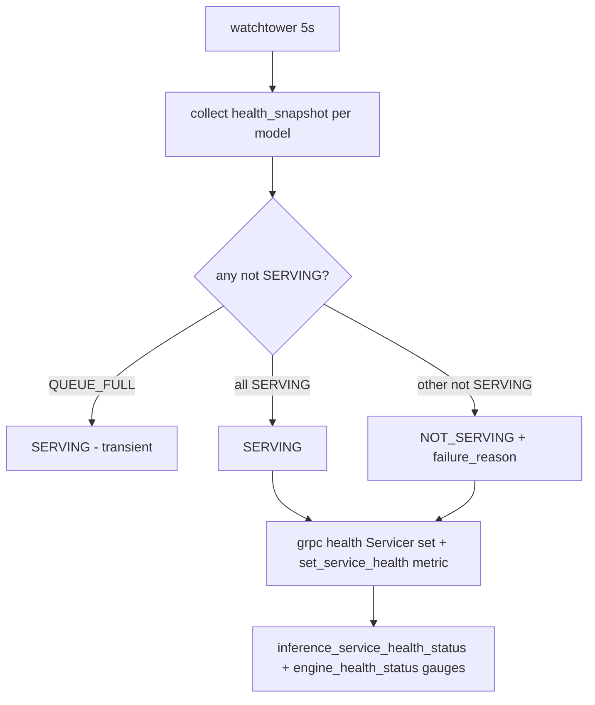
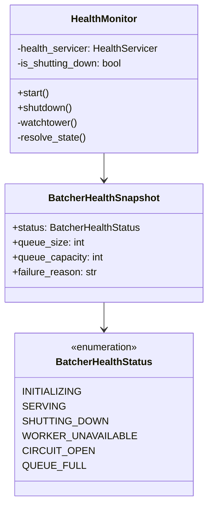

# Health Checks

This document explains how the Inference service monitors its own health and how you can check if it's working properly.

## Why Health Checks Matter

Health checks help you know:
- Is the service running?
- Can it process requests?
- Is it ready to handle traffic?

This is important for:
- **Monitoring** - Know when something goes wrong
- **Load balancing** - Route traffic only to healthy instances
- **Debugging** - Quickly identify what's broken

## How Health Checks Work

The service has a health monitor that polls every 5 seconds:


```mermaid
graph TB
    Watch[watchtower 5s] --> Snap[collect health_snapshot per model]
    Snap --> Resolve{any not SERVING?}
    Resolve -->|QUEUE_FULL| Keep[SERVING - transient]
    Resolve -->|other not SERVING| NotServe[NOT_SERVING + failure_reason]
    Resolve -->|all SERVING| Serve[SERVING]
    Serve --> Pub[grpc health Servicer set + set_service_health metric]
    NotServe --> Pub
    Pub --> Gauge[inference_service_health_status + engine_health_status gauges]
```

**What happens:**
1. Every 5 seconds, the monitor checks each model's health
2. If any model (except QUEUE_FULL) is not serving, the service reports `NOT_SERVING`
3. If all models are serving, the service reports `SERVING`
4. Health status is published to gRPC health service and metrics

## Health States

Each model reports one of these states:

| State | Meaning | gRPC Status | What Happens |
|-------|---------|-------------|--------------|
| `SERVING` | Normal operation | `SERVING` | Accepts predictions |
| `INITIALIZING` | Starting up | `NOT_SERVING` | Rejects predictions |
| `SHUTTING_DOWN` | Closing down | `NOT_SERVING` | Rejects predictions |
| `WORKER_UNAVAILABLE` | Worker crashed | `NOT_SERVING` | Rejects predictions |
| `QUEUE_FULL` | Too many waiting | `SERVING` (transient) | Rejects predictions |

**Important:** `QUEUE_FULL` intentionally does NOT flip health to `NOT_SERVING`. This keeps the load balancer sending traffic, and the service sheds load quickly with `RESOURCE_EXHAUSTED`.

> The enum in `src/domain/models.py` also defines a `CIRCUIT_OPEN` state, but no code path currently produces it (the circuit breaker is not wired up). You will not see it reported.

## Health Check Classes


```mermaid
classDiagram
    class BatcherHealthStatus {
        <<enumeration>>
        INITIALIZING
        SERVING
        SHUTTING_DOWN
        WORKER_UNAVAILABLE
        CIRCUIT_OPEN
        QUEUE_FULL
    }
    class BatcherHealthSnapshot {
        +status: BatcherHealthStatus
        +queue_size: int
        +queue_capacity: int
        +failure_reason: str
    }
    class HealthMonitor {
        -health_servicer: HealthServicer
        -is_shutting_down: bool
        +start()
        +shutdown()
        -watchtower()
        -resolve_state()
    }
    HealthMonitor --> BatcherHealthSnapshot
    BatcherHealthSnapshot --> BatcherHealthStatus
```

## Health Endpoints

| Endpoint | Port | What It Does |
|----------|------|--------------|
| `grpc.health.v1.Health/Check` | 50051 | gRPC health check |
| `grpc.health.v1.Health/Watch` | 50051 | gRPC health watch (streaming) |
| `/metrics` | 8333 | Prometheus metrics |

## External Health Check

```bash
# Check gRPC health
grpcurl -plaintext localhost:50051 grpc.health.v1.Health/Check

# Check metrics
curl http://localhost:8333/metrics
```

## Docker Health Checks

There are two layers of Docker health checking, and Compose overrides the image default.

**Image default** (`Dockerfile.local`, and `Dockerfile` without the `--start-period`):

```dockerfile
HEALTHCHECK --interval=30s --timeout=10s --retries=3 --start-period=60s \
    CMD /bin/grpc_health_probe -addr=:${GRPC_PORT:-50051}
```

**Compose override** (`infra/compose.yml`, the one that applies when you run `make inference-up`):

```yaml
healthcheck:
  test: ["CMD-SHELL", "/bin/grpc_health_probe -addr=:$${GRPC_PORT:-50051}"]
  interval: 30s
  timeout: 10s
  retries: 5
  start_period: 10m
  start_interval: 5s
```

**What this means:**
- During the first 10 minutes (`start_period`), failures do not count — this covers the slow HuggingFace model download
- After that, Docker polls every 5 seconds (`start_interval`), escalating to the normal 30-second `interval` once healthy
- Each probe times out after 10 seconds
- 5 consecutive failures mark the container `unhealthy`

The load-test stack (`infra/compose.load.yml`) polls faster — `interval: 5s`, `timeout: 10s`, `retries: 12` — because k6 needs quick readiness feedback. Don't confuse the two files.

## Port Layout

| Service | Host Port | Container Port | Purpose |
|---------|-----------|----------------|---------|
| ai-service | 50051 | 50051 | gRPC API |
| ai-service | 8333 | 8333 | Prometheus metrics |

## Monitoring Health

### What to Monitor

| Metric | Warning | Critical |
|--------|---------|----------|
| Service up | Down > 1 min | Down > 2 min |
| Queue full | > 1 minute | > 5 minutes |
| Worker unavailable | Any occurrence | > 1 minute |

### Health Check Commands

```bash
# Check if service is responding
grpcurl -plaintext localhost:50051 grpc.health.v1.Health/Check

# Check metrics
curl http://localhost:8333/metrics

# Check Docker health status
docker ps --format "table {{.Names}}\t{{.Status}}"
```

## Startup and Shutdown

### Startup

The health monitor is registered and published before the gRPC server starts accepting traffic:
1. `GRPCServer.start()` calls `health_monitor.start()` first, which publishes the current state and starts the 5s watchtower
2. The port is then bound and the server started
3. This prevents `NOT_FOUND` errors — the health service always has an answer, even during startup

### Shutdown

1. Sets `_is_shutting_down` flag
2. Publishes `NOT_SERVING shutdown_in_progress`
3. Cancels the watchtower task
4. Stops the gRPC server with 10-second grace period
5. Shuts down batchers

## Troubleshooting

### "Service reports NOT_SERVING"

**Possible causes:**
- Service is still starting up (`service_initializing`)
- Shutdown in progress (`shutdown_in_progress`)
- A model's batch worker crashed (`batch_worker_stopped`)

Note that a full queue is *not* a cause — `QUEUE_FULL` keeps the service `SERVING` on purpose.

**Fix:**
- Check service logs for specific errors
- Verify model files are accessible
- Check system resources (memory, disk)

### "Health check timeout"

**Possible causes:**
- Service is overloaded
- Network issues
- Service is starting up

**Fix:**
- Wait for startup to complete (can take minutes for model loading)
- Check system resources
- Verify network connectivity

### "Docker health check failing"

**Possible causes:**
- Container not started
- Health check command not available
- Ports not correctly mapped

**Fix:**
- Check container logs: `docker logs <container-id>`
- Verify health check command works manually
- Ensure ports are correctly mapped

## Related Documentation

- [Configuration](../getting-started/configuration.md) - Health check settings
- [Observability](../operations/observability.md) - Metrics and alerts
- [Architecture](../concepts/architecture.md) - How health fits in the system
