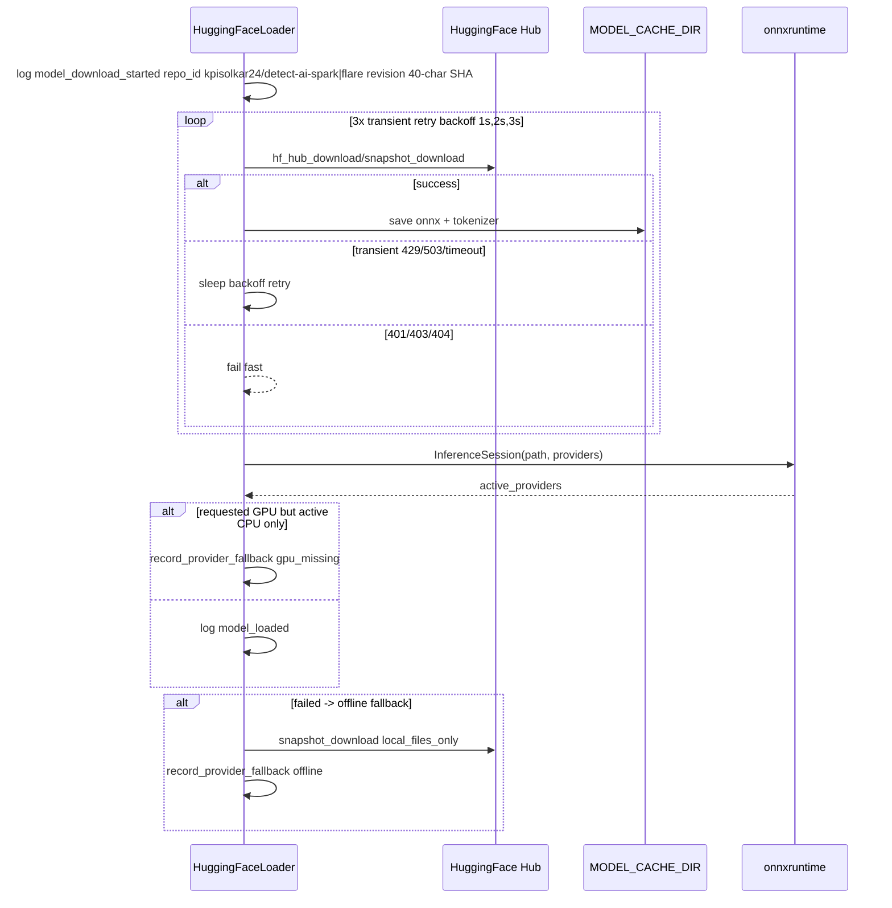
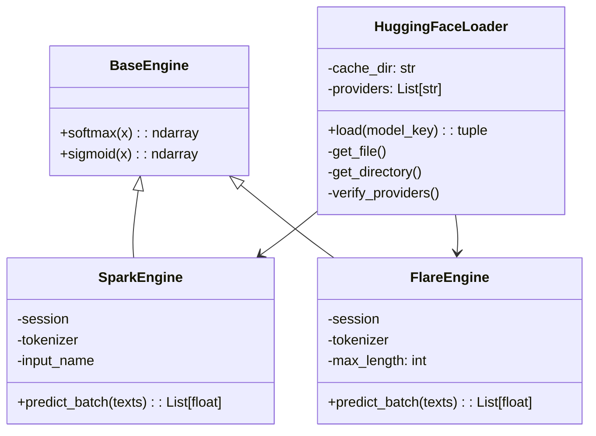

# Models

This document explains how the Inference service loads and uses machine learning models to detect AI-generated text.

## What are the Models?

The Inference service uses two ONNX models to detect AI-generated text:

| Model | Type | Best For | Speed |
|-------|------|----------|-------|
| **Spark** | TF-IDF + ONNX | Short texts, quick analysis | Fast |
| **Flare** | BERT + ONNX | Long documents, detailed analysis | Slower |

Both models output a probability (0-1) indicating how likely the text is AI-generated.

## How Models are Loaded

### Loading Sequence



**What happens:**
1. Service starts and creates a `HuggingFaceLoader`
2. Loader downloads models from HuggingFace Hub (or uses cache)
3. Models are loaded into ONNX Runtime
4. If GPU is requested but unavailable, falls back to CPU
5. If network fails, tries offline cache

### Model Repositories

| Model | Repository | Files |
|-------|------------|-------|
| Spark | `kpisolkar24/detect-ai-spark` | `detect-ai-spark.onnx` + `detect-ai-spark-tokenizer.pkl` |
| Flare | `kpisolkar24/detect-ai-flare` | `model.onnx` + `BertTokenizerFast` |

**Revisions:** Models are pinned to specific git SHAs for reproducibility.

### Caching

Models are cached in `MODEL_CACHE_DIR` (default: `./models`). This means:
- First run downloads models (requires internet)
- Subsequent runs use cached models (fast)
- In production, mount this directory as a volume/EBS to avoid re-downloading

## How Models Work

### SparkEngine



**How Spark works:**
1. Tokenizer transforms text to TF-IDF vectors: `tokenizer.transform(texts).toarray()`
2. Vectors are fed to ONNX model
3. Output is processed: handles shapes `(N,)`, `(N,1)`, `(N,2)` via `sigmoid`/`softmax`
4. Probability is clipped to 0-1

**Best for:** Short texts, quick analysis, lower resource usage.

### FlareEngine

**How Flare works:**
1. Tokenizer processes text: `tokenizer(..., padding, truncation, max_length=256)`
2. Token IDs are fed to ONNX model as int64 inputs
3. Output is processed to get probability
4. Probability is clipped to 0-1

**Best for:** Long documents, more accurate analysis, uses BERT embeddings.

## Security

### Safe Deserialization

The Spark model uses a pickle tokenizer. To prevent security risks, the service uses a `RestrictedUnpickler` that only allows:
- `sklearn`
- `scipy`
- `numpy`
- `builtins`
- `collections`
- `copyreg`

This prevents arbitrary code execution from malicious pickle files.

### Provider Verification

The service verifies that the requested inference provider is actually available:

```python
# If you request GPU but only CPU is available:
# Warning: gpu_provider_unavailable_falling_back_to_cpu
# Metric: inference_engine_provider_fallback_total{trigger=gpu_missing}
```

### Offline Fallback

If network access fails, the service tries to load models from the local cache:
1. Attempt normal download
2. If network fails, try `local_files_only=True`
3. Record provider fallback with trigger `offline`

## Configuration

| Setting | Default | Description |
|---------|---------|-------------|
| `MODEL_CACHE_DIR` | `./models` | Where models are cached |
| `HF_TOKEN` | (empty) | HuggingFace token for private repos |
| `SPARK_MODEL_REVISION` | `9a4800...` | Pinned Spark model revision |
| `FLARE_MODEL_REVISION` | `e1911c...` | Pinned Flare model revision |
| `INFERENCE_PROVIDERS` | `CPUExecutionProvider` | Inference providers to use |

## Monitoring

| Metric | What It Tells You |
|--------|-------------------|
| `inference_engine_health_status` | Current health of each model |
| `inference_engine_provider_fallback_total` | Provider fallbacks (GPU→CPU) |
| `model_batch_processing_seconds` | Time to process batches |

## Troubleshooting

### "Model download failed"

**Cause:** Cannot reach HuggingFace Hub.

**Fix:**
- Check internet connectivity
- Verify `HF_TOKEN` if using private repos
- Check `MODEL_CACHE_DIR` has sufficient disk space

### "GPU provider unavailable"

**Cause:** Requested CUDA but only CPU is available.

**Fix:**
- Check NVIDIA drivers are installed
- Verify Docker has GPU access: `docker run --rm --gpus all nvidia/cuda:11.0-base nvidia-smi`
- Use `INFERENCE_PROVIDERS=CPUExecutionProvider` for CPU-only

### "Model loading slow"

**Cause:** First run downloading models.

**Fix:**
- This is normal on first run
- Models are cached after first download
- Pre-download models in production: mount `MODEL_CACHE_DIR` as volume

## Related Documentation

- [Architecture](../concepts/architecture.md) - How models fit in the system
- [Batching](../concepts/batching.md) - How model predictions are batched
- [Configuration](../getting-started/configuration.md) - Model settings
