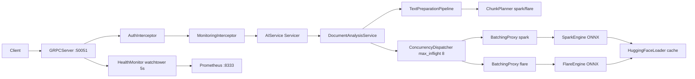
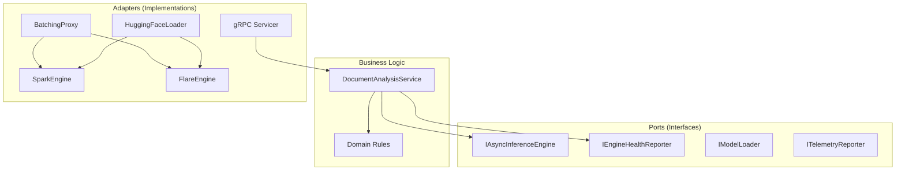
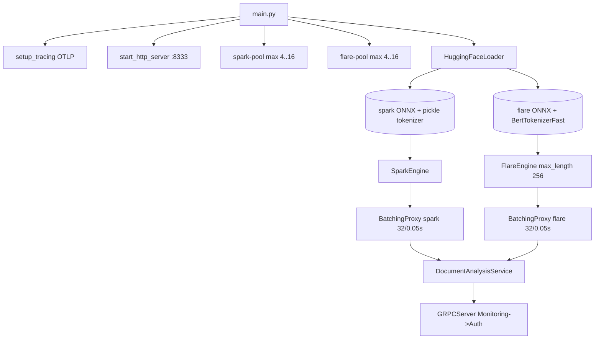

# Architecture

This document explains how the Inference service is structured and why it's designed this way.

## Overview

The Inference service detects AI-generated text. It's built as a single program that:

1. Accepts text via gRPC requests
2. Splits text into chunks for processing
3. Runs each chunk through an ML model
4. Aggregates results into a final score
5. Returns confidence scores with highlighted AI sections



**Key points:**
- Single gRPC port `50051`, metrics port `8333`
- Two isolated models prevent starvation (slow model doesn't block fast model)
- `QUEUE_FULL` sheds load with `RESOURCE_EXHAUSTED`, not `NOT_SERVING`

## How the Code is Organized

The service uses "hexagonal architecture" (also called "ports and adapters"). This means:

- **Business logic** is in the center (the "hexagon")
- **External systems** (ML models, gRPC) connect through "ports"
- Each external system has an "adapter" that connects it to the business logic



**Why this pattern?**
- Easy to test (can swap real ML models with fakes)
- Easy to change external systems (swap ONNX for PyTorch)
- Business logic stays clean and focused

## Project Structure

```
inference/
├── src/
│   ├── main.py                          # Application entry point
│   ├── domain/                          # Business rules
│   │   ├── models.py                    # Core data structures
│   │   └── exceptions.py                # Error types
│   ├── application/                     # Business logic
│   │   ├── ports/                       # Interfaces
│   │   │   ├── inbound/                 # What the service can do
│   │   │   └── outbound/                # What the service needs
│   │   └── services/                    # Business logic implementations
│   │       ├── document_analysis.py     # Core use case
│   │       ├── text_pipeline.py         # Text processing
│   │       ├── validation.py            # Input validation
│   │       ├── aggregation.py           # Result aggregation
│   │       ├── dispatcher.py            # Request dispatching
│   │       └── chunking/               # Text chunking
│   ├── adapters/                        # External connections
│   │   ├── inbound/grpc/               # gRPC API handler
│   │   └── outbound/inference/         # ML model adapters
│   └── infrastructure/                  # Cross-cutting concerns
│       ├── config/                     # Settings
│       ├── composition/                # Dependency injection
│       ├── metrics.py                  # Prometheus metrics
│       └── tracing.py                  # OpenTelemetry tracing
├── protos/                             # gRPC API definition
├── tests/                              # Test files
├── load/                               # Load testing
├── infra/                              # Docker Compose files
├── Dockerfile                          # Production image
├── Dockerfile.local                    # Local dev image
├── Makefile                            # Build commands
└── pyproject.toml                      # Python dependencies
```

## How the Service Starts

When the service starts, it:

1. **Loads configuration** from environment variables
2. **Sets up tracing** (OpenTelemetry, if configured)
3. **Starts metrics server** on port `8333`
4. **Loads ML models** from HuggingFace (or cache)
5. **Creates batchers** for each model
6. **Starts gRPC server** on port `50051`
7. **Starts health monitor** (polls every 5 seconds)



## Key Components

### DocumentAnalysisService

The core business logic. It:
- Validates input text
- Plans chunks using the appropriate tokenizer
- Dispatches chunks to the correct model
- Aggregates results into a final score

### BatchingProxy

Batches individual chunk predictions into efficient batch operations. It:
- Queues incoming predictions
- Collects up to 32 items within 50ms
- Runs batch predictions on a thread pool
- Reports health status

### TextPreparationPipeline

Processes input text through:
1. **Validation** - Checks text is valid and within limits
2. **Chunking** - Splits text into manageable pieces

### ConcurrencyDispatcher

Manages parallel chunk processing with a semaphore (max 8 concurrent chunks). It:
- Creates tasks for each chunk
- Yields results as they complete
- Handles timeouts (30s per chunk)

### ResultAggregator

Combines chunk probabilities into a final score. It:
- Uses weighted averaging (first chunk gets more weight)
- Builds highlight spans showing AI-generated sections
- Merges adjacent spans with the same label

## Why This Design?

| Benefit | Explanation |
|---------|-------------|
| **Testability** | Can test business logic without real ML models |
| **Flexibility** | Can swap models without changing business logic |
| **Performance** | Batching and concurrency maximize throughput |
| **Reliability** | Health checks and load shedding prevent cascading failures |
| **Observability** | Metrics and tracing provide visibility into behavior |

## Next Steps

- [Request Flows](request-flows.md) - See how requests are processed
- [Chunking](chunking.md) - How text is split into chunks
- [Batching](batching.md) - How requests are batched for efficiency
- [Configuration](../getting-started/configuration.md) - Learn about settings
