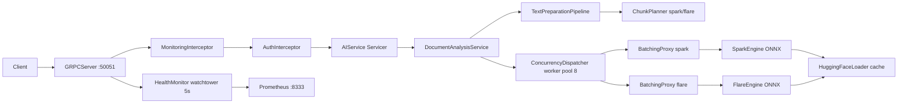
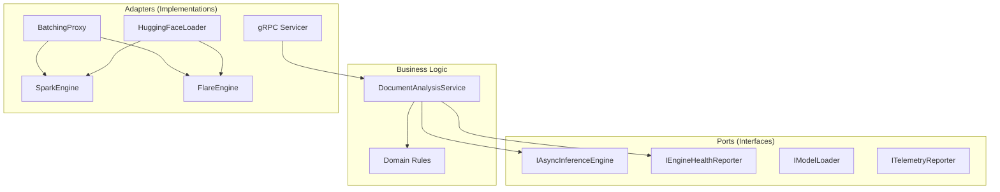
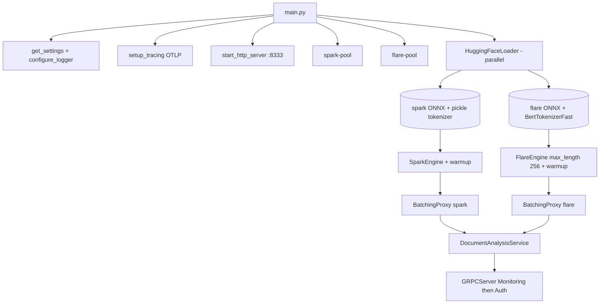

# Architecture

This document explains how the Inference service is structured and why it's designed this way.

## Overview

The Inference service detects AI-generated text. It's built as a single program that:

1. Accepts text via gRPC requests
2. Splits text into chunks for processing
3. Runs each chunk through an ML model
4. Aggregates results into a final score
5. Returns confidence scores with highlighted AI sections


```mermaid
graph LR
    Client --> GRPC[GRPCServer :50051]
    GRPC --> Mon[MonitoringInterceptor]
    Mon --> Auth[AuthInterceptor]
    Auth --> Svc[AIService Servicer]
    Svc --> DAS[DocumentAnalysisService]
    DAS --> Prep[TextPreparationPipeline]
    Prep --> Planner[ChunkPlanner spark/flare]
    DAS --> Disp[ConcurrencyDispatcher worker pool 8]
    Disp --> BP_S[BatchingProxy spark]
    Disp --> BP_F[BatchingProxy flare]
    BP_S --> Eng_S[SparkEngine ONNX]
    BP_F --> Eng_F[FlareEngine ONNX]
    Eng_S --> Loader[HuggingFaceLoader cache]
    Eng_F --> Loader
    GRPC --> Health[HealthMonitor watchtower 5s]
    Health --> Metrics[Prometheus :8333]
```

**Key points:**
- Interceptors run in registration order: **Monitoring first, then Auth**, so every request (including rejected ones) is counted before auth decides.
- Single gRPC port `50051`, metrics port `8333`
- Two isolated models prevent starvation (slow model doesn't block fast model)
- `QUEUE_FULL` sheds load with `RESOURCE_EXHAUSTED`, not `NOT_SERVING`

## How the Code is Organized

The service uses "hexagonal architecture" (also called "ports and adapters"). This means:

- **Business logic** is in the center (the "hexagon")
- **External systems** (ML models, gRPC) connect through "ports"
- Each external system has an "adapter" that connects it to the business logic


```mermaid
graph TB
    subgraph "Business Logic"
        Service[DocumentAnalysisService]
        Domain[Domain Rules]
    end
    
    subgraph "Ports (Interfaces)"
        Inference[IAsyncInferenceEngine]
        Health[IEngineHealthReporter]
        Loader[IModelLoader]
        Telemetry[ITelemetryReporter]
    end
    
    subgraph "Adapters (Implementations)"
        Batch[BatchingProxy]
        Spark[SparkEngine]
        Flare[FlareEngine]
        HF[HuggingFaceLoader]
        GRPC[gRPC Servicer]
    end
    
    Service --> Domain
    Service --> Inference
    Service --> Health
    Batch --> Spark
    Batch --> Flare
    HF --> Spark
    HF --> Flare
    GRPC --> Service
```

**Why this pattern?**
- Easy to test (can swap real ML models with fakes)
- Easy to change external systems (swap ONNX for PyTorch)
- Business logic stays clean and focused

## Project Structure

```
inference/
├── src/
│   ├── main.py                          # Application entry point
│   ├── generated/                       # gRPC stubs (gitignored, built by `make proto`)
│   ├── domain/                          # Business rules
│   │   ├── models.py                    # Core data structures
│   │   └── exceptions.py                # Error types
│   ├── application/                     # Business logic
│   │   ├── ports/                       # Interfaces
│   │   │   ├── inbound/                 # What the service can do
│   │   │   └── outbound/                # What the service needs
│   │   └── services/                    # Business logic implementations
│   │       ├── document_analysis.py     # Core use case
│   │       ├── text_pipeline.py         # Text processing
│   │       ├── validation.py            # Input validation
│   │       ├── aggregation.py           # Result aggregation
│   │       ├── dispatcher.py            # Chunk worker pool
│   │       └── chunking/               # Text chunking (BERT + regex + sliding window)
│   ├── adapters/                        # External connections
│   │   ├── inbound/grpc/               # gRPC servicer, interceptors, health
│   │   └── outbound/inference/          # ML model adapters
│   │       ├── batcher.py              # BatchingProxy
│   │       ├── batching/               # Batch processing
│   │       ├── engines/                # SparkEngine, FlareEngine, logit decoding
│   │       ├── loader.py               # HuggingFace download + ONNX session
│   │       └── loading/                # Session options, safe unpickle, HF client
│   └── infrastructure/                  # Cross-cutting concerns
│       ├── config/                     # Settings (dev/prod) + AWS loader
│       ├── composition/                # Dependency injection (container, executors)
│       ├── metrics.py                  # Prometheus metrics
│       ├── tracing.py                  # OpenTelemetry tracing
│       └── log_setup.py                # structlog JSON setup
├── protos/                             # gRPC API definition
├── tests/                              # Test files
├── load/                               # Load testing
├── infra/                              # Docker Compose files + .env.example
├── docs/                               # This documentation set
├── Dockerfile                          # GPU image (CUDA 12.4)
├── Dockerfile.local                    # Local CPU image
├── Makefile                            # Build commands
└── pyproject.toml                      # Python dependencies
```

## How the Service Starts

When the service starts, it:

1. **Loads and validates configuration** from environment/AWS (`get_settings()`)
2. **Configures structured logging** (JSON to stdout)
3. **Creates thread pools** for each model (`spark-pool`, `flare-pool`)
4. **Sets up tracing** (OpenTelemetry, only if `OTEL_EXPORTER_OTLP_ENDPOINT` is set)
5. **Starts metrics server** on port `8333`
6. **Loads both ML models in parallel** from HuggingFace (or local cache)
7. **Warms up each engine** with one dummy inference (skipped when `ORT_WARMUP_ENABLED=false`)
8. **Wraps the engines in batchers** and starts them
9. **Starts gRPC server** on port `50051`, with the health monitor started first so probes never see `NOT_FOUND`
10. **Health monitor polls** every 5 seconds

If any step throws, the process logs `startup_failed` at CRITICAL and exits with status 1.


```mermaid
graph TB
    Main[main.py] --> Cfg[get_settings + configure_logger]
    Main --> Trace[setup_tracing OTLP]
    Main --> MetricsStart[start_http_server :8333]
    Main --> ExecS[spark-pool]
    Main --> ExecF[flare-pool]
    Main --> Loader2[HuggingFaceLoader - parallel]
    Loader2 --> SparkRes[(spark ONNX + pickle tokenizer)]
    Loader2 --> FlareRes[(flare ONNX + BertTokenizerFast)]
    SparkRes --> SparkRaw[SparkEngine + warmup]
    FlareRes --> FlareRaw[FlareEngine max_length 256 + warmup]
    SparkRaw --> BPS[BatchingProxy spark]
    FlareRaw --> BPF[BatchingProxy flare]
    BPS --> DAS2[DocumentAnalysisService]
    BPF --> DAS2
    DAS2 --> GRPC2[GRPCServer Monitoring then Auth]
```

## Key Components

### DocumentAnalysisService

The core business logic. It:
- Validates input text
- Plans chunks using the appropriate tokenizer
- Dispatches chunks to the correct model
- Aggregates results into a final score

### BatchingProxy

Batches individual chunk predictions into efficient batch operations. It:
- Queues incoming predictions (bounded queue, `BATCH_QUEUE_MAX_SIZE`)
- Collects up to `BATCH_SIZE` items within `BATCH_TIMEOUT` (defaults: 32 items / 50ms)
- Runs batch predictions on the model's thread pool, with up to `MAX_CONCURRENT_BATCHES` batches in flight
- Reports health status

Per-model overrides (`SPARK_BATCH_SIZE`, `FLARE_BATCH_TIMEOUT`, ...) let you tune each model independently; unset values fall back to `BATCH_SIZE`/`BATCH_TIMEOUT`.

### TextPreparationPipeline

Processes input text through:
1. **Validation** - Checks text is valid and within limits
2. **Chunking** - Splits text into manageable pieces

### ConcurrencyDispatcher

Runs chunks in parallel through a fixed worker pool (size `min(MAX_INFLIGHT_DOC_CHUNKS, chunk_count)`, default 8). It:
- Creates the worker pool once and feeds it a queue of chunk indexes, so at most `MAX_INFLIGHT_DOC_CHUNKS` chunks are in flight at any time
- Yields results as they complete, in completion order
- Enforces a 30-second timeout per chunk and validates the engine returns a probability in `[0, 1]`
- Cancels the remaining workers on the first failure or when the client disconnects

### ResultAggregator

Combines chunk probabilities into a final score. It:
- Uses weighted averaging (first chunk gets more weight)
- Builds highlight spans showing AI-generated sections
- Merges adjacent spans with the same label

## Why This Design?

| Benefit | Explanation |
|---------|-------------|
| **Testability** | Can test business logic without real ML models |
| **Flexibility** | Can swap models without changing business logic |
| **Performance** | Batching and concurrency maximize throughput |
| **Reliability** | Health checks and load shedding prevent cascading failures |
| **Observability** | Metrics and tracing provide visibility into behavior |

## Next Steps

- [Request Flows](request-flows.md) - See how requests are processed
- [Chunking](chunking.md) - How text is split into chunks
- [Batching](batching.md) - How requests are batched for efficiency
- [Configuration](../getting-started/configuration.md) - Learn about settings
