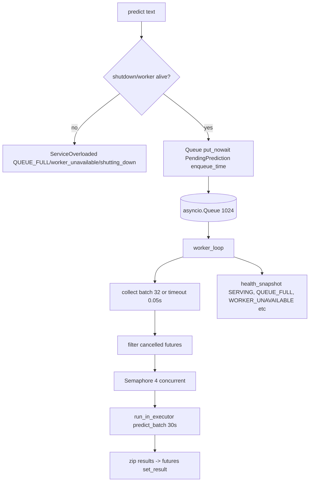
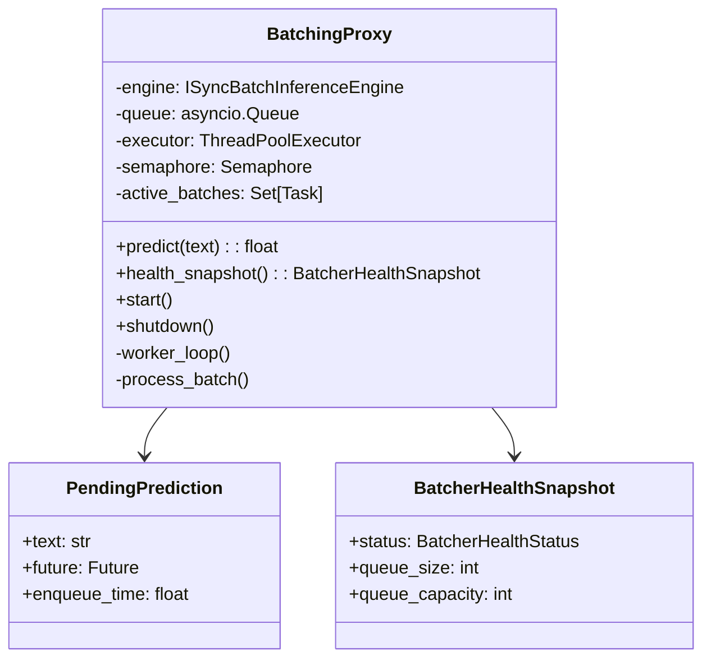

# Batching

This document explains how the Inference service batches multiple chunk predictions for efficient processing.

## What is Batching?

Instead of running each chunk prediction one at a time (slow), the service collects multiple predictions and runs them together (fast). This is like shopping: instead of going to the store for each item, you collect a list and buy everything at once.

**Why batch?**
- GPU/CPU overhead is reduced when processing multiple items together
- Better utilization of hardware resources
- Higher throughput with the same hardware

## How Batching Works

### The Flow



**What happens:**
1. Client calls `predict(text)`
2. If the service is shutting down or the worker is dead, reject immediately
3. Add the prediction to a queue (max 1024 items)
4. Worker collects up to 32 items within 50ms
5. Cancelled predictions are filtered out
6. Batch is processed on a thread pool (max 4 concurrent batches)
7. Each batch has a 30-second timeout
8. Results are sent back to waiting clients

### The Worker Loop

The worker runs continuously in the background:

1. Wait for items in the queue
2. Collect items until:
   - Batch size reached (32 items), OR
   - Timeout reached (50ms), OR
   - Queue is empty
3. Process the batch
4. Repeat

**Why 50ms timeout?** This balances latency (how fast individual predictions are) vs throughput (how many predictions per second). A longer timeout means more items per batch but slower individual responses.

### Concurrency Control

The service uses two levels of concurrency control:

| Level | Limit | Purpose |
|-------|-------|---------|
| Queue size | 1024 | Maximum waiting predictions |
| Concurrent batches | 4 | Maximum simultaneous GPU/CPU operations |

**Why limit concurrent batches?** Running too many batches simultaneously can overload the GPU/CPU and actually slow things down.

## Health Status

The batcher reports its health status:

```python
if shutdown_flag: SHUTTING_DOWN
elif worker_task is None: INITIALIZING
elif worker_task.done(): WORKER_UNAVAILABLE
elif queue.full(): QUEUE_FULL
else: SERVING
```

| Status | Meaning | What Happens |
|--------|---------|--------------|
| `SERVING` | Normal operation | Accepts predictions |
| `INITIALIZING` | Starting up | Rejects predictions |
| `SHUTTING_DOWN` | Closing down | Rejects predictions |
| `WORKER_UNAVAILABLE` | Worker crashed | Rejects predictions |
| `QUEUE_FULL` | Too many waiting | Rejects predictions |

**Important:** `QUEUE_FULL` does NOT flip the gRPC health status to `NOT_SERVING`. The service keeps accepting traffic but sheds load quickly with `RESOURCE_EXHAUSTED`.

## Shutdown

When the service shuts down:

1. Set `shutdown_flag`
2. Try to deliver a shutdown sentinel to the worker (retry 5 times if queue full)
3. Wait up to 5 seconds for the worker to finish
4. Wait up to 35 seconds for active batches to complete
5. Drain remaining queue items and reject them with `ServiceOverloadedError`

**Why drain the queue?** Clients waiting for results should get a clean error instead of hanging forever.

## Class View



## Configuration

| Setting | Default | Description |
|---------|---------|-------------|
| `BATCH_SIZE` | 32 | Items per batch (1..512) |
| `BATCH_TIMEOUT` | 0.05 | Batch linger time in seconds (0..10) |
| `BATCH_QUEUE_MAX_SIZE` | 1024 | Max queue size (1..10000) |
| `MAX_CONCURRENT_BATCHES` | 4 | Concurrent ONNX runs (1..32) |

## Monitoring

| Metric | What It Tells You |
|--------|-------------------|
| `model_batch_size` | Distribution of batch sizes |
| `model_batch_queue_size` | Items waiting in queue |
| `model_batch_queue_wait_seconds` | Time items wait in queue |
| `model_batch_processing_seconds` | Time to process batches |
| `inference_batch_queue_rejected_total` | Rejected predictions |
| `inference_batch_errors_total` | Batch processing errors |

## Troubleshooting

**Predictions timing out?**
- Check if the queue is full (`model_batch_queue_size`)
- Check if batches are processing slowly (`model_batch_processing_seconds`)
- Increase `BATCH_SIZE` or `BATCH_TIMEOUT`

**High latency?**
- Check `model_batch_queue_wait_seconds` - items waiting too long?
- Check `model_batch_processing_seconds` - batches taking too long?
- Reduce `MAX_CONCURRENT_BATCHES` if GPU/CPU is overloaded

**Queue full errors?**
- Check `BATCH_QUEUE_MAX_SIZE` - increase if needed
- Check if the worker is running (`health_snapshot()`)
- Check model performance

## Next Steps

- [Chunking](chunking.md) - How text is split into chunks
- [Health](../components/health.md) - How health status is monitored
- [Observability](../operations/observability.md) - Metrics and alerts
