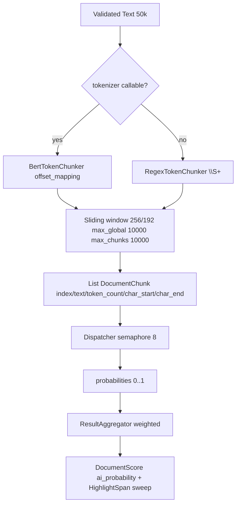
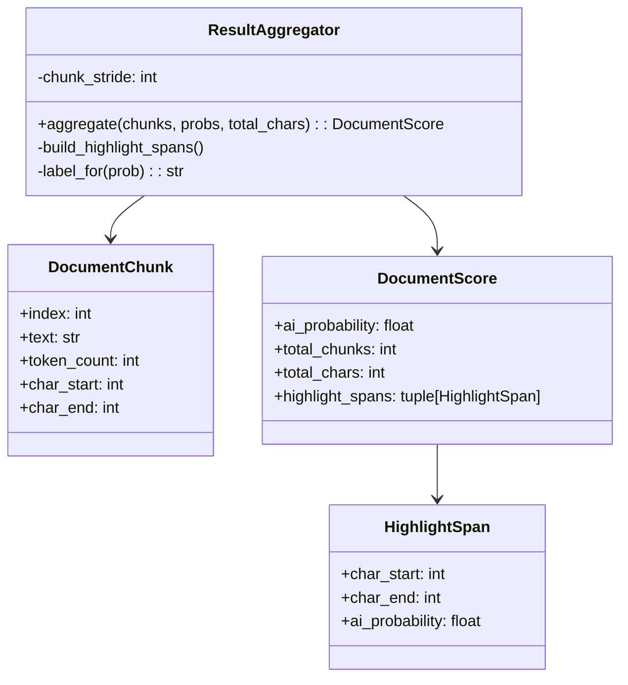

# Chunking & Aggregation

This document explains how the Inference service splits text into chunks for analysis and combines the results.

## What is Chunking?

ML models can only process a fixed amount of text at once (like reading a book one page at a time). Chunking splits long text into smaller pieces that the model can handle, then combines the results.

**Why chunk?**
- Models have a maximum input size (256 tokens for our models)
- Processing the entire document at once would fail
- Chunking allows us to analyze documents of any length

## How Chunking Works

### The Pipeline



**What happens:**
1. Text is validated (not empty, within limits)
2. A tokenizer splits text into tokens
3. A sliding window creates chunks with overlap
4. Each chunk is sent to the model
5. Results are aggregated into a final score

### Tokenizers

The service uses two types of tokenizers:

| Tokenizer | When Used | How It Works |
|-----------|-----------|--------------|
| **BertTokenChunker** | Flare model (callable tokenizer) | Uses HuggingFace tokenizer with `return_offsets_mapping=True` |
| **RegexTokenChunker** | Spark model (pickle tokenizer) | Splits on whitespace using regex `\S+` |

The tokenizer is selected automatically based on the model:
- If the tokenizer is callable (like Flare's BERT tokenizer), use `BertTokenChunker`
- Otherwise (like Spark's pickle tokenizer), use `RegexTokenChunker`

### Sliding Window

The sliding window creates overlapping chunks:

```
Chunk size: 256 tokens
Stride: 192 tokens (overlap: 64 tokens)

Text: [token1, token2, ..., token1000]

Chunk 1: [token1, ..., token256]
Chunk 2: [token193, ..., token448]   (starts at stride)
Chunk 3: [token385, ..., token640]
...
```

**Why overlap?** Overlapping chunks ensure context at chunk boundaries isn't lost. The model sees the same text from different perspectives.

**Limits:**
- Maximum 10,000 global tokens per request
- Maximum 10,000 chunks per request
- If exceeded, the service returns an error

### Fallback

If tokenization produces no chunks but the text is non-empty, a single chunk covering the entire text is created. This handles edge cases with unusual text.

## Validation

The `ChunkPlanner` validates:
- `stride <= chunk_size` (overlap can't exceed chunk size)
- `chunk_size > 0`
- `max_global_tokens > 0`
- Total tokens don't exceed `max_global_tokens`
- Total chunks don't exceed `max_chunks` (10,000)

## Aggregation

After all chunks are processed, results are combined into a final score.

### How Weighted Averaging Works



**Weight calculation:**
- First chunk: `weight = token_count` (full weight)
- Other chunks: `weight = min(stride, token_count)` (partial weight)

**Final score:** `ai_prob = sum(weight * prob) / sum(weight)`

**Why weighted?** The first chunk gets more weight because it typically contains the introduction/main topic.

### Highlight Spans

The aggregator also creates highlight spans showing which parts of the text are likely AI-generated:

1. Sort chunks by `char_start`
2. Find all boundaries (start/end positions)
3. For each boundary region, average the probabilities of overlapping chunks
4. Merge adjacent spans with the same label (`AI` or `Human`)
5. Use length-weighted probability for merged spans

**Example:**
```
Text: "Hello world. This is AI generated text. More human text."
Chunks: [
  (0-12, prob=0.1),    # "Hello world."
  (13-40, prob=0.9),   # "This is AI generated text."
  (41-60, prob=0.2)    # "More human text."
]
Spans: [
  (0-12, "Human", 0.1),
  (13-40, "AI", 0.9),
  (41-60, "Human", 0.2)
]
```

## Configuration

| Setting | Default | Description |
|---------|---------|-------------|
| `CHUNK_TOKEN_LIMIT` | 256 | Tokens per chunk |
| `CHUNK_TOKEN_STRIDE` | 192 | Overlap between chunks |
| `MAX_GLOBAL_TOKENS` | 10,000 | Max tokens per request |
| `MAX_TEXT_CHARS` | 50,000 | Max input characters |

## Next Steps

- [Batching](batching.md) - How chunks are batched for efficiency
- [Request Flows](request-flows.md) - How requests move through the system
- [Configuration](../getting-started/configuration.md) - Learn about settings
