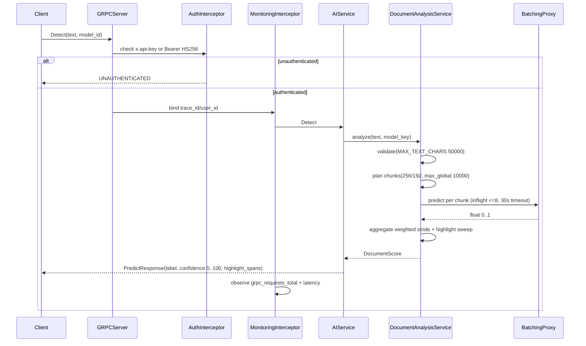
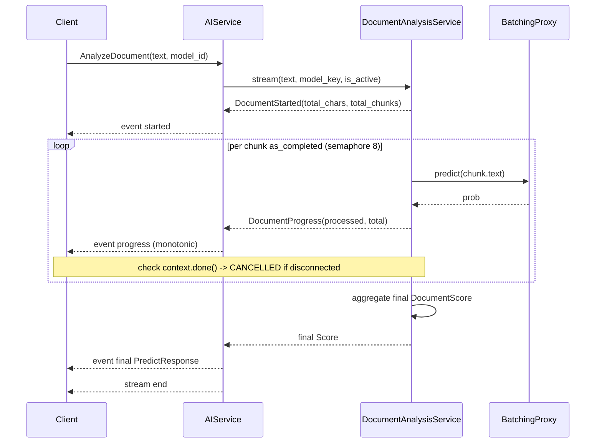

# Request Flows

This document explains how user requests are processed by the Inference service. We'll look at each main operation and see what happens step by step.

## Detect (Unary RPC)

When a user sends a short text for analysis, it's processed in a single request-response cycle.

**What happens:**

1. Client sends a `Detect` request with text and model ID
2. `AuthInterceptor` checks the API key or JWT token
3. `MonitoringInterceptor` binds trace ID and user ID
4. `DocumentAnalysisService.analyze()` is called
5. Text is validated (not empty, within 50,000 character limit)
6. Text is split into chunks (256 tokens each, 192 token overlap)
7. Each chunk is sent to the model (max 8 concurrent, 30s timeout per chunk)
8. Results are aggregated into a weighted score
9. Response is returned with label (`AI` or `Human`), confidence score, and highlight spans

**Why it's fast:** The batching proxy collects multiple chunks and runs them in parallel.

## AnalyzeDocument (Server-Streaming RPC)

When a user sends a long document, they get real-time progress updates.

**What happens:**

1. Client sends an `AnalyzeDocument` request
2. Service validates the text and plans chunks
3. First event: `started` with `total_chars` and `total_chunks`
4. For each chunk (as it completes):
   - Chunk is predicted
   - `progress` event is sent with `processed_chunks` and `total_chunks`
   - Progress is strictly increasing (monotonic)
5. Final event: `PredictResponse` with complete analysis
6. Stream ends

**Why streaming?** Users see progress in real-time instead of waiting for the entire analysis to complete.

## Error Handling

When something goes wrong, the service returns clear error messages:

| Path | Code | Meaning |
|------|------|---------|
| Unknown `model_id` or bad text | `INVALID_ARGUMENT` | Bad input from client |
| Queue full / worker dead / circuit open | `RESOURCE_EXHAUSTED` | Service overloaded, try later |
| Client disconnect | `CANCELLED` | Client stopped listening |
| Engine returned `NaN` or shape mismatch | `INTERNAL` | Something broke on the server |

**Important:** `RESOURCE_EXHAUSTED` does NOT flip the health status to `NOT_SERVING`. The service keeps accepting traffic but sheds load quickly.

## Summary

| Operation | How It Works | Speed |
|-----------|--------------|-------|
| Detect | Single request-response | Fast (depends on text length) |
| AnalyzeDocument | Stream with progress updates | Shows progress in real-time |

## Next Steps

- [Chunking](chunking.md) - How text is split into chunks
- [Batching](batching.md) - How chunks are batched for efficiency
- [Authentication](../components/auth.md) - How requests are authenticated
- [API Reference](../components/api.md) - Complete API documentation
