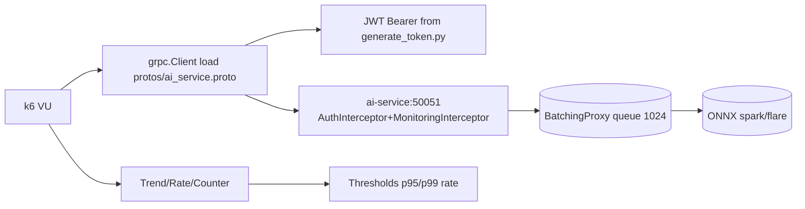
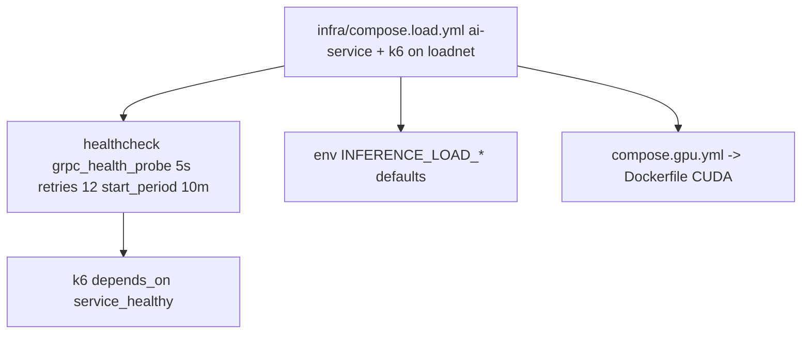
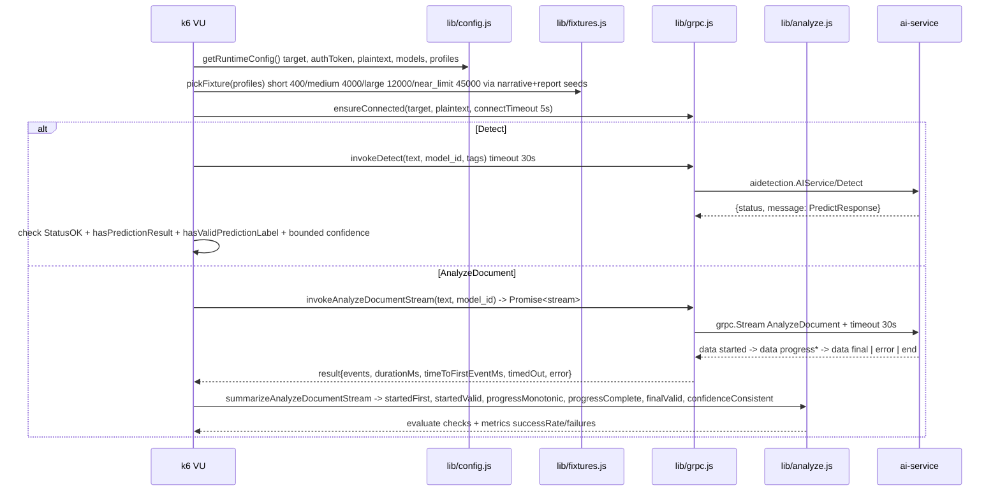

# Load Testing

Simple k6 gRPC load tests for the inference service. Uses `infra/compose.load.yml` to spin `ai-service + k6` isolated on `loadnet`, no dependency on the main stack. Auth via HS256 `Bearer` token generated from `AI_SERVICE_API_KEY` via `load/scripts/generate_token.py`.

## Scenarios

| Scenario | File | Executor | Stages / VUs | Thresholds | Payload |
|---|---|---|---|---|---|
| `smoke` | `scenarios/smoke.js` | `iterations:1` 1 VU | `1` iter, `rate==1` | `checks rate==1` | `Detect` short `spark`/`flare` |
| `detect` | `scenarios/detect.js` | `ramping-arrival-rate` | `30s:5,1m:10,30s:0` preAllocated `20` max `100` `startRate 1` | `p95<1500 p99<2500 rate>=0.99` | `Detect` `short/medium/large` random model |
| `analyze` | `scenarios/analyze.js` | `constant-vus` `6` VUs | `5m` graceful `30s` | `p95<5000 p99<10000 first_event<1500 rate>=0.99` | `AnalyzeDocument` stream `short/medium/large` |
| `soak` | `scenarios/soak.js` | `constant-vus` `2` VUs | `30m` graceful `1m` | `p95<7000 p99<12000 first_event<2000 rate>=0.99` | `AnalyzeDocument` soak |

All use tags `service:inference rpc:Detect|AnalyzeDocument` and check `grpc.StatusOK` + `hasPredictionResult` + `hasValidPredictionLabel` + bounded `0..100` confidence. Streaming scenarios validate `started` → monotonic `progress` → final `PredictResponse`.

## Quick Start

```bash
# from services/inference - self-contained (ai-service + k6), auto-generates Bearer token
make load-test SCENARIO=smoke GPU=0
make load-test SCENARIO=detect GPU=0 VUS=20 STAGES="30s:5,1m:10,30s:0" RPS=10 MAX_VUS=100
make load-test SCENARIO=analyze GPU=0 VUS=8 DURATION=10m
make load-test SCENARIO=soak GPU=1 VUS=3 DURATION=45m   # GPU=1 -> Dockerfile + CUDA
make load-down                                      # down -v

# aliases
make load-test-smoke GPU=0 VUS=1
make load-test-detect GPU=1
make load-test-analyze
make load-test-soak

# direct compose
docker compose -f infra/compose.load.yml up --abort-on-container-exit --exit-code-from k6
SCENARIO=detect docker compose -f infra/compose.load.yml up --abort-on-container-exit --exit-code-from k6
GPU=1 docker compose -f infra/compose.load.yml -f infra/compose.gpu.yml up --abort-on-container-exit --exit-code-from k6

# host-stack alternative (no self-contained)
INFERENCE_LOAD_AUTH_TOKEN=$(python3 load/scripts/generate_token.py --secret $AI_SERVICE_API_KEY) \
INFERENCE_LOAD_GRPC_TARGET=host.docker.internal:50051 \
docker run --rm -i --add-host host.docker.internal:host-gateway -v $(pwd)/../..:/workspace -w /workspace \
  -e INFERENCE_LOAD_GRPC_TARGET -e INFERENCE_LOAD_AUTH_TOKEN \
  grafana/k6 run load/scenarios/detect.js
```

Token is auto-generated in `Makefile:84` (`python3 load/scripts/generate_token.py --secret $AI_SERVICE_API_KEY` fallback `dev-secret-key-16chars-at-least`). Override via `INFERENCE_LOAD_AUTH_TOKEN=... make load-test`.

## Env

| Var | Default | Used |
|---|---|---|
| `INFERENCE_LOAD_GRPC_TARGET` | `ai-service:50051` (compose) or `host.docker.internal:PORT_INFERENCE` (host) | `lib/grpc.js` connect |
| `INFERENCE_LOAD_AUTH_TOKEN` | generated via `generate_token.py` from `AI_SERVICE_API_KEY` | `authorization: Bearer` |
| `INFERENCE_LOAD_GRPC_PLAINTEXT` | `true` | `grpc.Client` |
| `INFERENCE_LOAD_CONNECT_TIMEOUT` | `5s` | connect |
| `INFERENCE_LOAD_RPC_TIMEOUT` | `30s` | `invokeDetect` / stream `30s` deadline |
| `INFERENCE_LOAD_MODELS` | `spark,flare` | `lib/fixtures.js` round-robin `exec.scenario.iterationInTest % models.length` |
| `INFERENCE_LOAD_TEXT_PROFILES` | `short,medium,large` | `short 400`, `medium 4000`, `large 12000`, `near_limit 45000` from `fixtures/narrative.txt`+`report.txt` |
| `INFERENCE_LOAD_SMOKE_VUS` | `1` | `smoke` |
| `INFERENCE_LOAD_SMOKE_ITERATIONS` | `1` | `smoke` |
| `INFERENCE_LOAD_DETECT_START_RATE` | `1` | `ramping-arrival-rate` `startRate` |
| `INFERENCE_LOAD_DETECT_PREALLOCATED_VUS` | `20` (`VUS` maps here) | `detect` |
| `INFERENCE_LOAD_DETECT_MAX_VUS` | `100` (`MAX_VUS` maps) | `detect` |
| `INFERENCE_LOAD_DETECT_STAGES` | `30s:5,1m:10,30s:0` (`STAGES` maps) | `detect` |
| `INFERENCE_LOAD_DETECT_P95_MS` | `1500` | `detect` threshold |
| `INFERENCE_LOAD_DETECT_P99_MS` | `2500` | `detect` |
| `INFERENCE_LOAD_DETECT_MIN_SUCCESS_RATE` | `0.99` | `detect` |
| `INFERENCE_LOAD_ANALYZE_VUS` | `6` (`VUS` maps) | `analyze` |
| `INFERENCE_LOAD_ANALYZE_DURATION` | `5m` (`DURATION` maps) | `analyze` |
| `INFERENCE_LOAD_ANALYZE_GRACEFUL_STOP` | `30s` | `analyze` |
| `INFERENCE_LOAD_ANALYZE_P95_MS` | `5000` | `analyze` |
| `INFERENCE_LOAD_ANALYZE_P99_MS` | `10000` | `analyze` |
| `INFERENCE_LOAD_ANALYZE_FIRST_EVENT_P95_MS` | `1500` | `analyze` `time_to_first_event` |
| `INFERENCE_LOAD_ANALYZE_MIN_SUCCESS_RATE` | `0.99` | `analyze` |
| `INFERENCE_LOAD_SOAK_VUS` | `2` (`VUS` maps) | `soak` |
| `INFERENCE_LOAD_SOAK_DURATION` | `30m` (`DURATION` maps) | `soak` |
| `INFERENCE_LOAD_SOAK_GRACEFUL_STOP` | `1m` | `soak` |
| `INFERENCE_LOAD_SOAK_P95_MS` | `7000` | `soak` |
| `INFERENCE_LOAD_SOAK_P99_MS` | `12000` | `soak` |
| `INFERENCE_LOAD_SOAK_FIRST_EVENT_P95_MS` | `2000` | `soak` |
| `INFERENCE_LOAD_SOAK_MIN_SUCCESS_RATE` | `0.99` | `soak` |

Elegant `make` vars `VUS`/`RPS`/`STAGES`/`DURATION`/`MAX_VUS` map to the above (see `Makefile:72`). Specific `INFERENCE_LOAD_*` still work and override elegant vars.

## Architecture





## How it Works



- `lib/config.js:118` parses `stages` as `duration:target`, `parseDurationMs` handles `ms|s|m|h`, `readRatio` validates `0..1`.
- `lib/grpc.js:13` loads `../protos/ai_service.proto`, maintains singleton `grpc.Client`, handles `grpc.Stream` data/error/end + `30s` deadline that `closeClient()` on timeout.
- `lib/analyze.js:88` `summarizeAnalyzeDocumentStream` checks: `startedFirst`+`startedValid` (`total_chars`/`total_chunks` >0), `progressMonotonic`+`progressTotalsConsistent`+`progressWithinBounds`, `progressComplete` (last `processed==total`), `finalValid` (`hasPredictionResult` + `isBoundedPercentage` + `AI+Human≈100` + `confidence consistent`), `unknownEventCount==0`. Failure reason inferred as `timeout`, `grpc_*`, `started_invalid`, `progress_not_monotonic`, etc.
- `load/scripts/generate_token.py:14` builds `HS256` `sub=k6-load-tester` `iat` now `exp=iat+3600` via stdlib `hmac`+`base64.url_encode`.
- Custom k6 metrics: `inference_load_detect_duration` (`Trend`), `inference_load_detect_success_rate` (`Rate`), `inference_load_analyze_duration`, `inference_load_analyze_time_to_first_event`, `inference_load_analyze_success_rate`, plus `failures` counters tagged with `model`, `profile`, `status`, `reason`.

## When to Run

* **Smoke** (`make load-test SCENARIO=smoke`) before deploy — `1` iter, fail fast `fail()` if any check fails.
* **Detect spike** (`STAGES=30s:10,2m:20,30s:0` `VUS=20..100`) to verify `p95<1500` under burst and `BatchingProxy queue 1024` + `RESOURCE_EXHAUSTED` shedding (health stays `SERVING`).
* **Analyze stream** (`VUS=6..8` `5m`) to catch `first_event p95<1500` regressions, monotonic progress, and aggregation leaks for `large`/`near_limit` payloads.
* **Soak** (`VUS=2` `30m` `graceful 1m`) overnight to catch `onnxruntime` memory/CUDA leaks and `provider_fallback` if GPU unavailable.
* **Near-limit** (`INFERENCE_LOAD_TEXT_PROFILES=near_limit` `45000` chars, near `MAX_GLOBAL_TOKENS 10000`, `MAX_TEXT_CHARS 50000`) to exercise `Too many chunks >10000` guard and `per-chunk 30s` timeout.
* Use `GPU=1` variant to compare `CPUExecutionProvider` vs `CUDAExecutionProvider` throughput.

See `services/inference/README.md` for service config and `infra/compose.load.yml` for full env defaults.

