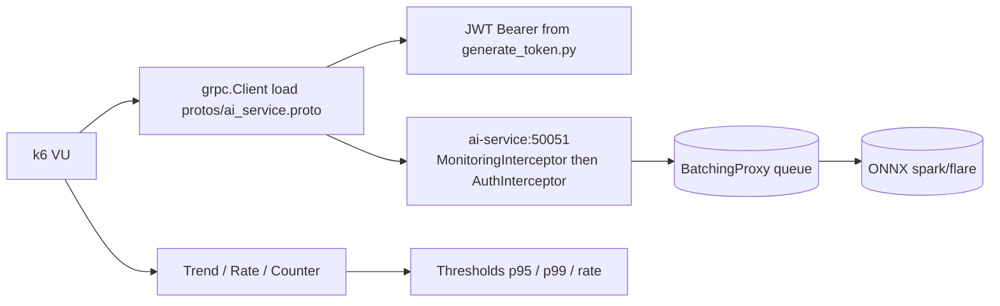
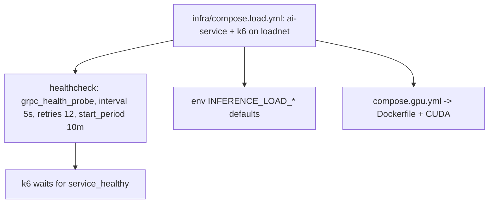
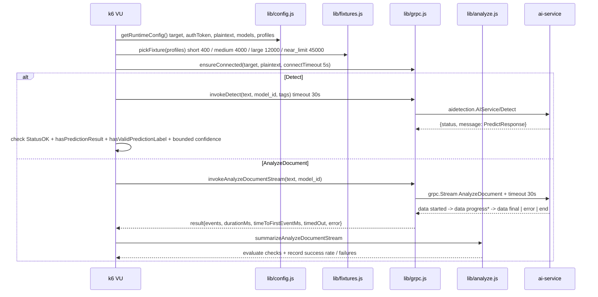

# Load Testing

k6-based gRPC load tests for the inference service. `infra/compose.load.yml` starts a self-contained `ai-service + k6` pair on a dedicated `loadnet` network, so nothing here depends on the main stack.

Authentication uses an HS256 `Bearer` token generated from the API key by `load/scripts/generate_token.py`.

Every command below runs from `services/inference`.

## Scenarios

| Scenario | File | Executor | Load profile | Key thresholds |
|---|---|---|---|---|
| `smoke` | `scenarios/smoke.js` | `iterations: 1`, 1 VU | Single iteration | all checks must pass |
| `detect` | `scenarios/detect.js` | `ramping-arrival-rate` | `30s:5, 1m:10, 30s:0`, preallocated 20 / max 100 VUs, `startRate 1` | `p95 < 1500ms`, `p99 < 2500ms`, success `>= 99%` |
| `analyze` | `scenarios/analyze.js` | `constant-vus` | 6 VUs for 5m, graceful stop 30s | `p95 < 5000ms`, `p99 < 10000ms`, first event `p95 < 1500ms`, success `>= 99%` |
| `soak` | `scenarios/soak.js` | `constant-vus` | 2 VUs for 30m, graceful stop 1m | `p95 < 7000ms`, `p99 < 12000ms`, first event `p95 < 2000ms`, success `>= 99%` |

Payloads: every scenario picks its model and fixture deterministically by iteration index, round-robining over `INFERENCE_LOAD_MODELS` (default `spark,flare`) and `INFERENCE_LOAD_TEXT_PROFILES` (default `short,medium,large`). `smoke` calls `Detect`; `detect` calls `Detect`; `analyze` and `soak` stream `AnalyzeDocument`.

Scenario-level tags are `service:inference` plus `test_type` and, for `detect`/`analyze`/`soak`, `rpc:Detect` or `rpc:AnalyzeDocument` (smoke has no `rpc` tag). Every iteration runs these checks:

- `grpc.StatusOK`
- a prediction result with a valid label (`AI` or `Human`)
- confidence bounded to `0..100` (`detect` and streaming only)

Streaming scenarios additionally verify the event order: `started` first, `progress` monotonically increasing and consistent with the totals, `final` valid.

## Quick Start

```bash
# Self-contained run: brings up ai-service + k6, auto-generates the Bearer token
make load-test SCENARIO=smoke GPU=0
make load-test SCENARIO=detect GPU=0 VUS=20 STAGES="30s:5,1m:10,30s:0" RPS=10 MAX_VUS=100
make load-test SCENARIO=analyze GPU=0 VUS=8 DURATION=10m
make load-test SCENARIO=soak GPU=1 VUS=3 DURATION=45m   # GPU=1 -> CUDA image
make load-down                                          # tear down with -v

# Aliases for the same thing
make load-test-smoke GPU=0 VUS=1
make load-test-detect GPU=1
make load-test-analyze
make load-test-soak

# Direct compose (no make)
docker compose -f infra/compose.load.yml up --abort-on-container-exit --exit-code-from k6
SCENARIO=detect docker compose -f infra/compose.load.yml up --abort-on-container-exit --exit-code-from k6
GPU=1 docker compose -f infra/compose.load.yml -f infra/compose.gpu.yml up --abort-on-container-exit --exit-code-from k6
```

> Going around `make` skips token generation — `INFERENCE_LOAD_AUTH_TOKEN` is required by `lib/config.js`, so export it yourself first (see below).

### Running against an already-running service

Instead of the self-contained stack, point k6 at a service that is already up:

```bash
INFERENCE_LOAD_AUTH_TOKEN=$(python3 load/scripts/generate_token.py --secret "$API_KEY") \
INFERENCE_LOAD_GRPC_TARGET=host.docker.internal:50051 \
docker run --rm -i --add-host host.docker.internal:host-gateway -v "$(pwd)/../..:/workspace" -w /workspace \
  -e INFERENCE_LOAD_GRPC_TARGET -e INFERENCE_LOAD_AUTH_TOKEN \
  grafana/k6 run load/scenarios/detect.js
```

### Token handling

The `load-test` target generates the token itself: it signs with `$AI_SERVICE_API_KEY` if set, otherwise with `$INFERENCE_LOAD_AUTH_TOKEN_SECRET`, otherwise with the fallback `dev-secret-key-16chars-at-least`. The service must be configured with the **same** key. Beware of the fully-unset case: `infra/compose.load.yml` picks up `API_KEY` from `infra/.env` (or the shell) but falls back to `test-key-16chars-long`, which does not match the Makefile's `dev-secret-key-16chars-at-least` fallback — so without `infra/.env` you get `UNAUTHENTICATED`. Set `API_KEY` explicitly and both sides agree:

```bash
export API_KEY=dev-secret-key-16chars-at-least
make load-test SCENARIO=smoke

# or bring your own token
INFERENCE_LOAD_AUTH_TOKEN=$(python3 load/scripts/generate_token.py --secret "$API_KEY") make load-test SCENARIO=smoke
```

## Configuration

### Elegant `make` variables

Pass these on the `make` command line; they map onto the `INFERENCE_LOAD_*` vars below.

| Make var | Maps to |
|---|---|
| `VUS` | `INFERENCE_LOAD_SMOKE_VUS`, `INFERENCE_LOAD_DETECT_PREALLOCATED_VUS`, `INFERENCE_LOAD_ANALYZE_VUS`, `INFERENCE_LOAD_SOAK_VUS` |
| `RPS` | `INFERENCE_LOAD_DETECT_START_RATE` |
| `STAGES` | `INFERENCE_LOAD_DETECT_STAGES` |
| `DURATION` | `INFERENCE_LOAD_ANALYZE_DURATION`, `INFERENCE_LOAD_SOAK_DURATION` |
| `MAX_VUS` | `INFERENCE_LOAD_DETECT_MAX_VUS` |

Setting an `INFERENCE_LOAD_*` variable directly takes precedence over the elegant mapping.

### Environment variables

| Var | Default | Used for |
|---|---|---|
| `INFERENCE_LOAD_GRPC_TARGET` | `ai-service:50051` (set by `compose.load.yml`); required otherwise | `lib/grpc.js` connection |
| `INFERENCE_LOAD_AUTH_TOKEN` | generated by `make load-test` | `authorization: Bearer` |
| `INFERENCE_LOAD_GRPC_PLAINTEXT` | `true` | insecure channel (the service has no TLS) |
| `INFERENCE_LOAD_CONNECT_TIMEOUT` | `5s` | connect timeout |
| `INFERENCE_LOAD_RPC_TIMEOUT` | `30s` | per-RPC and stream deadline |
| `INFERENCE_LOAD_MODELS` | `spark,flare` | models round-robin per iteration |
| `INFERENCE_LOAD_TEXT_PROFILES` | `short,medium,large` | fixture sizes: `short 400`, `medium 4000`, `large 12000`, `near_limit 45000` chars, drawn from `fixtures/narrative.txt` + `fixtures/report.txt` |
| `INFERENCE_LOAD_SMOKE_VUS` | `1` | smoke VUs |
| `INFERENCE_LOAD_SMOKE_ITERATIONS` | `1` | smoke iterations |
| `INFERENCE_LOAD_DETECT_START_RATE` | `1` | `detect` arrival rate |
| `INFERENCE_LOAD_DETECT_PREALLOCATED_VUS` | `20` | `detect` preallocated VUs |
| `INFERENCE_LOAD_DETECT_MAX_VUS` | `100` | `detect` max VUs |
| `INFERENCE_LOAD_DETECT_STAGES` | `30s:5,1m:10,30s:0` | `detect` stages |
| `INFERENCE_LOAD_DETECT_P95_MS` | `1500` | `detect` threshold |
| `INFERENCE_LOAD_DETECT_P99_MS` | `2500` | `detect` threshold |
| `INFERENCE_LOAD_DETECT_MIN_SUCCESS_RATE` | `0.99` | `detect` threshold |
| `INFERENCE_LOAD_ANALYZE_VUS` | `6` | `analyze` VUs |
| `INFERENCE_LOAD_ANALYZE_DURATION` | `5m` | `analyze` duration |
| `INFERENCE_LOAD_ANALYZE_GRACEFUL_STOP` | `30s` | `analyze` ramp-down |
| `INFERENCE_LOAD_ANALYZE_P95_MS` | `5000` | `analyze` threshold |
| `INFERENCE_LOAD_ANALYZE_P99_MS` | `10000` | `analyze` threshold |
| `INFERENCE_LOAD_ANALYZE_FIRST_EVENT_P95_MS` | `1500` | `analyze` time-to-first-event |
| `INFERENCE_LOAD_ANALYZE_MIN_SUCCESS_RATE` | `0.99` | `analyze` threshold |
| `INFERENCE_LOAD_SOAK_VUS` | `2` | `soak` VUs |
| `INFERENCE_LOAD_SOAK_DURATION` | `30m` | `soak` duration |
| `INFERENCE_LOAD_SOAK_GRACEFUL_STOP` | `1m` | `soak` ramp-down |
| `INFERENCE_LOAD_SOAK_P95_MS` | `7000` | `soak` threshold |
| `INFERENCE_LOAD_SOAK_P99_MS` | `12000` | `soak` threshold |
| `INFERENCE_LOAD_SOAK_FIRST_EVENT_P95_MS` | `2000` | `soak` time-to-first-event |
| `INFERENCE_LOAD_SOAK_MIN_SUCCESS_RATE` | `0.99` | `soak` threshold |

## Architecture


```mermaid
graph LR
    K6[k6 VU] --> GRPC[grpc.Client load protos/ai_service.proto]
    GRPC --> Auth[JWT Bearer from generate_token.py]
    GRPC --> Svc[ai-service:50051<br/>MonitoringInterceptor then AuthInterceptor]
    Svc --> Q[(BatchingProxy queue)]
    Q --> ONNX[(ONNX spark/flare)]
    K6 --> Met[Trend / Rate / Counter]
    Met --> Thr[Thresholds p95 / p99 / rate]
```


```mermaid
graph TB
    Compose[infra/compose.load.yml: ai-service + k6 on loadnet] --> Health["healthcheck: grpc_health_probe, interval 5s, retries 12, start_period 10m"]
    Health --> K6C[k6 waits for service_healthy]
    Compose --> Env[env INFERENCE_LOAD_* defaults]
    Compose --> GPU2["compose.gpu.yml -> Dockerfile + CUDA"]
```

> The load stack deliberately health-checks every 5s with 12 retries; the main stack (`infra/compose.yml`) uses 30s / 5 retries. See [Health Checks](../docs/components/health.md).

## How it Works


```mermaid
sequenceDiagram
    participant K6 as k6 VU
    participant C as lib/config.js
    participant F as lib/fixtures.js
    participant G as lib/grpc.js
    participant A as lib/analyze.js
    participant S as ai-service
    K6->>C: getRuntimeConfig() target, authToken, plaintext, models, profiles
    K6->>F: pickFixture(profiles) short 400 / medium 4000 / large 12000 / near_limit 45000
    K6->>G: ensureConnected(target, plaintext, connectTimeout 5s)
    alt Detect
        K6->>G: invokeDetect(text, model_id, tags) timeout 30s
        G->>S: aidetection.AIService/Detect
        S-->>G: {status, message: PredictResponse}
        K6->>K6: check StatusOK + hasPredictionResult + hasValidPredictionLabel + bounded confidence
    else AnalyzeDocument
        K6->>G: invokeAnalyzeDocumentStream(text, model_id)
        G->>S: grpc.Stream AnalyzeDocument + timeout 30s
        S-->>G: data started -> data progress* -> data final | error | end
        G-->>K6: result{events, durationMs, timeToFirstEventMs, timedOut, error}
        K6->>A: summarizeAnalyzeDocumentStream
        A-->>K6: evaluate checks + record success rate / failures
    end
```

Implementation notes:

- `lib/config.js` parses stages as `duration:target`; durations accept `ms|s|m|h`, ratios are validated `0..1`.
- `lib/grpc.js` loads `load/protos/ai_service.proto`, keeps a singleton `grpc.Client`, and closes the client when the 30s deadline fires.
- `lib/analyze.js` `summarizeAnalyzeDocumentStream` validates: `started` is first with `total_chars`/`total_chunks` > 0; progress is monotonic, in bounds, totals consistent, and complete (last `processed == total`); `final` is last, has a valid result, bounded confidence, `AI + Human ≈ 100`, and a `confidenceScore` matching the winning side; and no unknown events. The `failures` counter's `reason` tag carries one of `timeout`, `started_missing_or_out_of_order`, `started_invalid`, `progress_out_of_bounds`, `progress_total_mismatch`, `progress_not_monotonic`, `progress_incomplete`, `final_missing_or_out_of_order`, `final_invalid`, `final_confidence_inconsistent`, `unknown_event`, or `stream_check_failed`; its `status` tag carries the formatted gRPC code (`CANCELED`, `DEADLINE_EXCEEDED`, `OK`, ...).
- `load/scripts/generate_token.py` builds an HS256 JWT with `sub=k6-load-tester`, `iat=now`, `exp=iat+3600` using only the standard library.
- Custom k6 metrics. `detect` defines its own: `inference_load_detect_duration`, `inference_load_detect_success_rate`, `inference_load_detect_failures`. `analyze` and `soak` build theirs from a shared `createAnalyzeMetrics(prefix)` helper, so the names are `<prefix>_duration`, `<prefix>_time_to_first_event`, `<prefix>_event_count`, `<prefix>_failures`, `<prefix>_success_rate` — with prefix `inference_load_analyze` for `analyze` and `inference_load_analyze_soak` for `soak`. Failure counters are tagged with `model`, `profile`, `status` (and `reason` for the streaming scenarios).

## When to Run

- **Smoke** before any deploy — one iteration, fails fast if any check fails.
- **Detect spike** (`STAGES=30s:10,2m:20,30s:0`, `VUS=20..100`) to verify `p95 < 1500ms` under burst and that queue saturation sheds load with `RESOURCE_EXHAUSTED` while health stays `SERVING`.
- **Analyze stream** (`VUS=6..8`, `5m`) to catch first-event latency regressions and non-monotonic progress.
- **Soak** (`VUS=2`, `30m`) to catch `onnxruntime` memory/CUDA leaks and unexpected provider fallbacks.
- **Near-limit** (`INFERENCE_LOAD_TEXT_PROFILES=near_limit`, 45000 chars) to exercise the `MAX_TEXT_CHARS 50000` / `MAX_GLOBAL_TOKENS 10000` guards and the 30s per-chunk timeout.
- **`GPU=1`** to compare `CPUExecutionProvider` vs `CUDAExecutionProvider` throughput.

Note that the load stack ships its own tuned service defaults — `BATCH_SIZE=8`, `INFERENCE_MAX_WORKERS=8`, `GRPC_MAX_WORKERS=10` (versus 32, 32 and 50 in the main stack) — so k6 and the service fit on one machine. Don't read load-test numbers as production capacity without accounting for that.

See [`services/inference/README.md`](../README.md) for service configuration and `infra/compose.load.yml` for the full load-stack env defaults.
