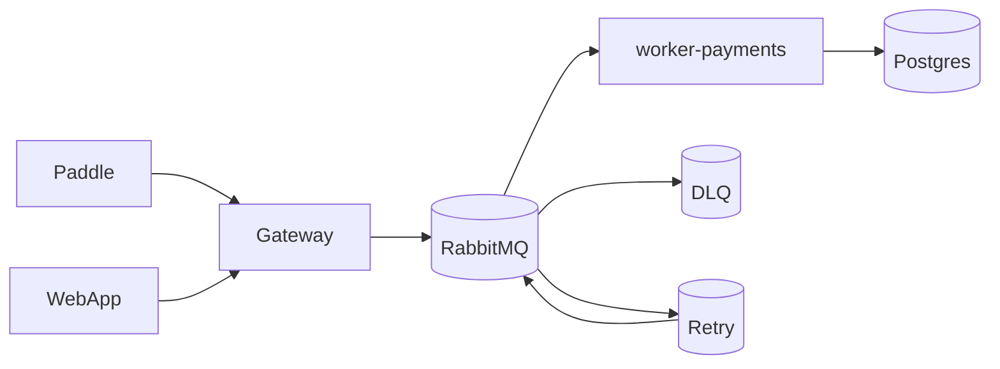
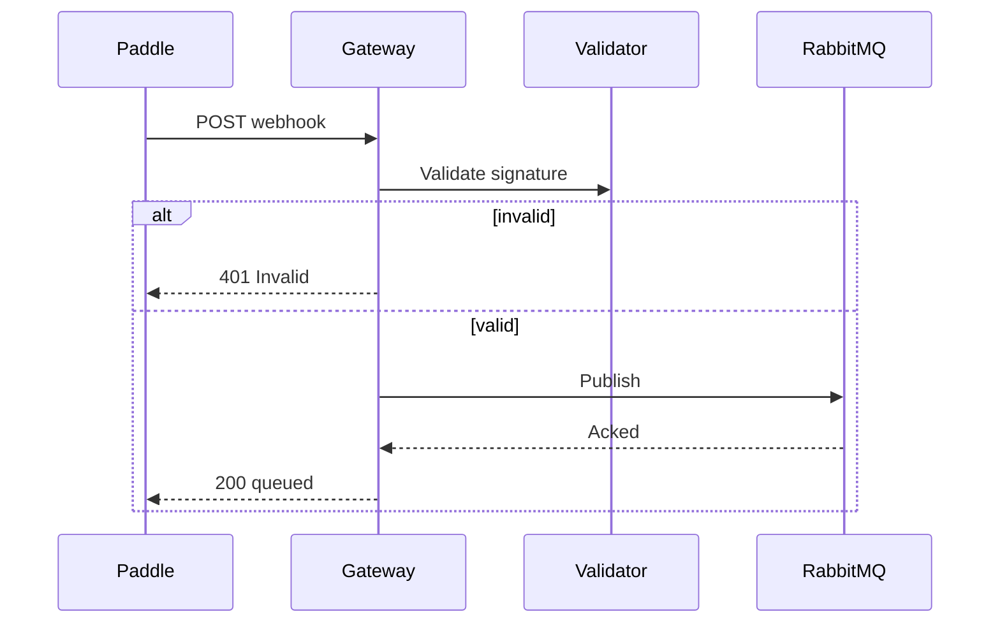
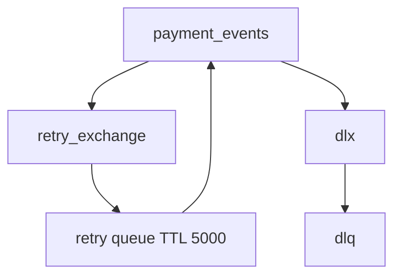
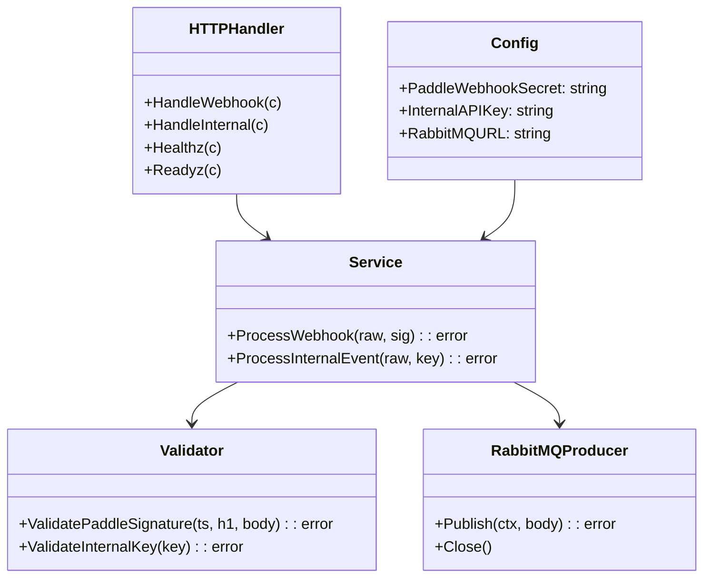

# Architecture

## High-level

Stateless Go `gin` service, no DB. Forwards raw JSON (`1 MiB`, `5s` timeout) with publisher confirms.

## Sequence

`ProcessWebhook` vs `ProcessInternalEvent` share `event_id` tracing; both use `1 MiB` limit and persistent `application/json`.

## DLQ / Retry

* `payment_events` → `retry_exchange` (TTL 5s) → `payment_events` (retry)
* `payment_events` → `dlx` → `dlq` (dead-letter after max retries)
* Quorum vs classic via `RABBITMQ_QUEUE_TYPE` (`quorum` in prod, `classic` locally).

## Class view

`internal/domain/service.go` implements `ports.Service`; `infrastructure/rabbitmq/producer.go` wraps `amqp091-go` with confirms; `transport/http/handler.go` validates then calls service.

See `02-validation.md` for HMAC details and `03-internals.md` for RabbitMQ code.
