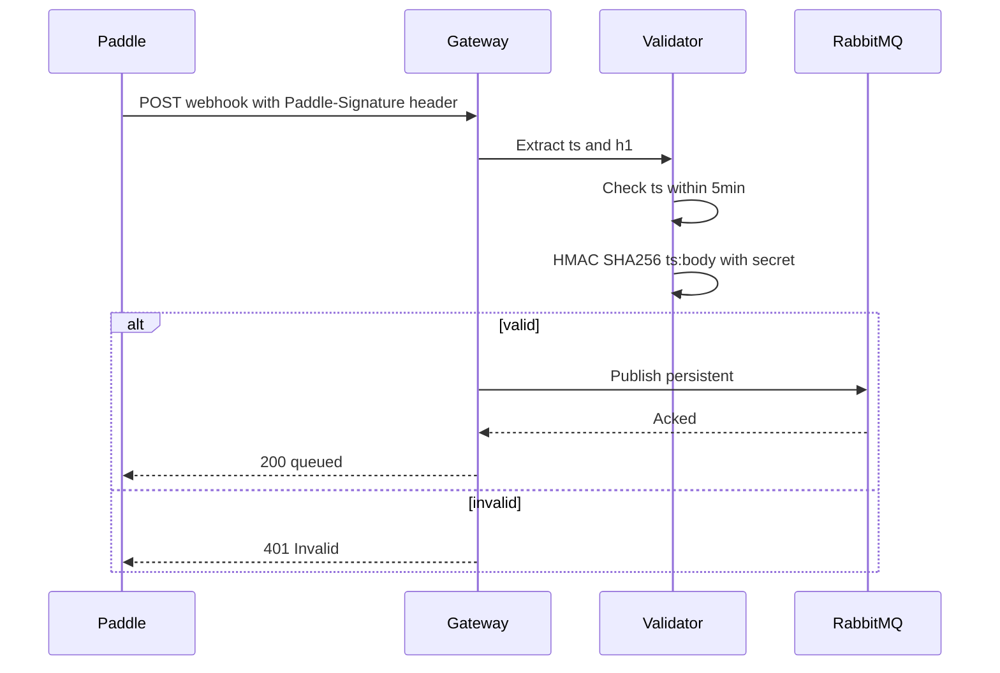
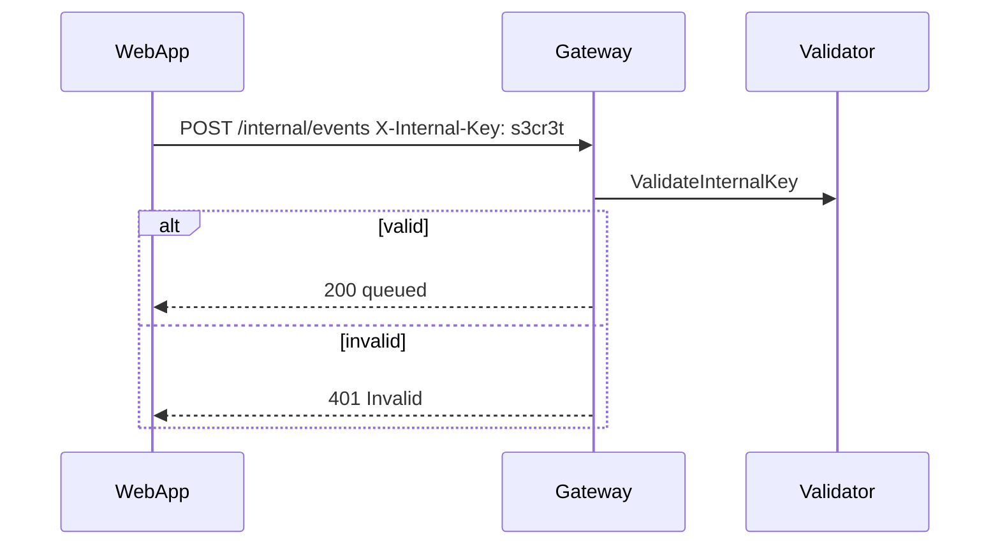

# Validation

## Paddle webhook

Code at `internal/infrastructure/paddle/signature.go`.

* Header `Paddle-Signature: ts=1234567890;h1=abc...`
* `ts` must be within `5min` of server time (prevents replay).
* `h1 = HMAC_SHA256(secret, "ts:rawBody")` hex-encoded, constant-time compare.
* Raw body size `<=1 MiB`, `5s` context timeout, `persistent` delivery.

## Internal events

* `X-Internal-Key` must equal `INTERNAL_API_KEY` (16+ chars, constant-time).
* Same `1 MiB` limit and publisher confirms.

## Failure branch

| Input | Code | Metric | Retryable |
|---|---|---|---|
| Missing/invalid signature | `401 Invalid` | `invalid_signatures` + `grpc_auth_failures` | no |
| `ts` drift >5min | `401` | `invalid_signatures` | no |
| Oversize `>1 MiB` | `400` | `http_requests_total{code=400}` | no |
| RabbitMQ down (`readyz`) | `503 {rabbitmq: disconnected}` | `rabbitmq_connection_status 0` | yes — caller retries |
| RabbitMQ down (`POST`) | `503 {retryable:true}` + `Retry-After: 5` | `payment_events_published_total{status=error}` / `rabbitmq_connection_status 0` | yes — Paddle retries, gateway **fast-fails** (no buffering) |
| Publish nacked / timeout `5s` | `500` | `payment_events_published_total{status=error}` | no |

Stateless fast-fail: gateway never buffers when RabbitMQ is down (buffer would be lost on gateway crash); `503` signals retryable. `400` vs `401` vs `500` vs `503` mapped in `transport/http/handler.go:61-138` (`isRetryablePublishError` checks `ports.ErrNotConnected` / `context.DeadlineExceeded`).
