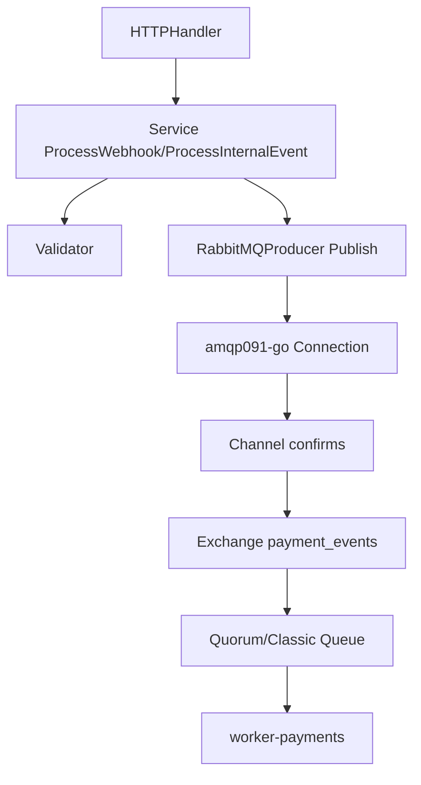
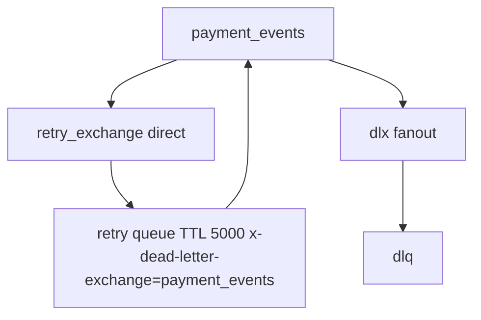
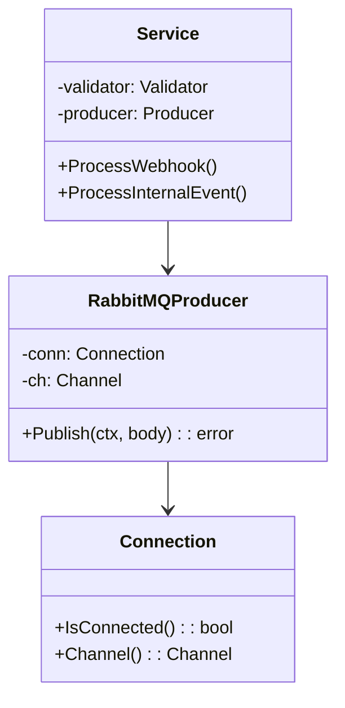

# Internals

## RabbitMQ adapter

* `internal/infrastructure/rabbitmq/connection.go` — dials `RABBITMQ_URL`, auto-reconnects with `5s + jitter(0-1s)` (`handleReconnect`), exposes `IsConnected` / `ErrNotConnected` sentinel (`ports.ErrNotConnected`), records `rabbitmq_connection_status` + `rabbitmq_reconnections_total`.
* `producer.go` — `PublishWithContext` with `persistent`, `application/json`, `publisher confirms` (`confirmMode` + `PublishConfirm` wait `5s`). `GetChannel()` fast-fails with `ErrNotConnected` if down; `Publish` returns `ErrNotConnected` / `context.DeadlineExceeded` → handler maps to `503 + Retry-After: 5` (retryable); nack/timeout without connection loss → `500`. No buffering — fast-fail is intentional (Paddle retries, buffered data would be lost on gateway crash).

## Retry / DLQ

* Retry via `x-message-ttl 5000` + `x-dead-letter-exchange`.
* DLQ via `x-dead-letter-exchange dlx`.
* Consumer (`worker-payments`) acks only after DB commit; nacks with `requeue=false` go to DLQ.

## Quorum vs classic

| Env | `RABBITMQ_QUEUE_TYPE` | Durable | Replication |
|---|---|---|---|
| local | `classic` | yes | single |
| prod | `quorum` | yes | Raft 3x |

Set via `infra/compose.yml` vs `infra/compose.prod.yml`.

## Class view

Health: `GET /readyz` checks `IsConnected()` → `200` or `503`. Writes (`POST`) also fast-fail `503 + Retry-After: 5` when `IsConnected()==false` / `ErrNotConnected` (see `transport/http/handler.go:isRetryablePublishError`).

## Observability hook

Metrics `published_events{event_type,status}`, `rabbitmq_connection_status`; tracing via `otelgin` middleware and `otlptracehttp` exporter.
