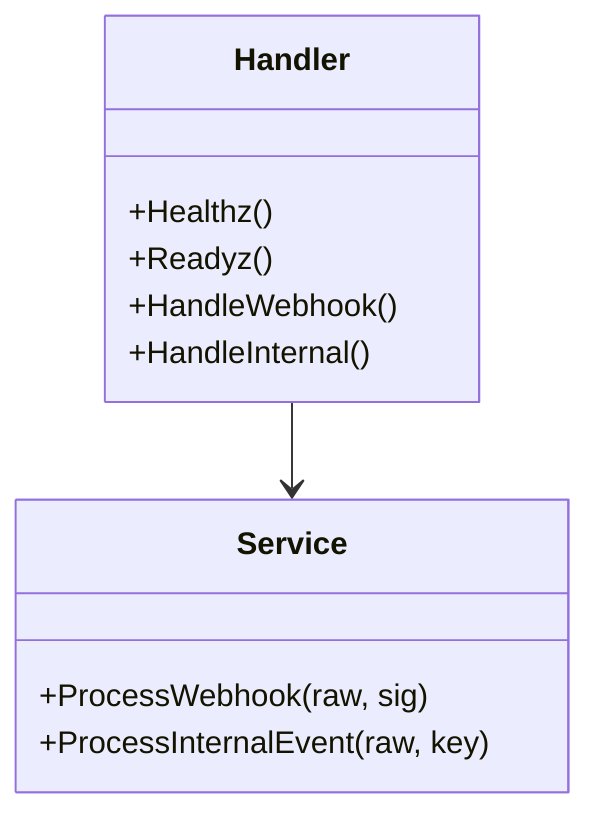

# API

## Endpoints

| Method | Path | Headers | Success | Errors |
|---|---|---|---|---|
| `GET` | `/healthz` | — | `200 {"status":"ok"}` | — |
| `GET` | `/readyz` | — | `200` if RabbitMQ up | `503` if down |
| `GET` | `/metrics` | — | Prometheus text | — |
| `POST` | `/webhook/paddle` | `Paddle-Signature: ts=...;h1=...` | `200 {"status":"queued"}` | `400` oversize, `401` bad sig, `500` publish fail |
| `POST` | `/internal/events` | `X-Internal-Key: s3cr3t` | `200 {"status":"queued"}` | `401` bad key, `400`, `500` |



## Examples

```bash
curl -H "Paddle-Signature: ts=1710000000;h1=..." -d '{"event_type":"subscription.updated"}' http://localhost:8080/webhook/paddle
curl -H "X-Internal-Key: s3cr3t" -d '{"event_type":"user.cancel_subscription"}' http://localhost:8080/internal/events
```

## Status mapping

| Code | When |
|---|---|
| `400` | Body `>1 MiB` or invalid JSON |
| `401` | HMAC mismatch, `ts` drift, bad `X-Internal-Key` |
| `500` | Publisher not acked / timeout `5s` |
| `503` | `readyz` when `IsConnected()==false` |

See `internal/transport/http/handler.go` for Gin binding and `domain/service.go` for publishing.
