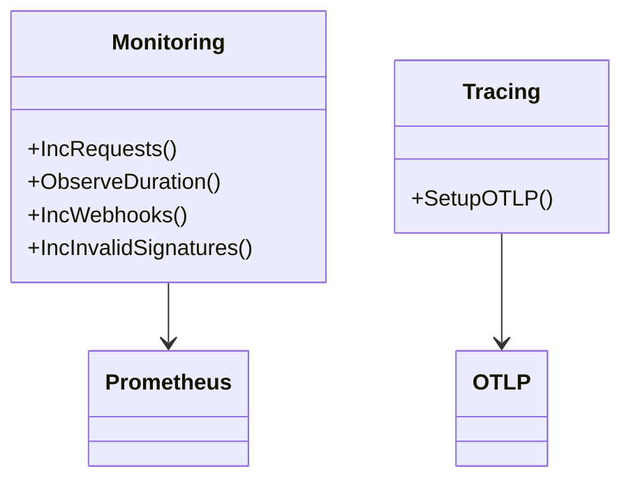

# Observability

Logs are JSON to stdout. Tracing is OTel if `OTEL_EXPORTER_OTLP_ENDPOINT` set. Metrics at `GET /metrics` for Prometheus.

## Metrics

| Metric | Type | Labels | Notes |
|---|---|---|---|
| `http_requests_total` | Counter | `method, route, code` | `503` spike = fast-fail when down |
| `http_request_duration_seconds` | Histogram | `method, route` | fast-fail `503` < `500`*5s* |
| `payment_webhooks_received_total` | Counter | `event_type` | |
| `invalid_signatures_total` | Counter | — | |
| `published_events_total` | Counter | `event_type, status` | `status=error` on `503`/`500` |
| `rabbitmq_connection_status` | Gauge | — | `1` up `0` down, drives `503` |
| `rabbitmq_reconnections_total` | Counter | — | increments on `handleReconnect` (5s+jitter) |
| `rabbitmq_publish_duration_seconds` | Histogram | — | only on `conf.Done()` acked |

Code at `internal/monitoring/monitoring.go` via `prometheus` + `otel`.

## Dashboards and alerts

| Alert | Expr |
|---|---|
| Gateway down | `up{job="gateway"}==0` for `1m` |
| RabbitMQ down | `rabbitmq_connection_status==0` for `1m` |
| High invalid signatures | `rate(invalid_signatures[5m]) >0.1` (1 per 10s) |
| High publish latency | `histogram_quantile(0.95, http_request_duration) >0.5` for `5m` |
| DLQ depth | `rabbitmq_queue_messages{queue="dlq"} >10` for `5m` |
| Retry depth | `rabbitmq_queue_messages{queue="retry"} >50` for `5m` |

Tracing: `otelgin` middleware + `otlptracehttp` exporter, resource `payment-gateway`.

## Class view

