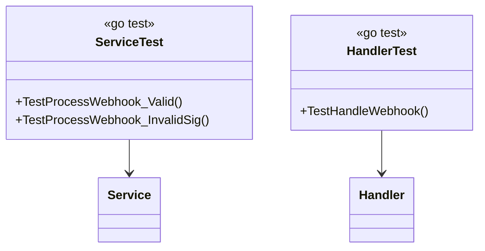

# Testing

## Commands

```bash
# Run unit tests
make test

# Run with coverage
make test-coverage

# Run integration (testcontainers rabbitmq)
make test-integration

# Run HA integration (3-node testcontainers cluster, quorum + single-node kill)
make test-integration-ha

# Run load (k6)
make load-test
```

## Unit

```
internal/domain/service_test.go
internal/infrastructure/paddle/signature_test.go
internal/infrastructure/config/config_test.go
internal/transport/http/handler_test.go
internal/monitoring/monitoring_test.go
```

`go test -v ./...` with `testify` mocks (`test/mocks/*_mock.go`).

## Integration

`test/integration/integration_test.go` uses `testcontainers-go` + `rabbitmq` module; run via `go test -v -tags=integration ./test/integration/...`.

## HA integration (3-node, no Compose)

`test/integration/ha_cluster.go` starts 3 `rabbitmq:3.13-management-alpine`
containers on a dedicated Docker network (shared Erlang cookie, `join_cluster`),
then `ha_quorum_test.go` verifies: quorum publish/consume, classic-vs-quorum
`406`, quorum DLQ, and 20-msg survival across a single-node kill (quorum
majority 2/3). Mirrors Amazon MQ `CLUSTER_MULTI_AZ`; Floci stays Terraform-only.
Run via `go test -v -tags=ha_integration -timeout=600s ./test/integration/... -run TestHA`.

## Load

See `test/load/README.md`:

| Scenario | File | Stages |
|---|---|---|
| `spike` | `scenarios/spike.js` | `10s:20, 30s:200, 10s:0` |
| `stress` | `scenarios/stress.js` | `1m:50..300` |
| `soak` | `scenarios/soak.js` | `30s at 200 mix` |
| `internal` | `scenarios/internal.js` | `30s at 200` |

```bash
make load-test SCENARIO=spike TARGET_VUS=100
```

Each VU posts `subscription.updated` with `utils.js` HMAC; checks `200 queued`.

## Class under test


