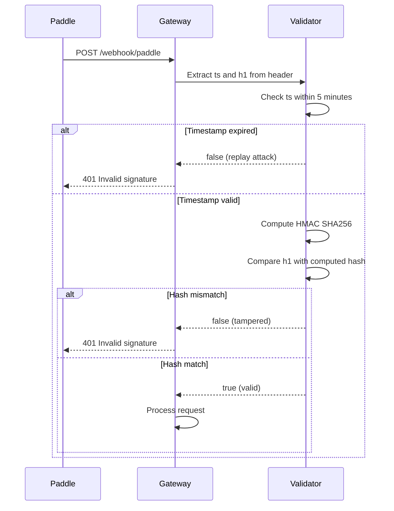
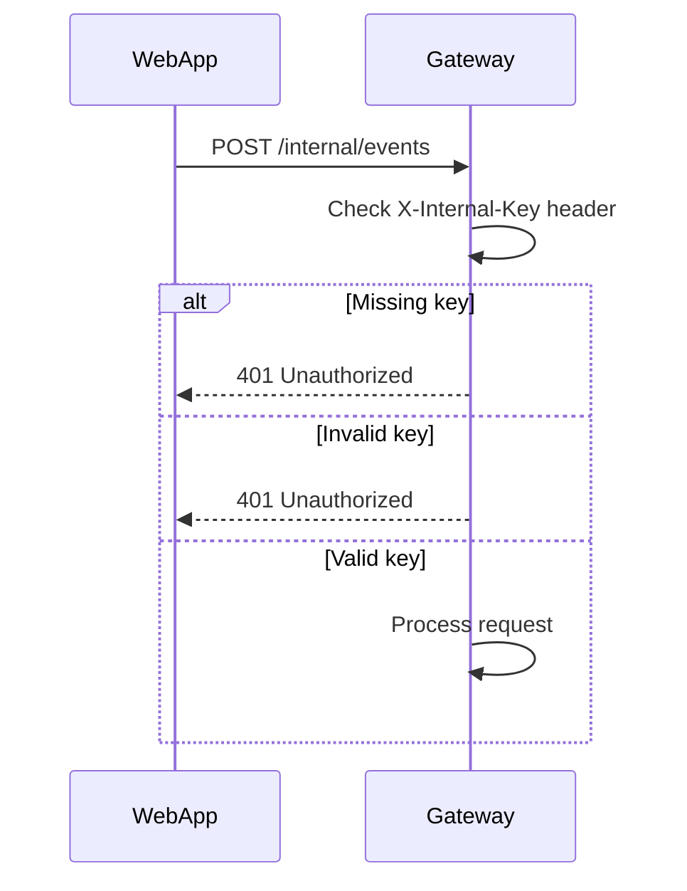

# Validation

This document explains how the Payment Gateway validates incoming requests.

## Overview

The gateway validates two types of requests:

1. **Paddle Webhooks** - Uses HMAC SHA256 signature validation
2. **Internal Events** - Uses API key validation

Think of it as a **security checkpoint** that verifies IDs before allowing entry.

## Paddle Webhook Validation

Paddle signs every webhook with an HMAC signature. The gateway verifies this signature to ensure:

- The webhook actually came from Paddle
- The body hasn't been tampered with
- The webhook isn't too old (prevents replay attacks)

### Validation Flow



### Signature Format

The `Paddle-Signature` header contains:

```
Paddle-Signature: ts=1710000000;h1=abc123def456...
```

| Part | Description | Example |
|------|-------------|---------|
| `ts` | Unix timestamp when webhook was sent | `1710000000` |
| `h1` | HMAC SHA256 signature (hex-encoded) | `abc123def456...` |

### Validation Rules

| Rule | Why | Error |
|------|-----|-------|
| Timestamp within 5 minutes | Prevents replay attacks | 401 Invalid signature |
| HMAC matches body | Ensures integrity | 401 Invalid signature |
| Constant-time comparison | Prevents timing attacks | - |

**Why 5 minutes?**
- Balances security vs. clock drift
- Paddle webhooks are sent immediately
- 5 minutes allows for minor time differences

**Why constant-time comparison?**
- Prevents timing attacks where attacker measures comparison time
- Standard security practice for HMAC validation

### HMAC Computation

The gateway computes HMAC like this:

```go
// Pseudo-code
message = ts + ":" + body
computed_hmac = HMAC_SHA256(webhook_secret, message)
valid = constant_time_compare(computed_hmac, h1)
```

**Why include timestamp in HMAC?**
- Prevents replay attacks
- Ensures timestamp can't be forged
- Binds timestamp to the body

### Example Signature Verification

Given:
- Webhook secret: `whsec_my_secret_key`
- Body: `{"event_type":"subscription.updated"}`
- Timestamp: `1710000000`

```
message = "1710000000:{"event_type":"subscription.updated"}"
hmac = HMAC_SHA256("whsec_my_secret_key", message)
signature = "ts=1710000000;h1=" + hex_encode(hmac)
```

## Internal Event Validation

Internal events use a simpler API key validation.

### Validation Flow



### Validation Rules

| Rule | Why | Error |
|------|-----|-------|
| Key must be present | Authentication required | 401 Unauthorized |
| Key must match exactly | Prevent unauthorized access | 401 Unauthorized |
| Constant-time comparison | Prevents timing attacks | - |

**Why simple API key?**
- Internal events come from trusted sources
- No need for HMAC (no tampering risk)
- Simpler to implement and debug

### Key Configuration

The API key is set via `INTERNAL_API_KEY` environment variable:

```bash
export INTERNAL_API_KEY=s3cr3t_k3y_12345
```

**Why require 16+ characters?**
- Prevents weak keys
- Standard security practice
- Reduces brute-force risk

## Body Validation

Both endpoints validate the request body:

### Size Limit

| Rule | Limit | Why |
|------|-------|-----|
| Max body size | 1 MiB | Prevents DoS attacks |

**Why 1 MiB?**
- Paddle webhooks are typically small (< 100 KB)
- 1 MiB prevents memory exhaustion
- Still allows large payloads if needed

### Content Type

| Rule | Required | Why |
|------|----------|-----|
| Content-Type | `application/json` | Ensures valid JSON |

### JSON Parsing

| Rule | Why | Error |
|------|-----|-------|
| Valid JSON | Prevents parsing errors | 400 Bad Request |
| No binary data | Ensures text-based processing | 400 Bad Request |

## Error Responses

### Invalid Signature

```json
{
  "error": "Invalid signature"
}
```

**When this happens:**
- HMAC doesn't match
- Timestamp is too old
- Body was tampered with

**What to do:**
- Verify your webhook secret
- Check if body was modified in transit
- Ensure timestamp is synchronized

### Unauthorized

```json
{
  "error": "Unauthorized"
}
```

**When this happens:**
- Missing `X-Internal-Key` header
- Key doesn't match `INTERNAL_API_KEY`

**What to do:**
- Verify the API key in your request
- Check `INTERNAL_API_KEY` environment variable

### Body Too Large

```json
{
  "error": "Request body too large or unreadable"
}
```

**When this happens:**
- Body exceeds 1 MiB
- Body is not valid JSON

**What to do:**
- Reduce payload size
- Ensure valid JSON format

## Security Considerations

### Timing Attacks

The gateway uses **constant-time comparison** for all validation:

```go
// Pseudo-code - constant time comparison
func constantTimeEquals(a, b string) bool {
    if len(a) != len(b) {
        return false
    }
    result := 0
    for i := 0; i < len(a); i++ {
        result |= a[i] ^ b[i]
    }
    return result == 0
}
```

**Why constant-time?**
- Prevents attackers from measuring comparison time
- Standard security practice
- No performance penalty

### Replay Attacks

The gateway prevents replay attacks by checking timestamp:

| Protection | How |
|------------|-----|
| Timestamp validation | Rejects webhooks older than 5 minutes |
| HMAC binding | Timestamp is included in HMAC computation |
| No idempotency | Each webhook is processed once |

**Why no idempotency?**
- Paddle handles retries
- Gateway is stateless (no storage)
- Worker-payments handles deduplication

### Secret Management

| Aspect | Dev | Prod |
|--------|-----|------|
| Storage | `.env` file | AWS Secrets Manager |
| Rotation | Manual | AWS-managed |
| Access | Developer machine | IAM roles |

**Why different storage?**
- Dev: Fast iteration, local development
- Prod: Secure, auditable, rotated automatically

## Testing Validation

### Unit Tests

The gateway has comprehensive tests for validation:

```bash
# Run validation tests
make test

# Run with verbose output
go test -v ./internal/infrastructure/paddle/...
```

**What tests verify:**
- Valid signatures are accepted
- Invalid signatures are rejected
- Expired timestamps are rejected
- Missing headers are rejected
- Body size limits are enforced

### Integration Tests

```bash
# Run integration tests
make test-integration
```

**What tests verify:**
- End-to-end validation flow
- Error responses are correct
- Metrics are recorded

## Troubleshooting

### "Invalid signature" on valid webhook

**Possible causes:**
1. **Clock drift** - Your server time is different from Paddle's
2. **Wrong secret** - `PADDLE_WEBHOOK_SECRET` doesn't match Paddle's
3. **Body modified** - Proxy or middleware changed the body

**What to do:**
1. Check server time: `date +%s`
2. Verify secret in Paddle dashboard
3. Check for proxies modifying the body

### "Unauthorized" on internal event

**Possible causes:**
1. **Missing header** - `X-Internal-Key` not sent
2. **Wrong key** - Key doesn't match `INTERNAL_API_KEY`
3. **Extra whitespace** - Key has leading/trailing spaces

**What to do:**
1. Check request headers
2. Verify `INTERNAL_API_KEY` environment variable
3. Trim whitespace from key

### 503 on valid request

**Possible causes:**
1. **RabbitMQ down** - Gateway can't publish
2. **Timeout** - Context timeout exceeded

**What to do:**
1. Check RabbitMQ status: `curl http://localhost:8080/readyz`
2. Retry after `Retry-After` header duration

## Related Documentation

- [API Reference](api.md) - HTTP endpoint details
- [Request Flows](../concepts/request-flows.md) - How validation fits in the flow
- [Health](../operations/health.md) - Monitoring validation failures
- [Observability](../operations/observability.md) - Validation metrics
