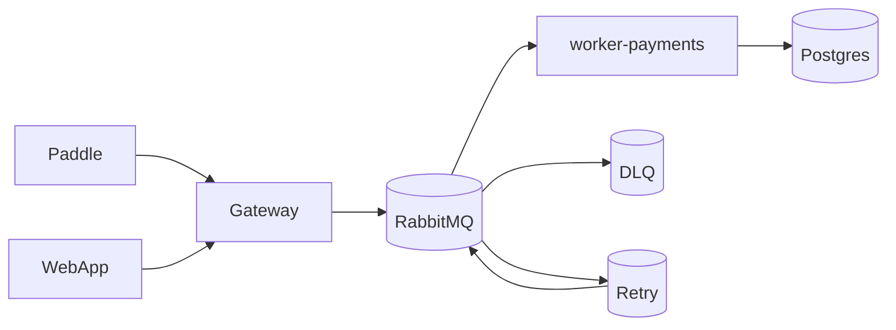
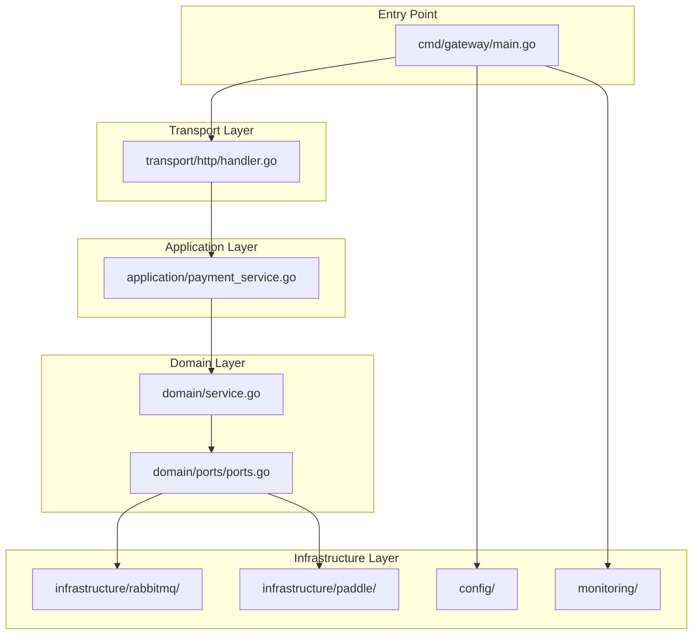
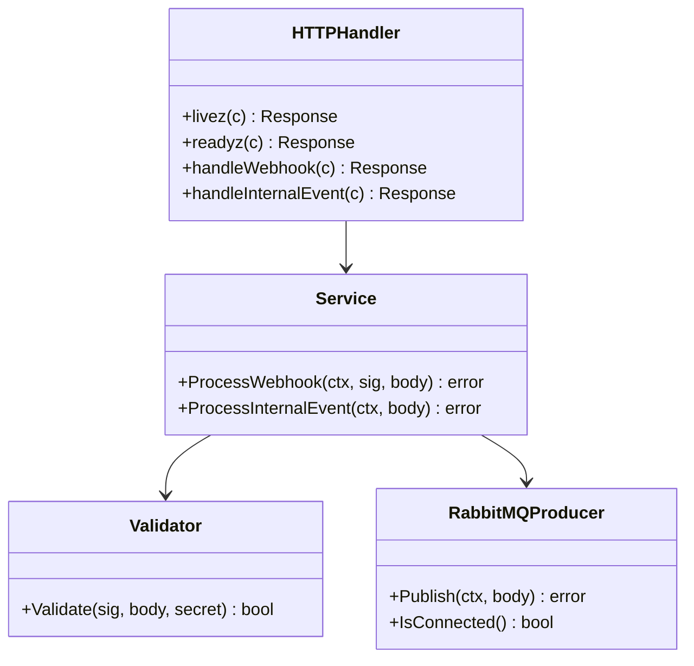
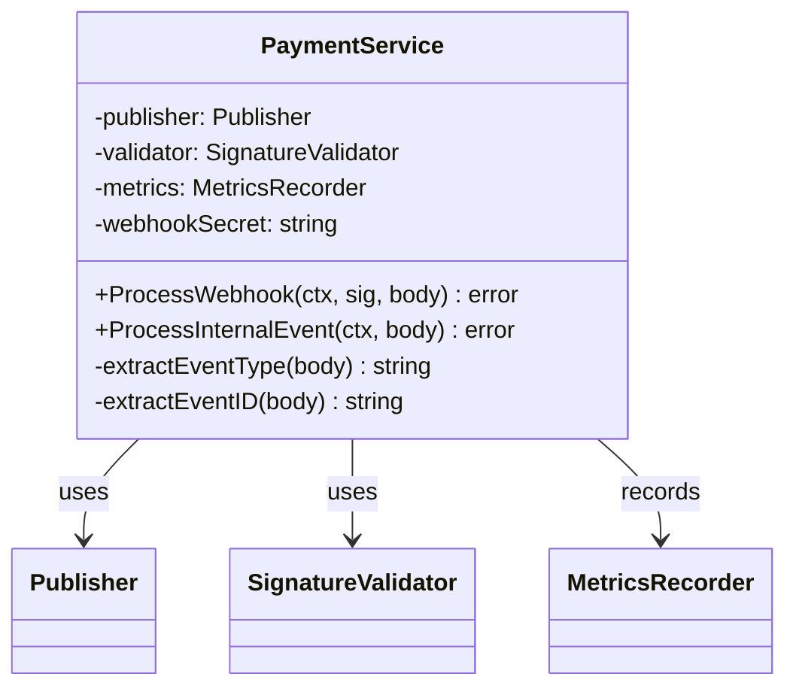
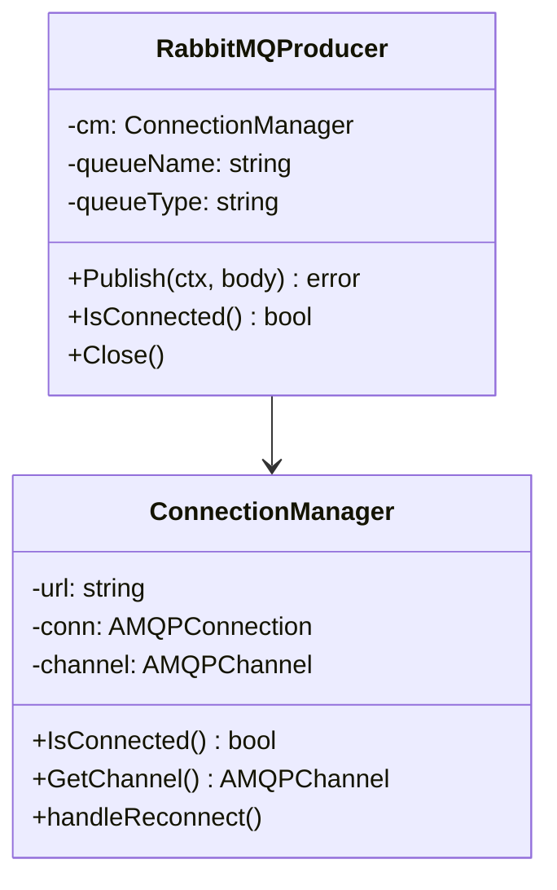
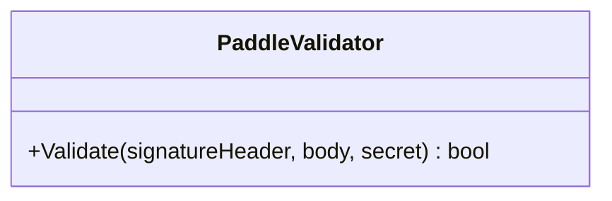
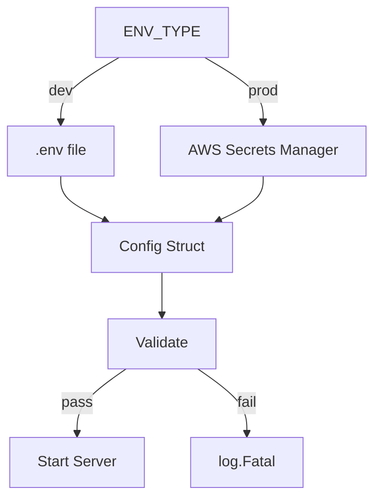
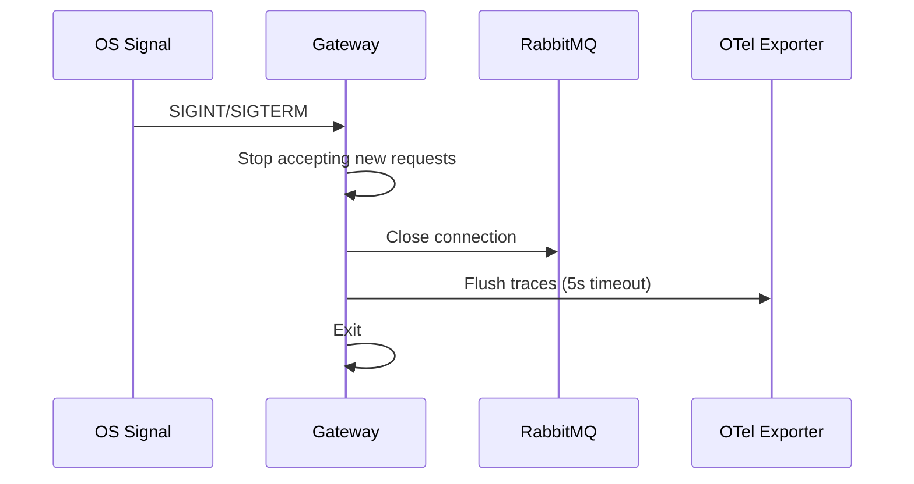

# Architecture

This document explains how the Payment Gateway service is structured and why it's designed this way.

## High-Level Overview

The Payment Gateway is a **stateless Go service** that acts as a secure entry point for payment events. It validates incoming webhooks, ensures they're authentic, and forwards them to RabbitMQ for processing.

Think of it as a **secure mailroom** that checks IDs before forwarding packages to the right department.

**What happens:**
1. Paddle sends a webhook to the gateway
2. WebApp sends internal events to the gateway
3. Gateway validates the signature/key
4. Gateway forwards the raw JSON to RabbitMQ
5. `worker-payments` processes the event and stores it in Postgres
6. Failed messages go to retry queue, then to DLQ

## Why This Architecture?

| Benefit | Explanation |
|---------|-------------|
| **Stateless** | No database, no session state - easy to scale horizontally |
| **Fast-fail** | Returns 503 immediately when RabbitMQ is down (no buffering) |
| **Secure** | HMAC signature validation for Paddle, API key for internal events |
| **Reliable** | Publisher confirms ensure messages reach RabbitMQ |
| **Observable** | Metrics, tracing, and health checks built-in |

**Why stateless?**
- Gateway can crash without losing data (messages are in RabbitMQ)
- Easy to deploy multiple instances behind a load balancer
- No database to manage or scale

**Why fast-fail instead of buffering?**
- If gateway buffers messages and crashes, those messages are lost
- Paddle retries automatically when it gets a 503
- Buffering adds complexity without real benefit

## Project Structure

### Layer Responsibilities

| Layer | Files | Responsibility |
|-------|-------|----------------|
| **Entry Point** | `cmd/gateway/main.go` | Bootstrap, wire dependencies, graceful shutdown |
| **Transport** | `transport/http/handler.go` | HTTP routing, request parsing, error mapping |
| **Application** | `application/payment_service.go` | Business logic orchestration |
| **Domain** | `domain/service.go`, `domain/event.go` | Core business rules, event parsing |
| **Ports** | `domain/ports/ports.go` | Interfaces (contracts between layers) |
| **Infrastructure** | `infrastructure/` | External system integrations |

**Why hexagonal architecture?**
- Business logic is isolated from external systems
- Easy to test (swap real RabbitMQ with mocks)
- Can change infrastructure without touching business logic

## Core Components

### HTTP Handler

The HTTP handler receives requests and maps them to service calls:

**What it does:**
- Registers routes: `/healthz`, `/readyz`, `/webhook/paddle`, `/internal/events`
- Enforces 1 MiB body limit (prevents DoS)
- Sets 5s context timeout (prevents hanging)
- Maps errors to HTTP status codes (401, 400, 500, 503)

### Payment Service

The payment service implements business logic:

**What it does:**
- Extracts event type and ID from JSON body
- Validates Paddle signature (HMAC SHA256)
- Publishes event to RabbitMQ
- Records metrics for observability

### RabbitMQ Producer

The RabbitMQ producer handles message delivery:

**What it does:**
- Manages connection with auto-reconnect (5s + jitter)
- Declares queue topology (main, retry, DLQ)
- Publishes with publisher confirms (ensures delivery)
- Supports quorum and classic queues

### Paddle Validator

The Paddle validator checks webhook signatures:

**What it does:**
- Parses `Paddle-Signature: ts=...;h1=...` header
- Validates timestamp is within 5 minutes (prevents replay)
- Computes HMAC SHA256 and compares with constant-time compare
- Returns true/false (no error details for security)

## Configuration Flow

**What happens:**
1. Gateway reads `ENV_TYPE` to determine mode
2. Dev mode loads from `.env` file
3. Prod mode loads from AWS Secrets Manager
4. Config validates all required fields
5. If validation fails, service exits immediately
6. If validation passes, service starts

## Graceful Shutdown

**What happens:**
1. OS sends SIGINT or SIGTERM
2. Gateway stops accepting new requests (10s timeout)
3. Gateway closes RabbitMQ connection
4. Gateway flushes OpenTelemetry traces (5s timeout)
5. Gateway exits cleanly

**Why graceful shutdown?**
- In-flight requests complete normally
- RabbitMQ messages aren't lost
- Traces are flushed to collectors

## Why No Database?

The gateway is intentionally stateless:

| Aspect | With Database | Without Database |
|--------|---------------|------------------|
| **State** | Stores sessions, events | Stateless - all state in RabbitMQ |
| **Scaling** | Harder (need DB scaling) | Easy (just add more instances) |
| **Failure** | DB failure = service failure | Gateway crash = no data loss |
| **Complexity** | Higher (DB schema, migrations) | Lower (just forward messages) |

**Why this works:**
- Paddle retries webhooks when gateway returns 503
- RabbitMQ ensures message durability
- `worker-payments` handles all persistence
- Gateway is just a secure forwarder

## Related Documentation

- [Request Flows](request-flows.md) - How requests move through the system
- [Message Delivery](message-delivery.md) - RabbitMQ topology and reliability
- [API Reference](../components/api.md) - HTTP endpoints
- [Health](../operations/health.md) - Health checks
