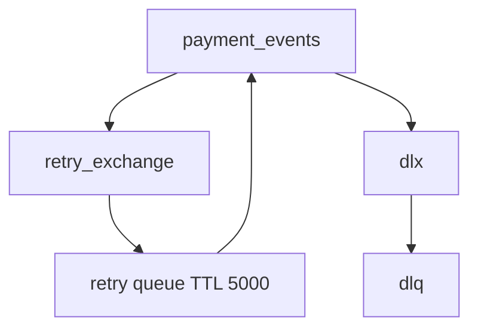
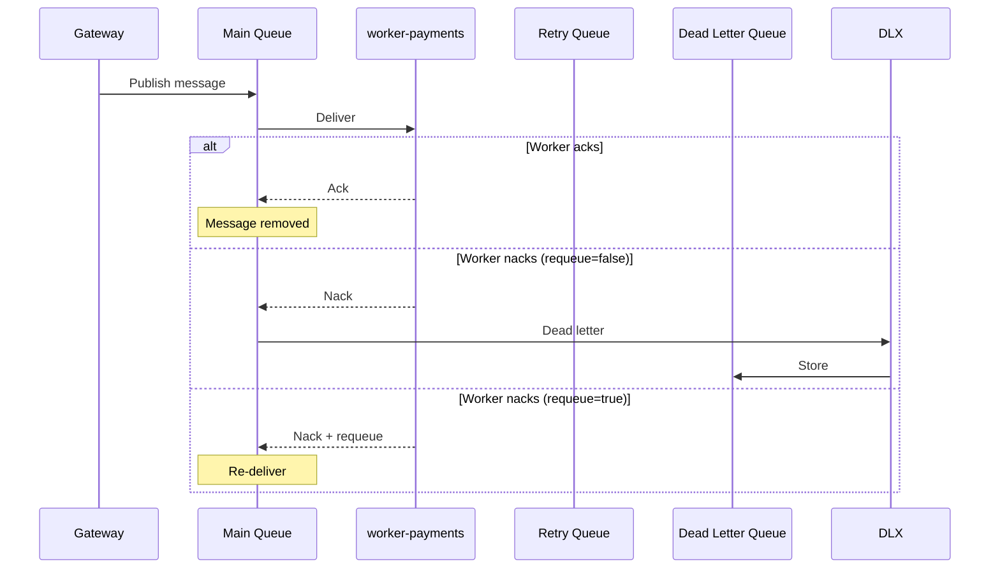
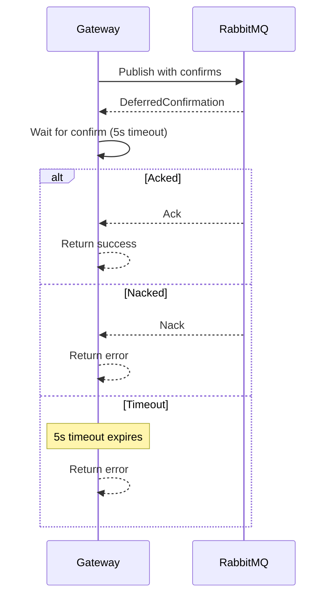
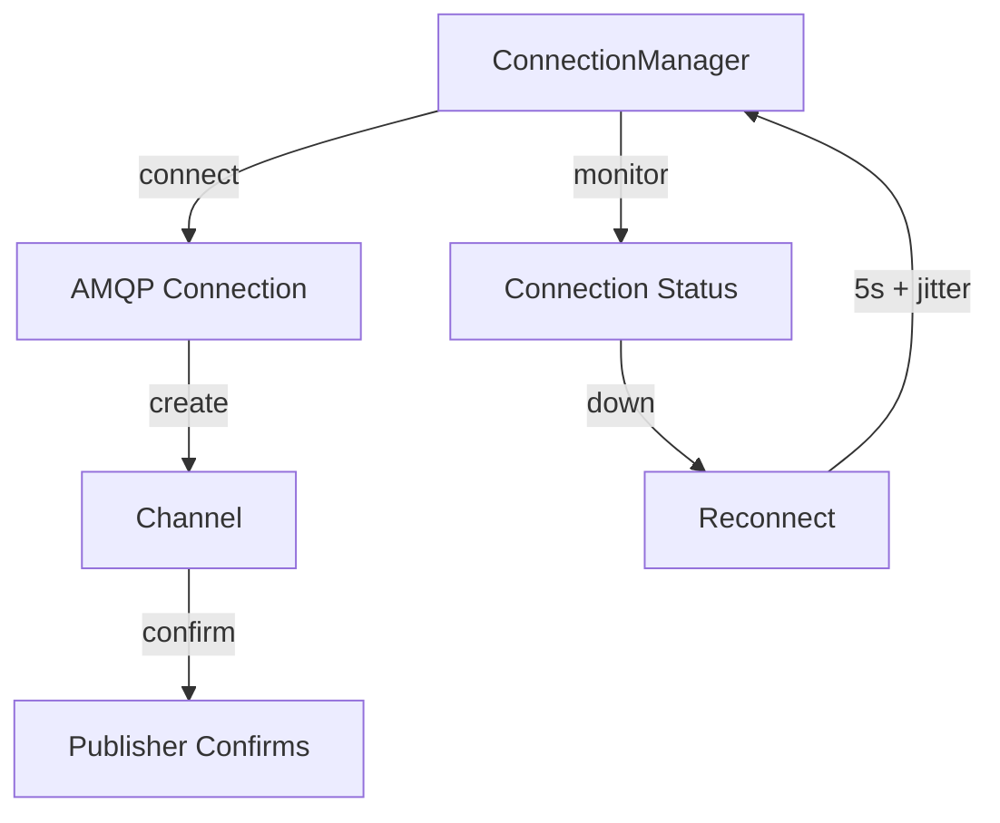
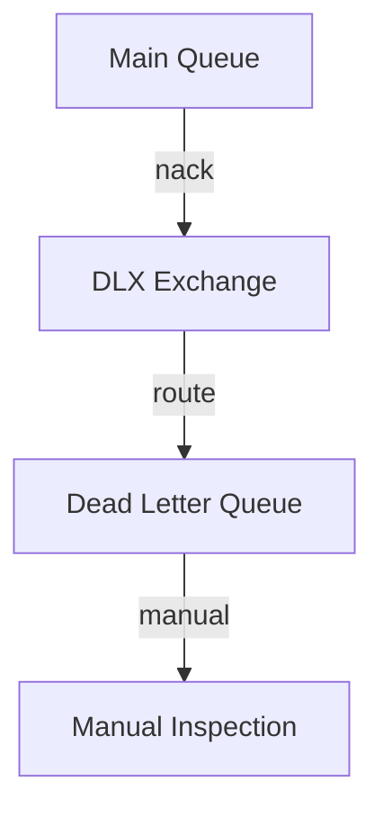
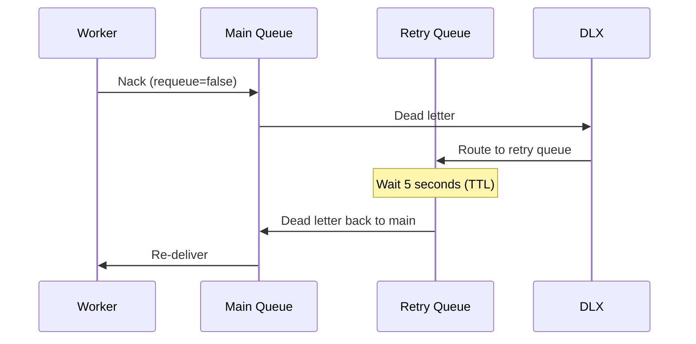
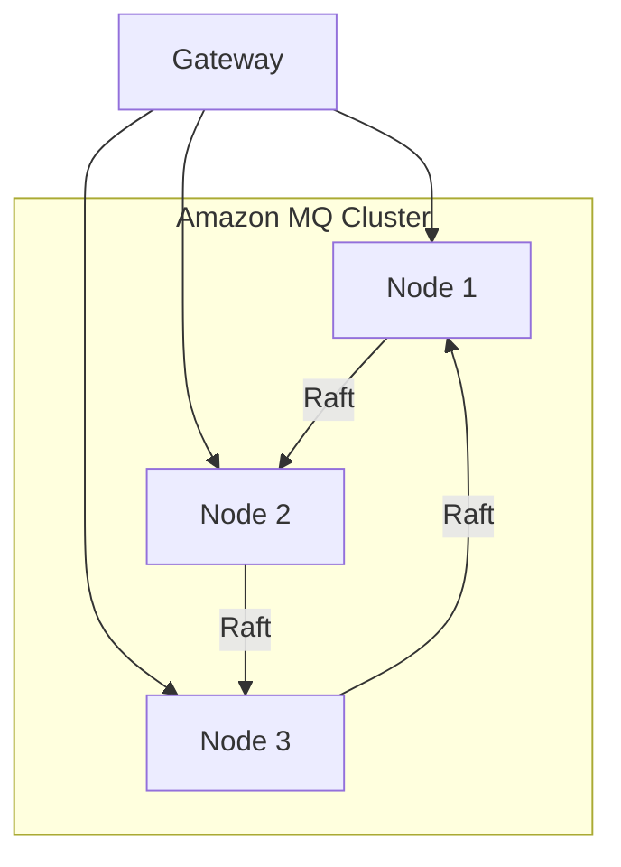

# Message Delivery

This document explains how the Payment Gateway ensures reliable message delivery to RabbitMQ.

## Overview

The gateway uses RabbitMQ's features to guarantee messages reach `worker-payments` even if things go wrong. Think of it as a **postal service with tracking and insurance**.

## RabbitMQ Topology

The gateway sets up this queue topology:



### Queue Descriptions

| Queue | Purpose | Arguments |
|-------|---------|-----------|
| `payment_events` | Main queue for all events | `x-dead-letter-exchange: dlx` |
| `payment_events_retry` | Temporary retry queue | `x-message-ttl: 5000`, `x-dead-letter-exchange: ""` |
| `payment_events_dlq` | Dead letter queue for failed messages | - |

**Why this topology?**
- **Retry with backoff** - Failed messages retry after 5 seconds
- **Dead lettering** - Messages that fail repeatedly go to DLQ
- **Separation** - Retry and DLQ are isolated from main queue

## Message Flow



**What happens:**
1. Gateway publishes message to main queue
2. Worker receives and processes the message
3. If successful, worker acks - message is removed
4. If failed, worker nacks with `requeue=false` - message goes to DLQ
5. If retriable, worker nacks with `requeue=true` - message re-delivered

## Publisher Confirms

The gateway uses **publisher confirms** to ensure messages reach RabbitMQ:



**What are publisher confirms?**
- RabbitMQ acknowledges it received the message
- Ensures message isn't lost in transit
- Like certified mail with return receipt

**Why 5 second timeout?**
- Prevents hanging if RabbitMQ is slow
- Paddle will retry on timeout
- Gateway stays responsive

## Connection Management

The gateway manages RabbitMQ connections with auto-reconnect:



### Reconnect Behavior

| Aspect | Value | Why |
|--------|-------|-----|
| **Initial delay** | 5 seconds | Give RabbitMQ time to recover |
| **Jitter** | 0-1 second | Prevent thundering herd |
| **Max retries** | Infinite | Keep trying until connected |
| **Status tracking** | `rabbitmq_connection_status` | Drives health checks |

**Why auto-reconnect?**
- RabbitMQ may restart or failover
- Gateway should recover automatically
- No manual intervention needed

**Why jitter?**
- If multiple gateways restart simultaneously
- They would all try to connect at the same time
- Jitter spreads connection attempts

## Quorum vs Classic Queues

The gateway supports both queue types:

| Aspect | Classic Queue | Quorum Queue |
|--------|---------------|--------------|
| **Durability** | Optional | Always durable |
| **Replication** | Single node | Multi-node (Raft) |
| **Memory** | Lower | Higher |
| **Throughput** | Higher | Lower |
| **Use Case** | Development | Production |

### When to Use Each

| Environment | Queue Type | Why |
|-------------|------------|-----|
| Local development | `quorum` | Matches production behavior |
| CI/CD testing | `quorum` | Catches queue-specific issues |
| Production (standalone) | `quorum` | High availability |
| Production (cluster) | `quorum` | Raft replication |

### Queue Type Selection

The queue type is set via `RABBITMQ_QUEUE_TYPE` environment variable:

```bash
# Development (default)
RABBITMQ_QUEUE_TYPE=quorum

# Production (Amazon MQ)
RABBITMQ_QUEUE_TYPE=quorum
```

**Why quorum by default?**
- Modern queue type with better reliability
- Matches production behavior
- Prevents "works on my machine" issues

## Dead Letter Queue (DLQ)

The DLQ stores messages that failed processing:



### DLQ Characteristics

| Aspect | Value | Why |
|--------|-------|-----|
| **Capacity** | Unlimited | Don't lose any messages |
| **Retention** | Until manually cleared | Investigate issues |
| **Monitoring** | `rabbitmq_queue_messages{queue="dlq"}` | Alert on depth |
| **Action** | Manual requeue or fix | Requires investigation |

**Why monitor DLQ depth?**
- High depth means messages are failing
- Indicates a problem with worker-payments
- Needs immediate attention

### Handling DLQ Messages

When DLQ depth increases:

1. **Check worker-payments logs** - See why messages are failing
2. **Inspect DLQ messages** - Use RabbitMQ Management UI
3. **Fix the issue** - Deploy fix to worker-payments
4. **Requeue messages** - Move messages back to main queue

## Retry Mechanism

Failed messages retry after 5 seconds:



**Why 5 second retry?**
- Gives transient issues time to resolve
- Prevents immediate re-failure
- Balances speed vs. load

**Why retry via dead lettering?**
- RabbitMQ native feature
- No custom retry logic needed
- Automatic TTL-based retry

## Message Durability

All messages are published as **persistent**:

```go
amqp.Publishing{
    DeliveryMode: amqp.Persistent,
    ContentType:  "application/json",
    Body:         body,
}
```

**Why persistent?**
- Messages survive RabbitMQ restarts
- Written to disk before acking
- Ensures at-least-once delivery

## High Availability (HA)

In production, the gateway uses Amazon MQ `CLUSTER_MULTI_AZ`:



### HA Characteristics

| Aspect | Value | Why |
|--------|-------|-----|
| **Nodes** | 3 | Quorum majority (2/3) |
| **Replication** | Raft consensus | Strong consistency |
| **Failover** | Automatic | No manual intervention |
| **Queue type** | Quorum | Required for HA |

**Why 3 nodes?**
- Quorum requires majority (2/3)
- Can survive 1 node failure
- Standard for production RabbitMQ

## Related Documentation

- [Request Flows](request-flows.md) - How messages are published
- [Architecture](architecture.md) - Overall system design
- [Health](../operations/health.md) - How to monitor RabbitMQ
- [Observability](../operations/observability.md) - Metrics for message delivery
