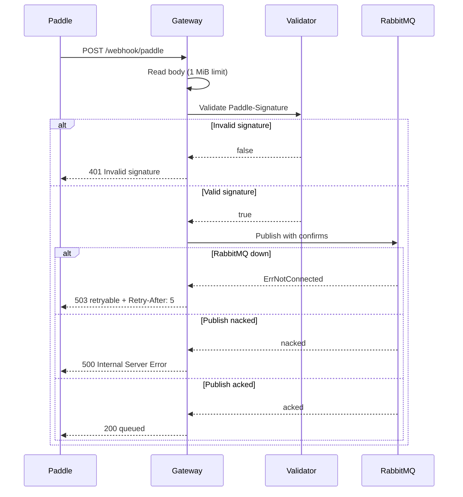
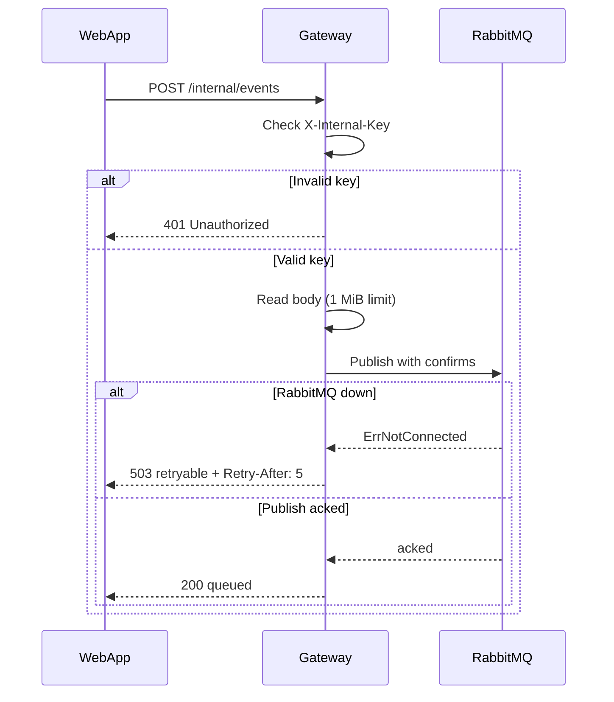
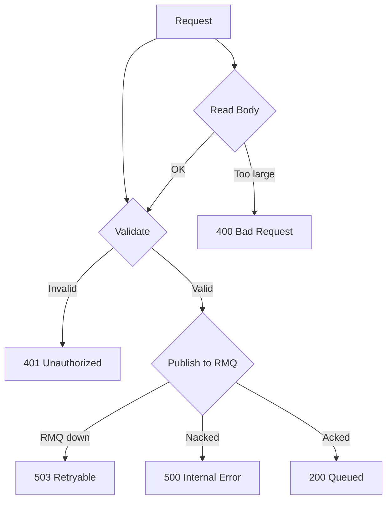
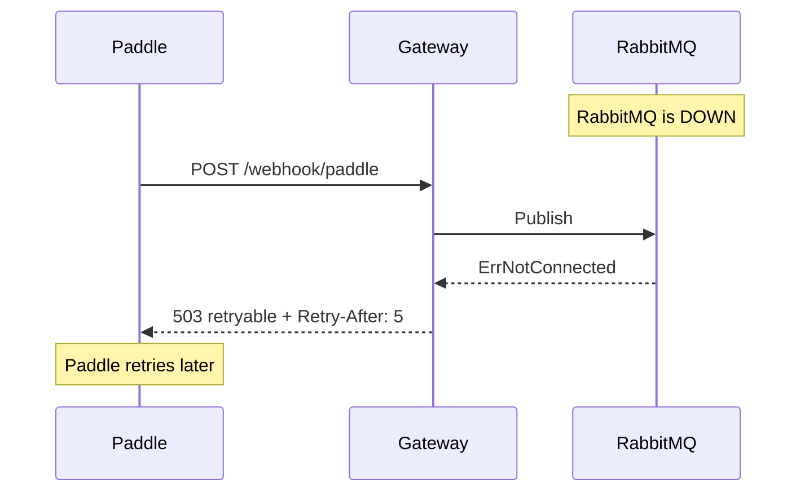
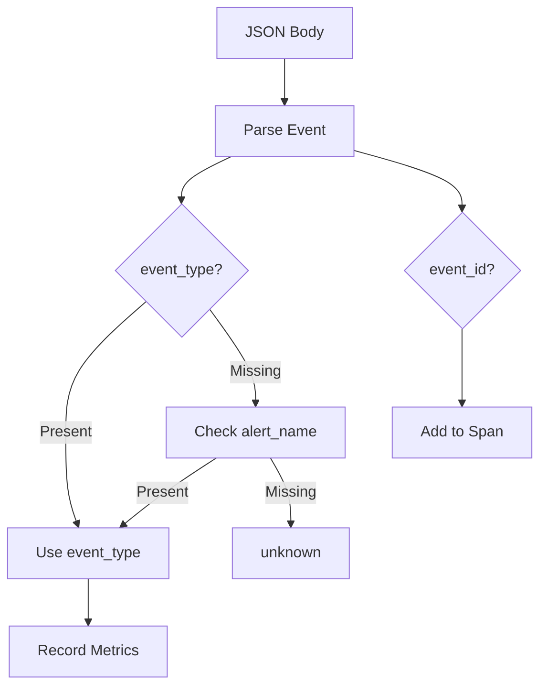

# Request Flows

This document explains how requests move through the Payment Gateway system.

## Overview

The gateway handles two types of requests:

1. **Paddle Webhooks** - External events from Paddle payment processor
2. **Internal Events** - Events from your web application

Both follow similar paths but have different validation mechanisms.

## Paddle Webhook Flow

This is the primary flow for receiving payment events from Paddle.

**What happens:**
1. Paddle sends a POST request with JSON body and `Paddle-Signature` header
2. Gateway reads the body (max 1 MiB)
3. Gateway validates the HMAC signature
4. If invalid, returns 401 (Paddle won't retry)
5. If valid, publishes to RabbitMQ with publisher confirms
6. If RabbitMQ is down, returns 503 (Paddle will retry)
7. If publish fails, returns 500
8. If publish succeeds, returns 200

**Why this flow?**
- **Fast validation** - Rejects bad requests early
- **Secure** - HMAC prevents spoofed webhooks
- **Reliable** - Publisher confirms ensure delivery
- **Observable** - Metrics track every outcome

## Internal Event Flow

This flow handles events from your web application (e.g., user cancellation).

**What happens:**
1. WebApp sends a POST request with JSON body and `X-Internal-Key` header
2. Gateway validates the API key
3. If invalid, returns 401
4. If valid, reads the body and publishes to RabbitMQ
5. Returns 200, 503, or 500 based on publish result

**Why a separate flow?**
- Different authentication (API key vs HMAC)
- No signature validation needed (trusted internal source)
- Same reliability guarantees (publisher confirms)

## Error Handling Flow

The gateway maps errors to specific HTTP status codes:

### Error Code Mapping

| Error | Status Code | Retryable | Header | Why |
|-------|-------------|-----------|--------|-----|
| Invalid signature | 401 | No | - | Bad request, won't succeed on retry |
| Bad API key | 401 | No | - | Unauthorized, won't succeed on retry |
| Body too large | 400 | No | - | Client error, won't succeed on retry |
| RabbitMQ down | 503 | Yes | `Retry-After: 5` | Temporary, Paddle will retry |
| Publish nacked | 500 | No | - | Broker rejected, may need investigation |
| Context timeout | 503 | Yes | `Retry-After: 5` | Temporary, Paddle will retry |

**Why these status codes?**
- **401** - Client error (bad auth), no point retrying
- **400** - Client error (bad request), no point retrying
- **503** - Temporary issue, caller should retry
- **500** - Server error, may need investigation

## Fast-Fail Behavior

When RabbitMQ is down, the gateway **fast-fails** instead of buffering:

**Why fast-fail?**
- **No data loss** - If gateway buffered and crashed, buffered messages are lost
- **Paddle retries** - Paddle automatically retries on 503
- **Simpler** - No buffering logic to maintain
- **Faster recovery** - Gateway stays responsive even when RMQ is down

**Why not buffer?**
- Buffer would be in-memory (lost on crash)
- Buffer adds complexity
- Paddle already handles retries
- Buffer could grow unbounded under load

## Event Processing

Both flows extract event metadata from the JSON body:

**What happens:**
1. Gateway parses the JSON body
2. Extracts `event_type` field (primary)
3. Falls back to `alert_name` field (legacy Paddle)
4. If neither exists, uses `"unknown"`
5. Extracts `event_id` for tracing
6. Records metrics and adds to OpenTelemetry span

**Why extract event type?**
- Metrics need to know what type of event was processed
- Tracing needs to correlate events
- Debugging requires knowing what events are flowing

## Related Documentation

- [Message Delivery](message-delivery.md) - What happens after publishing
- [Validation](../components/validation.md) - How validation works
- [API Reference](../components/api.md) - HTTP endpoint details
- [Observability](../operations/observability.md) - How to monitor flows
