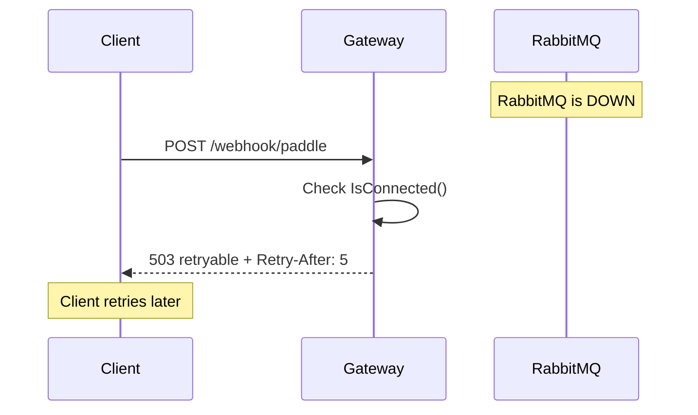

# Health

This document explains how to monitor the Payment Gateway's health status.

## Overview

The gateway provides two health endpoints:

- **Liveness** (`/healthz`) - Is the process running?
- **Readiness** (`/readyz`) - Can the gateway serve requests?

Think of liveness as "is it alive?" and readiness as "is it ready to work?"

## Health Endpoints

### Liveness Check

**What it does:** Always returns 200 if the process is running.

```bash
curl http://localhost:8080/healthz
```

**Response:**

```json
{
  "status": "ok"
}
```

**When to use:**
- Kubernetes liveness probe
- Basic "is it alive?" check
- Load balancer health check

**Configuration:**

```yaml
# Kubernetes pod spec
livenessProbe:
  httpGet:
    path: /healthz
    port: 8080
  initialDelaySeconds: 10
  periodSeconds: 10
```

### Readiness Check

**What it does:** Checks if RabbitMQ is connected.

```bash
curl http://localhost:8080/readyz
```

**Response (healthy):**

```json
{
  "status": "ok",
  "service": "gateway"
}
```

**Response (unhealthy):**

```json
{
  "status": "error",
  "rabbitmq": "disconnected"
}
```

**When to use:**
- Kubernetes readiness probe
- Load balancer routing decisions
- Monitoring RabbitMQ connectivity

**Configuration:**

```yaml
# Kubernetes pod spec
readinessProbe:
  httpGet:
    path: /readyz
    port: 8080
  initialDelaySeconds: 5
  periodSeconds: 5
```

## Fast-Fail Behavior

When RabbitMQ is down, the gateway **fast-fails** instead of buffering:



**What happens:**
1. Client sends a request
2. Gateway checks if RabbitMQ is connected
3. If not connected, returns 503 immediately
4. Includes `Retry-After: 5` header
5. Client retries after 5 seconds

**Why fast-fail?**
- **No data loss** - If gateway buffered and crashed, buffered messages are lost
- **Paddle retries** - Paddle automatically retries on 503
- **Simpler** - No buffering logic to maintain
- **Faster recovery** - Gateway stays responsive even when RMQ is down

**Why not buffer?**
- Buffer would be in-memory (lost on crash)
- Buffer adds complexity
- Paddle already handles retries
- Buffer could grow unbounded under load

## Health Check Implementation

### Liveness

The liveness check is simple - just return 200:

```go
func (h *Handler) livez(c *gin.Context) {
    c.JSON(http.StatusOK, gin.H{"status": "ok"})
}
```

**Why so simple?**
- Liveness only checks if process is running
- No external dependencies
- Fast and reliable

### Readiness

The readiness check verifies RabbitMQ connection:

```go
func (h *Handler) readyz(c *gin.Context) {
    if !h.health.IsConnected() {
        c.JSON(http.StatusServiceUnavailable, gin.H{
            "status": "error",
            "rabbitmq": "disconnected",
        })
        return
    }
    c.JSON(http.StatusOK, gin.H{
        "status": "ok",
        "service": "gateway",
    })
}
```

**Why check RabbitMQ?**
- Gateway can't serve requests without RabbitMQ
- Better to fail fast than silently drop messages
- Load balancers can route to healthy instances

## Docker Compose Health Checks

The compose file includes health checks:

```yaml
healthcheck:
  test: ["CMD", "wget", "--no-verbose", "--tries=1", "--spider", "http://localhost:8080/readyz"]
  interval: 10s
  timeout: 5s
  retries: 3
  start_period: 15s
```

| Setting | Value | Why |
|---------|-------|-----|
| `interval` | 10 seconds | Check frequently enough |
| `timeout` | 5 seconds | Fail fast if unresponsive |
| `retries` | 3 attempts | Allow transient failures |
| `start_period` | 15 seconds | Give time to start |

**Why these values?**
- 10 seconds catches issues quickly
- 5 seconds prevents hanging
- 3 retries allows transient failures
- 15 seconds start period allows for initialization

## Monitoring Health

### Key Metrics

| Metric | What It Tells You | Healthy Value |
|--------|-------------------|---------------|
| `rabbitmq_connection_status` | Is RabbitMQ connected? | `1` |
| `http_requests_total{code="503"}` | How many 503s? | Low or zero |
| `rabbitmq_reconnections_total` | How many reconnections? | Stable |

### Dashboard Queries

```promql
# RabbitMQ connection status
rabbitmq_connection_status

# 503 rate (fast-fail)
rate(http_requests_total{code="503"}[5m])

# Reconnection rate
rate(rabbitmq_reconnections_total[5m])
```

## Troubleshooting

### Readiness Check Fails (503)

**Symptoms:**
- `/readyz` returns 503
- Requests return 503 with `Retry-After: 5`

**Possible causes:**
1. **RabbitMQ is down** - Most common
2. **Network issue** - Can't reach RabbitMQ
3. **Wrong URL** - `RABBITMQ_URL` is incorrect

**What to do:**
1. Check RabbitMQ status: `docker ps | grep rabbitmq`
2. Check gateway logs: `make gateway-logs`
3. Verify `RABBITMQ_URL` configuration
4. Restart RabbitMQ: `docker restart rabbitmq`

### Health Check Times Out

**Symptoms:**
- Docker health check shows `unhealthy`
- Kubernetes pod shows `Readiness probe failed`

**Possible causes:**
1. **Gateway overloaded** - Too many requests
2. **RabbitMQ slow** - Broker responding slowly
3. **Network latency** - Slow connection

**What to do:**
1. Check gateway metrics: `curl http://localhost:8080/metrics`
2. Check RabbitMQ management UI: `http://localhost:15672`
3. Scale gateway instances if needed

### Intermittent 503s

**Symptoms:**
- Some requests succeed, some fail with 503
- `rabbitmq_reconnections_total` is increasing

**Possible causes:**
1. **RabbitMQ unstable** - Connection dropping
2. **Network flapping** - Intermittent connectivity
3. **Resource pressure** - Memory/CPU issues

**What to do:**
1. Check RabbitMQ logs
2. Monitor `rabbitmq_reconnections_total`
3. Check system resources (CPU, memory, network)

## Best Practices

### Kubernetes Configuration

```yaml
# Production-ready probe configuration
livenessProbe:
  httpGet:
    path: /healthz
    port: 8080
  initialDelaySeconds: 10
  periodSeconds: 10
  timeoutSeconds: 5
  failureThreshold: 3

readinessProbe:
  httpGet:
    path: /readyz
    port: 8080
  initialDelaySeconds: 5
  periodSeconds: 5
  timeoutSeconds: 5
  failureThreshold: 3
```

### Load Balancer Configuration

- Use `/readyz` for routing decisions
- Use `/healthz` for basic liveness
- Set appropriate timeout (5 seconds)
- Configure retry logic for 503s

### Monitoring Setup

1. **Alert on 503s** - High 503 rate indicates RabbitMQ issues
2. **Alert on reconnections** - Frequent reconnections indicate instability
3. **Dashboard** - Monitor `rabbitmq_connection_status` and 503 rate

## Related Documentation

- [Observability](observability.md) - Metrics and alerts
- [Message Delivery](../concepts/message-delivery.md) - RabbitMQ connection management
- [API Reference](../components/api.md) - Health endpoint details
- [Configuration](../getting-started/configuration.md) - Health check settings
