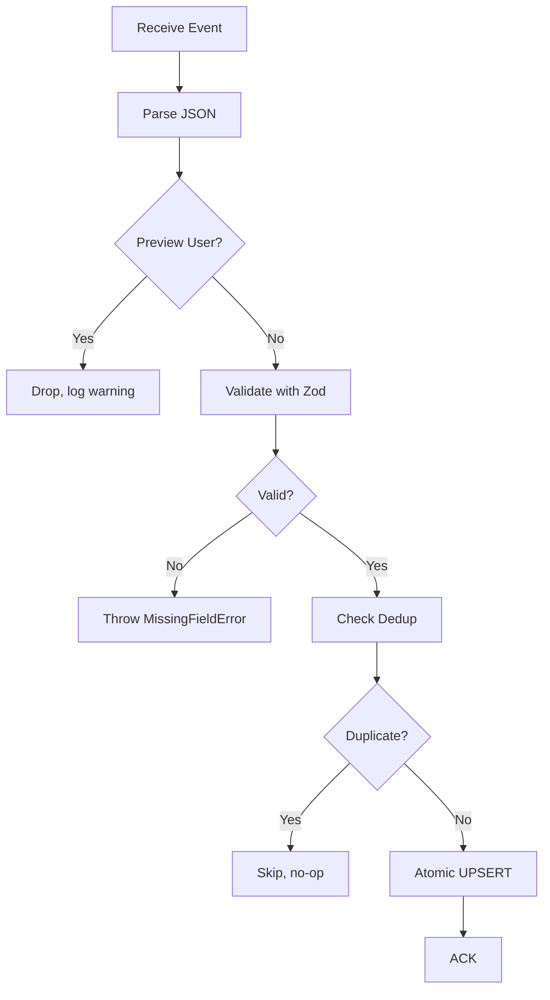
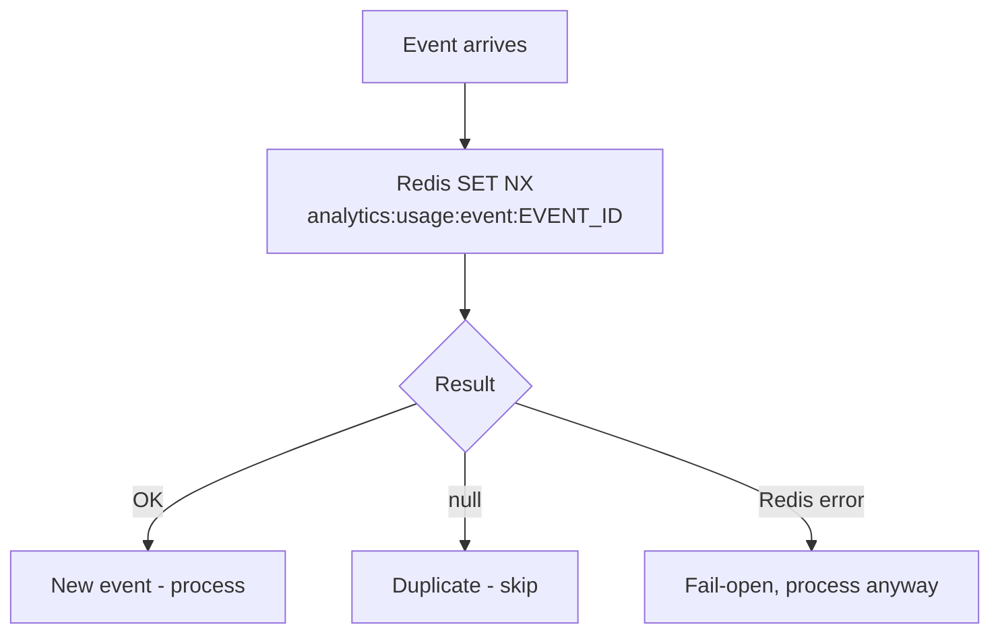
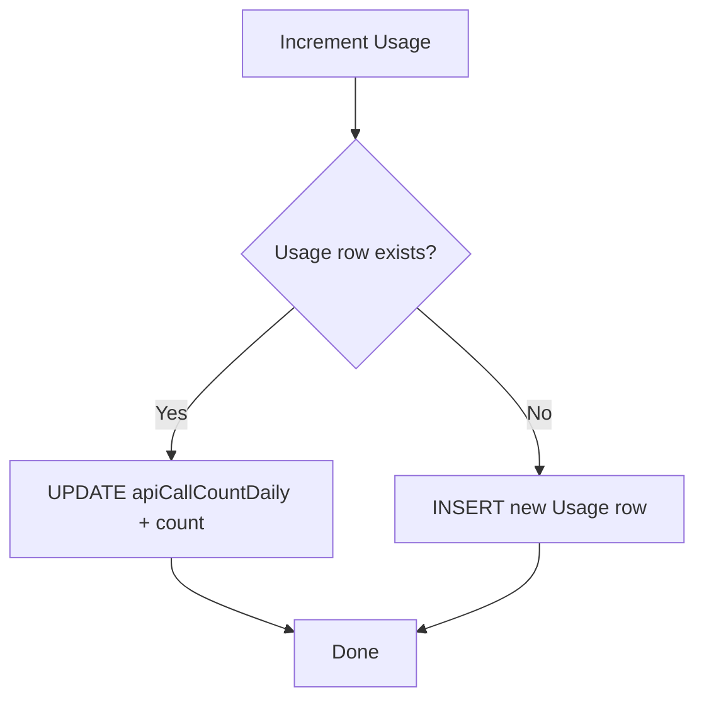
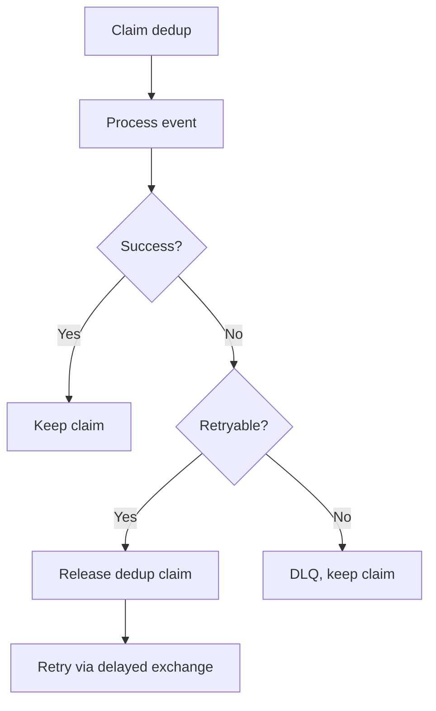

# Analytics Worker

This document explains how the Analytics worker processes usage events in detail.

## What is the Analytics Worker?

The Analytics worker tracks API usage by processing `usage_event` messages from RabbitMQ. It atomically increments daily and total usage counters in PostgreSQL.

## Why Have a Separate Analytics Worker?

- **Decoupling** — Usage tracking doesn't block API requests
- **Deduplication** — Prevents double-counting from redelivered messages
- **Scalability** — Can handle high-volume usage events independently

## How It Works

### Event Schema

Usage events must match this schema:

| Field | Type | Required | Description |
|-------|------|----------|-------------|
| `eventId` | string (UUID) | yes | Unique event identifier for dedup |
| `userId` | string | yes | User who made the API call |
| `count` | integer | yes | Number of API calls to count |
| `timestamp` | string (ISO) | no | When the call happened |
| `event_type` | `usage_event` | no | Event type discriminator |
| `type` | `usage_event` | no | Alternative event type field |

### Event Processing Pipeline

### Deduplication

The Analytics worker uses Redis SET NX for fast, atomic deduplication:

| Setting | Value | Description |
|---------|-------|-------------|
| Key pattern | `analytics:usage:event:{eventId}` | Per-event dedup key |
| TTL | 7 days (604800s) | Auto-cleanup of old dedup keys |
| Operation | `SET NX EX` | Atomic claim with expiry |

**Fail-open:** If Redis is down, the event is processed anyway. Better to over-count than lose usage data.

### Atomic Usage Increment

The worker uses a Prisma UPSERT to atomically increment usage counters:

**Why atomic?**
- Prevents race conditions from concurrent events
- No read-modify-write cycle
- Single database operation

### No Cache Invalidation

The Analytics worker does **not** invalidate user cache after incrementing usage:

| Cache Key | Why No Invalidation |
|-----------|---------------------|
| `user:basic:*` | Usage counters are not embedded in cached user blobs |
| `user:sub:*` | Usage is separate from subscription status |
| `rate_limit:*` | Counters expire at midnight UTC via TTL, not explicit invalidation |

**Why?**
- Pre-split: usage was embedded in user cache, causing churn on every increment
- Post-split: usage counters are independent, cache staleness is acceptable
- Rate limits reset at midnight UTC anyway

## Error Handling

### Error Classification

| Error | Action |
|-------|--------|
| Invalid event schema | Throw `MissingFieldError` (DLQ) |
| Missing `eventId` | Throw error (DLQ) |
| DB unavailable | Retry via RabbitMQ delayed exchange |
| Transient DB error | Retry via RabbitMQ delayed exchange |
| Redis error (dedup) | Fail-open, process anyway |
| Duplicate event | Silently skip |

### Dedup Claim Release

If processing fails after claiming dedup, the claim is released:

**Why release?**
- Retryable errors (like DB timeouts) may succeed on retry
- Releasing the claim allows the redelivered event to be processed
- Non-retryable errors keep the claim to prevent infinite retries

## Configuration

| Variable | Default | Description |
|----------|---------|-------------|
| `RABBITMQ_URL` | (required in prod) | RabbitMQ connection |
| `REDIS_URL` | (required) | Redis for dedup |
| `PORT` | 7001 | Health server port |

## Metrics

| Metric | What It Tells You |
|--------|-------------------|
| `worker_jobs_processed_total` | Total usage events processed |
| `worker_job_errors_total` | Failed events by error type |
| `worker_job_duration_seconds` | Processing time per event |
| `worker_stale_events_filtered_total` | Duplicate events filtered |
| `worker_domain_operations_volume_total` | Total API calls counted |
| `cache_operations_total` | Cache operations (dedup) |

## Troubleshooting

**Events not processing?**
- Check RabbitMQ connectivity
- Verify `analytics.usage` queue exists
- Look at worker logs for connection errors

**Usage counts seem low?**
- Check `worker_stale_events_filtered_total` — are events being deduped?
- Verify Redis is healthy for dedup
- Check for `MissingFieldError` in logs

**Usage counts seem high?**
- Check for duplicate events in the queue (Paddle or web app may be sending duplicates)
- Dedup is working correctly if `worker_stale_events_filtered_total` > 0

**High error rate?**
- Check database health
- Look at `worker_job_errors_total` for error types
- Common: DB connection pool exhaustion under high load

## Next Steps

- [Message Flows](../concepts/message-flows.md) - Analytics flow overview
- [Architecture](../concepts/architecture.md) - System design
- [Health](../operations/health.md) - Monitoring the worker
