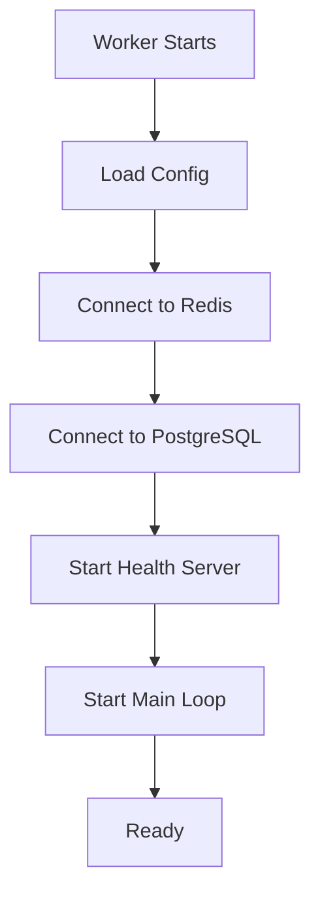
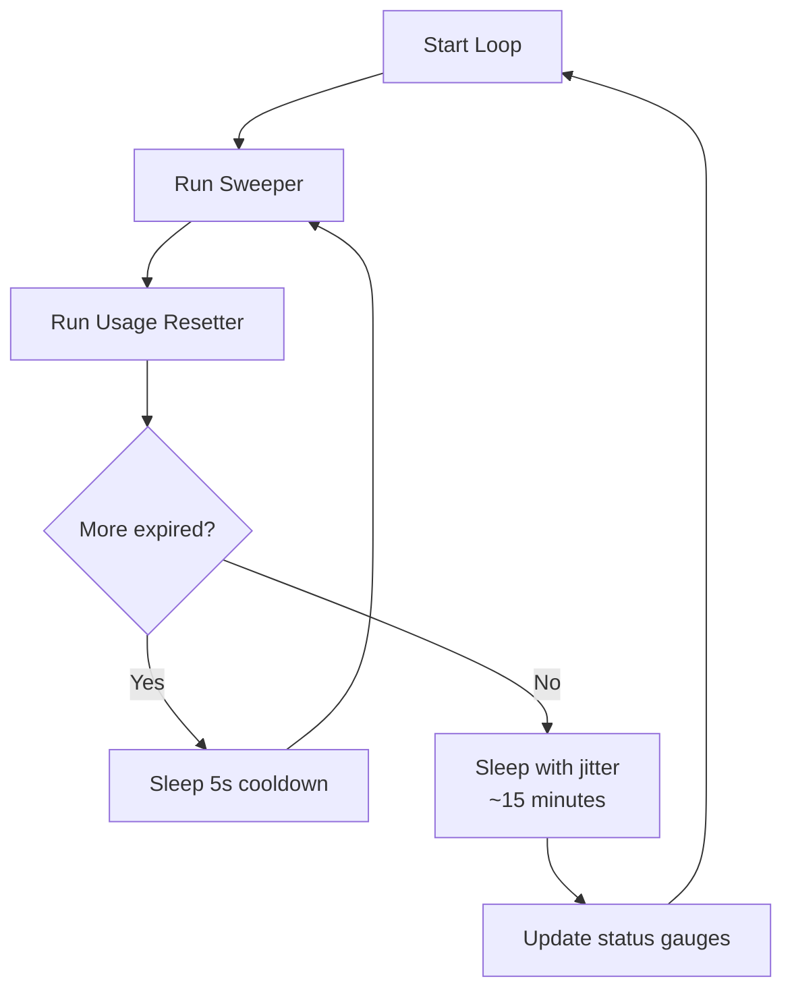
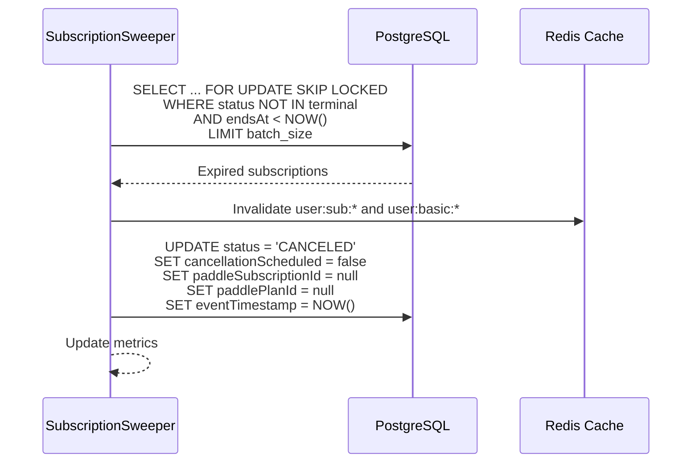
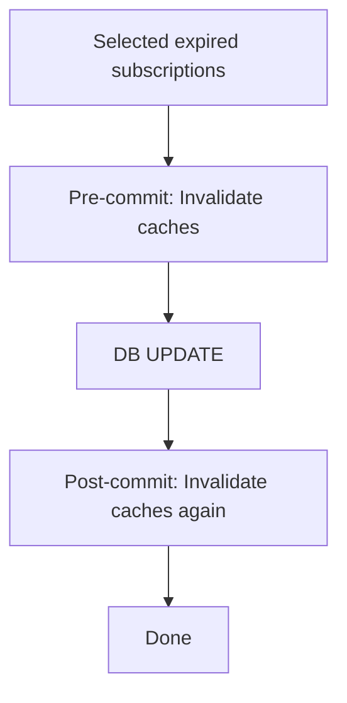
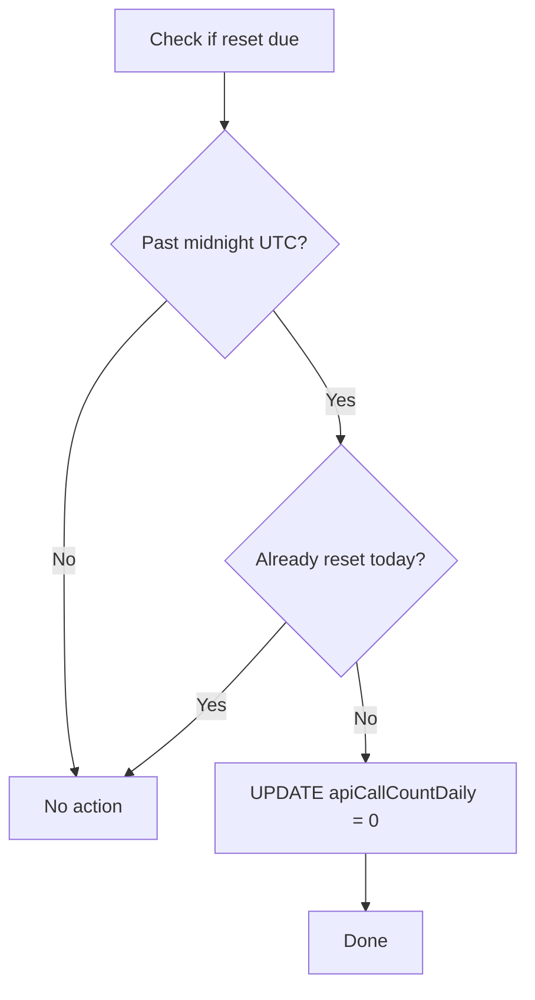

# Cron Worker

This document explains how the Cron worker performs background maintenance tasks in detail.

## What is the Cron Worker?

The Cron worker runs two periodic jobs:
1. **Subscription Sweeper** — Expires subscriptions that have passed their `endsAt` date
2. **Usage Resetter** — Resets daily API call counters at midnight UTC

## Why Have a Separate Cron Worker?

- **No queue dependency** — Runs on a timer, doesn't need RabbitMQ
- **Batch processing** — Handles thousands of expired subscriptions efficiently
- **Graceful shutdown** — Drains in-progress work before exiting
- **Self-healing** — Catches per-iteration errors and continues

## How It Works

### Startup Sequence



**Key behaviors:**
1. Dependencies probed with 5 retries, 2s backoff
2. Health server starts immediately
3. Main loop starts even if deps aren't ready (loop catches errors)
4. Graceful shutdown on SIGINT/SIGTERM/SIGQUIT

### Main Loop

The Cron worker runs a continuous loop with intelligent sleeping:



| Phase | Sleep Duration | When |
|-------|---------------|------|
| Batch cooldown | 5 seconds | After processing a non-empty batch |
| Idle sleep | ~15 minutes (jittered) | When no expired subscriptions found |
| Error cooldown | 60 seconds | After a critical error in the loop |

### Subscription Sweeper

The sweeper finds and expires subscriptions that have passed their `endsAt` date:



**Key behaviors:**
1. `FOR UPDATE SKIP LOCKED` — Prevents contention with other instances
2. Pre-commit cache invalidation — Shrinks stale-read window
3. Post-commit cache invalidation — Ensures cache is clean
4. Paddle identifiers cleared — Subscription is fully canceled
5. `cancellationScheduled` set to false — Moot after `endsAt` passes

#### Batch Processing

| Parameter | Default | Description |
|-----------|---------|-------------|
| `CRON_BATCH_SIZE` | 100 | Max subscriptions per batch |
| Batch cooldown | 5000ms | Sleep between non-empty batches |
| Idle sleep | ~900000ms (15 min) | Sleep between empty sweeps |

**Why batch?**
- Thousands of subscriptions may expire at once (e.g., billing cycle end)
- Processing all at once would overwhelm the database
- Batches allow interleaving with other database operations
- Metrics track batch efficiency

#### Cache Invalidation

The sweeper invalidates user caches before and after the database update:



**Why twice?**
- Pre-commit: Reduces window where stale cache is read
- Post-commit: Catches any reads during the DB update
- ~100ms replica lag remains possible (acceptable)

### Usage Resetter

The resetter is a safety net that resets daily usage counters at midnight UTC:



**Why a safety net?**
- Primary reset happens in the web app (sync)
- Cron reset catches cases where the web app didn't run
- Ensures daily counters reset even during maintenance windows

## Graceful Shutdown

The Cron worker handles shutdown carefully to avoid data loss:

```mermaid
sequenceDiagram
    participant Signal as SIGTERM
    participant Worker as Cron Worker
    participant Loop as Main Loop
    participant DB as PostgreSQL

    Signal->>Worker: Shutdown signal
    Worker->>Worker: Set isShuttingDown = true
    Worker->>Worker: Stop health server
    Worker->>Loop: Abort current sleep
    Worker->>Worker: Wait for current job (10s budget)
    alt Job finishes in time
        Worker->>Worker: Job completed
    else Job times out
        Worker->>Worker: Log abort, continue shutdown
    end
    Worker->>DB: Close Prisma connection
    Worker->>Worker: Exit process
```

**Shutdown budget:** 10 seconds total for all in-flight work.

| Shutdown Step | Timeout | Action on Timeout |
|---------------|---------|-------------------|
| Abort current sleep | Immediate | Sleep interrupted via AbortSignal |
| Wait for current job | 10s total budget | Log abort, continue |
| Close Prisma | Implicit | Force close |
| Exit | Immediate | `process.exit(0)` |

### Shutdown Metrics

| Metric | What It Tells You |
|--------|-------------------|
| `worker_cron_shutdown_aborts_total{reason="sleep_aborted"}` | Sleep was interrupted during shutdown |
| `worker_cron_shutdown_aborts_total{reason="job_grace_timeout"}` | Job didn't finish in time |
| `worker_cron_shutdown_aborts_total{reason="loop_grace_timeout"}` | Loop didn't finish in time |

## Health Checks

The Cron worker has two health endpoints:

### Liveness (`/health`)

Returns healthy unless:
- Worker is shutting down
- Loop hasn't started after 60 seconds

### Readiness (`/ready`)

Returns healthy only when:
- PostgreSQL is reachable
- Redis is reachable
- Connection pool is not pressured
- Last sweep was within 2x the check interval

```mermaid
graph TB
    A[/ready] --> B{Shutting down?}
    B -->|Yes| C[503 Not Ready]
    B -->|No| D{DB OK?}
    D -->|No| C
    D -->|Yes| E{Redis OK?}
    E -->|No| C
    E -->|Yes| F{Pool pressured?}
    F -->|Yes| C
    F -->|No| G{Loop stale?}
    G -->|Yes| C
    G -->|No| H[200 Ready]
```

## Configuration

| Variable | Default | Description |
|----------|---------|-------------|
| `CRON_CHECK_INTERVAL_MS` | 900000 (15 min) | How often to check for expired subscriptions |
| `CRON_BATCH_SIZE` | 100 | Max subscriptions per sweep batch |
| `REDIS_URL` | (required) | Redis for cache invalidation |
| `PORT` | 7002 | Health server port |

## Metrics

| Metric | What It Tells You |
|--------|-------------------|
| `worker_cron_loop_iterations_total` | Loop iterations by result (success, empty, error) |
| `worker_cron_sweep_batch_size` | Batch sizes per sweep |
| `worker_cron_expiry_lag_seconds` | Max lag between sweep time and oldest expired endsAt |
| `worker_cron_expired_backlog` | Number of expired subscriptions pending sweep |
| `worker_cron_subscription_status` | Subscription status distribution |
| `worker_cron_stale_events_filtered_total` | Phantom/stale events filtered |
| `worker_cron_cache_invalidate_duration_seconds` | Cache invalidation duration |
| `worker_cron_db_lock_skipped_total` | SKIP LOCKED rows (lock contention) |
| `worker_cron_jitter_seconds` | Sleep duration with jitter |
| `worker_cron_config` | Config values for drift detection |

## Troubleshooting

**Sweeper not processing?**
- Check PostgreSQL connectivity
- Verify `worker_cron_loop_iterations_total` is incrementing
- Look at worker logs for critical errors

**High expiry lag?**
- Check `worker_cron_expiry_lag_seconds` metric
- Increase `CRON_BATCH_SIZE` to process more per iteration
- Check database performance

**Many subscriptions in backlog?**
- Check `worker_cron_expired_backlog` metric
- May need to increase batch size or run more frequently
- Check for lock contention (`worker_cron_db_lock_skipped_total`)

**Shutdown aborts?**
- Check `worker_cron_shutdown_aborts_total` metric
- Jobs may be taking too long — check DB performance
- Consider increasing shutdown grace period if needed

## Next Steps

- [Message Flows](../concepts/message-flows.md) - Cron flow overview
- [Architecture](../concepts/architecture.md) - System design
- [Health](../operations/health.md) - Monitoring the worker
