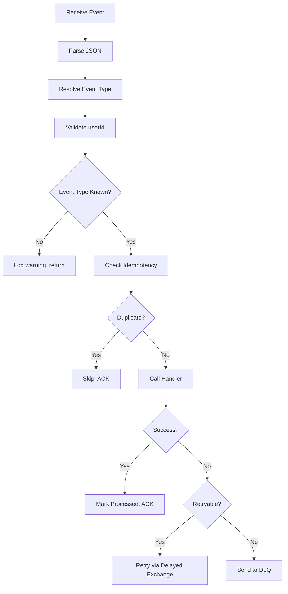
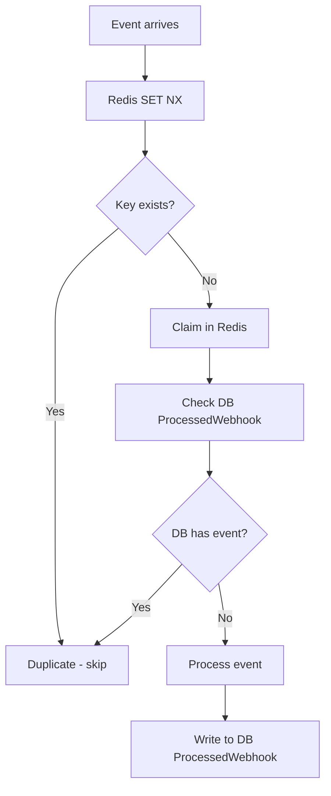
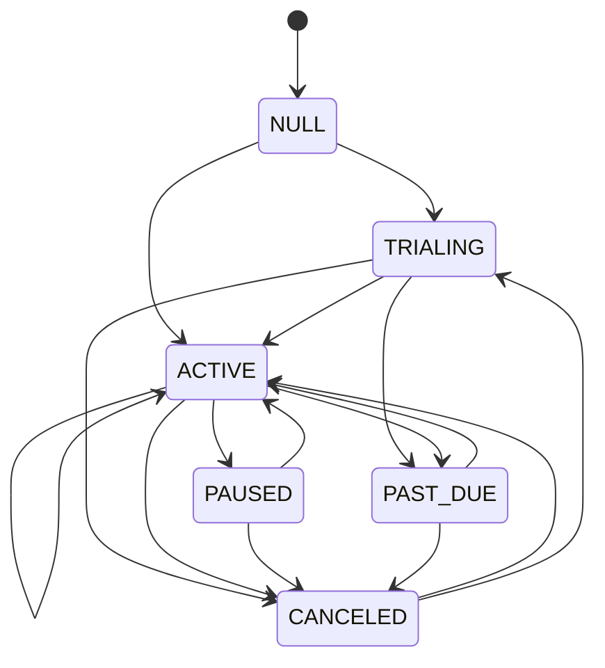
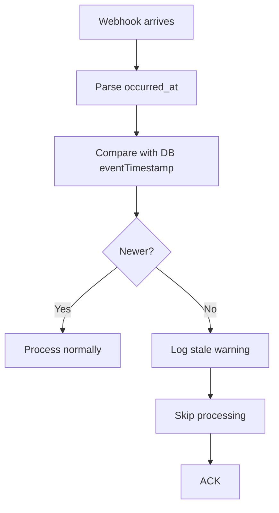
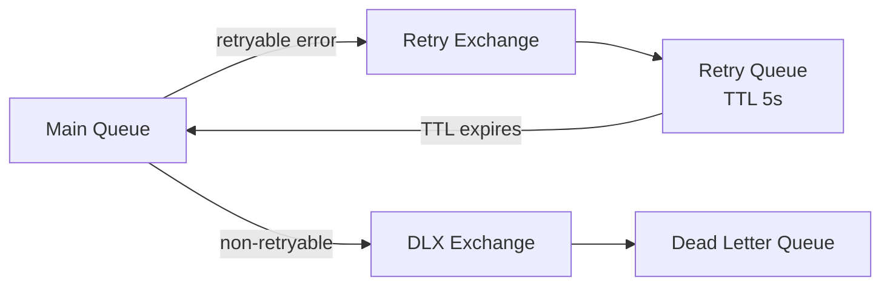
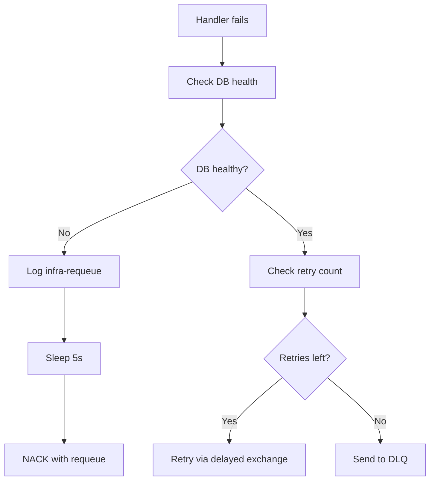

# Payments Worker

This document explains how the Payments worker processes Paddle webhooks in detail.

## What is the Payments Worker?

The Payments worker handles subscription lifecycle events from Paddle. It processes webhooks for subscription creation, updates, activation, cancellation, and user-initiated cancellations.

## Why Have a Separate Payments Worker?

- **Isolation** — Payment processing has unique dependencies (Paddle API, events Redis)
- **Reliability** — Quorum queues ensure no webhook is lost
- **Idempotency** — Duplicate webhooks from Paddle are safely ignored
- **State machine** — Invalid status transitions are rejected

## How It Works

### Event Types

The Payments worker handles these Paddle event types:

| Event Type | Handler | What It Does |
|------------|---------|--------------|
| `subscription.created` | `SubscriptionUpdatedHandler` | Creates/updates subscription with initial status |
| `subscription.updated` | `SubscriptionUpdatedHandler` | Updates subscription status and dates |
| `subscription.activated` | `SubscriptionUpdatedHandler` | Marks subscription as active |
| `subscription.canceled` | `SubscriptionCanceledHandler` | Clears paddle identifiers, marks canceled |
| `user.cancel_subscription` | `UserCancelHandler` | Calls Paddle API to cancel, then updates DB |

### Event Processing Pipeline

### Idempotency

Paddle may send the same webhook multiple times. The Payments worker uses a two-layer idempotency system:

| Layer | Storage | TTL | Purpose |
|-------|---------|-----|---------|
| Fast path | Redis (`paddle:evt:*`) | 7 days | Quick duplicate detection |
| Permanent | PostgreSQL (`ProcessedWebhook`) | 90 days | Replay window for manual investigation |

**Fail-open:** If Redis is down, falls back to DB check. If both fail, processes the event (better to over-process than lose data).

### State Machine

The Payments worker enforces valid subscription status transitions:

Invalid transitions throw `InvalidTransitionError` and send the event to the DLQ.

### Stale Event Detection

The worker tracks `eventTimestamp` on each subscription. If a webhook arrives with an older timestamp than the current record, it's considered stale:

## Error Handling

### Retry Topology

| Retry Setting | Value | Description |
|---------------|-------|-------------|
| Max retries | 5 | Messages retried up to 5 times |
| Retry delay | 5000ms (5s) | TTL on retry queue |
| Retry exchange | `{queue}_retry_exchange` | Routes retryable messages |
| Retry queue | `{queue}_retry` | Delayed message storage |

### Error Classification

| Error | Retryable? | Action |
|-------|------------|--------|
| `UserNotFoundError` | No | DLQ (webhook before user exists) |
| `MissingFieldError` | No | DLQ (missing required data) |
| `InvalidTransitionError` | No | DLQ (invalid status change) |
| `SyntaxError` | No | DLQ (malformed event) |
| DB unavailable | Yes (infra) | Requeue (no retry burn) |
| Transient DB error | Yes | Retry via delayed exchange |
| Redis error (idempotency) | N/A | Fail-open, process anyway |

### Infra-Requeue

When the database is unavailable (not the event's fault), the worker uses infra-requeue:

**Why infra-requeue?**
- Database being down is not the event's fault
- No retry burn (doesn't count against max retries)
- No DLQ (message is valid, just can't be processed yet)
- Message re-enters the queue after a short delay

## Configuration

| Variable | Default | Description |
|----------|---------|-------------|
| `PADDLE_API_KEY` | (required) | Paddle API key for cancel requests |
| `PADDLE_ENVIRONMENT` | `sandbox` | `sandbox` or `production` |
| `EVENT_REDIS_URL` | (required) | Redis for event dedup |
| `RABBITMQ_URL` | (required in prod) | RabbitMQ connection |
| `PORT` | 7003 | Health server port |

## Metrics

| Metric | What It Tells You |
|--------|-------------------|
| `worker_jobs_processed_total` | Total events processed |
| `worker_job_errors_total` | Failed events by error type |
| `worker_job_duration_seconds` | Processing time per event |
| `worker_dead_lettered_total` | Messages sent to DLQ |
| `worker_duplicate_events_total` | Duplicate events filtered |
| `worker_retry_total` | Retry attempts |
| `worker_infra_requeued_total` | Infra-requeue count |
| `paddle_cancel_total` | Paddle cancel requests by status |
| `paddle_request_duration_seconds` | Paddle API call duration |

## Troubleshooting

**Events not processing?**
- Check RabbitMQ connectivity
- Verify `payment_events` queue exists
- Look at worker logs for connection errors

**Many messages in DLQ?**
- Check `worker_dead_lettered_total` metric
- Review error logs for specific failure reasons
- Common: `UserNotFoundError` (webhook before user row), `InvalidTransitionError` (out-of-order webhooks)

**High duplicate count?**
- Paddle may be retrying webhooks — check Paddle dashboard
- Idempotency store is working correctly (duplicates are safely filtered)

**Stale events being filtered?**
- Check `worker_cron_stale_events_filtered_total` metric
- Webhooks arriving out of order — usually self-correcting

## Next Steps

- [Message Flows](../concepts/message-flows.md) - Payment flow overview
- [Architecture](../concepts/architecture.md) - System design
- [Health](../operations/health.md) - Monitoring the worker
