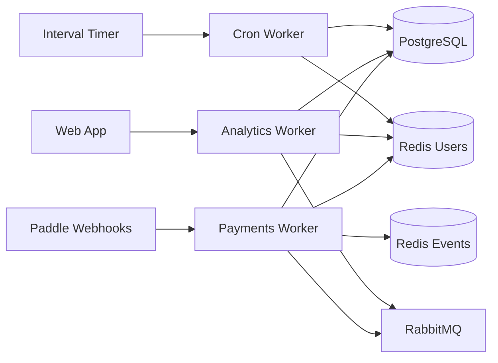
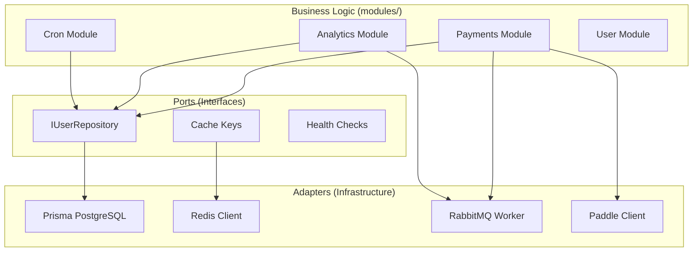
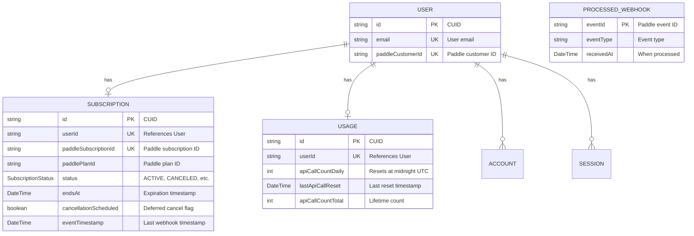
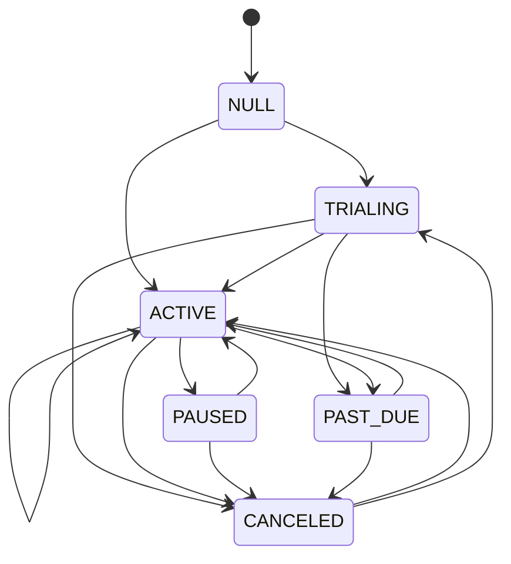
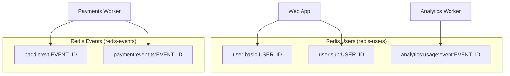
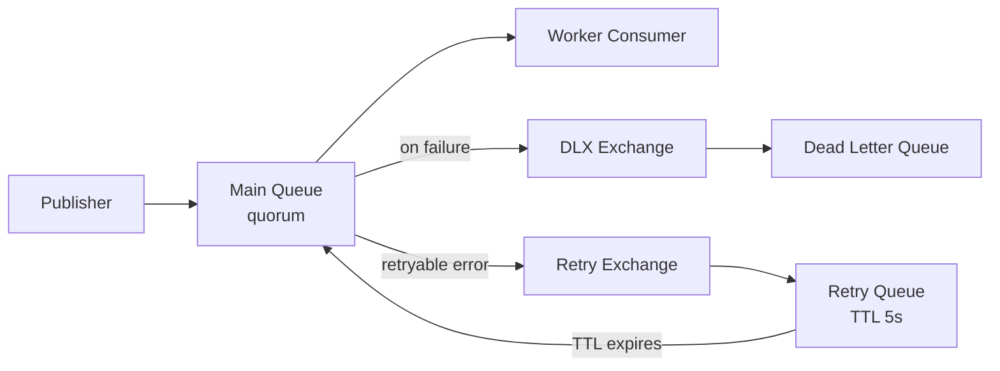
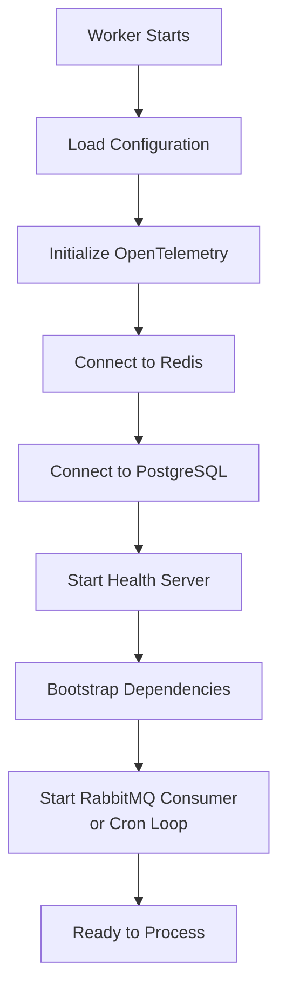

# Architecture

This document explains how the Workers service is structured and why it's designed this way.

## Overview

The Workers service is a TypeScript/Bun application that handles background processing for the DetectAI platform. It runs as **three independent worker processes**, each handling a specific domain:



**Why three separate workers?**
- Each worker has different dependencies (cron doesn't need RabbitMQ)
- Each can be scaled independently
- Failures in one don't affect the others
- Each runs in its own isolated Docker Compose stack

## How the Code is Organized

The service uses **clean architecture** (also called "ports and adapters"). This means:

- **Business logic** is in the center (the "hexagon")
- **External systems** (databases, caches, APIs) connect through "ports"
- Each external system has an "adapter" that connects it to the business logic



**Why this pattern?**
- Easy to test (can swap real databases with fakes)
- Easy to change external systems (swap PostgreSQL for another DB)
- Business logic stays clean and focused

## Project Structure

```
workers/
├── src/
│   ├── cmd/                          # Entry points (one per worker)
│   │   ├── payments/                 # Payments worker
│   │   │   ├── index.ts              # Bootstrap and main loop
│   │   │   └── config.ts             # Paddle + events-redis config
│   │   ├── analytics/                # Analytics worker
│   │   │   ├── index.ts              # Bootstrap and main loop
│   │   │   └── config.ts             # Analytics config
│   │   └── cron/                     # Cron worker
│   │       ├── index.ts              # Bootstrap and main loop
│   │       └── config.ts             # Cron config
│   ├── modules/                      # Business logic
│   │   ├── payments/
│   │   │   ├── domain/               # State machine, error types
│   │   │   ├── application/
│   │   │   │   ├── services/         # PaymentService (event dispatcher)
│   │   │   │   └── handlers/         # SubscriptionUpdated, Canceled, UserCancel
│   │   │   └── infrastructure/       # PaddleClient
│   │   ├── analytics/
│   │   │   ├── application/services/ # AnalyticsService
│   │   │   └── infrastructure/       # UsageEventDeduplicator
│   │   ├── cron/
│   │   │   └── application/services/ # SubscriptionSweeper, UsageResetter
│   │   └── user/
│   │       ├── domain/               # IUserRepository interface
│   │       └── infrastructure/       # PrismaUserRepository
│   └── shared/                       # Shared infrastructure
│       ├── bootstrap/                # Worker app helpers
│       ├── cache/                    # Redis client, keys, invalidation, dedup
│       ├── config/                   # Zod schemas, AWS loader
│       ├── database/                 # Prisma clients (primary + replica)
│       ├── errors/                   # AppError, isRetryableError
│       ├── health/                   # Health checks
│       ├── http/                     # WorkerServer (Bun HTTP)
│       ├── logging/                  # PII-redacting structured logger
│       ├── messaging/                # RabbitMQWorker, topology
│       ├── monitoring/               # prom-client metrics
│       ├── retry/                    # Exponential backoff, jitter
│       ├── tracing/                  # OpenTelemetry
│       └── utils/                    # withTimeout, abortableSleep
├── prisma/
│   ├── schema.prisma                 # Database models
│   └── migrations/                   # Schema migrations
├── infra/                            # Docker Compose per worker
│   ├── compose.payments.yml
│   ├── compose.analytics.yml
│   ├── compose.cron.yml
│   └── compose.migrate.yml
├── Dockerfile
├── Makefile
└── package.json
```

## Data Model

The Workers service uses PostgreSQL with the following models:



### Key Models

#### `User`
Stores user accounts. The Workers service reads user data for cache invalidation and subscription lookups.

#### `Subscription`
Tracks subscription lifecycle. This is the primary model modified by the Payments and Cron workers.

| Field | Description |
|-------|-------------|
| `status` | Current subscription state (`ACTIVE`, `CANCELED`, `PAST_DUE`, `PAUSED`, `TRIALING`) |
| `endsAt` | When the subscription expires (swept by Cron worker) |
| `cancellationScheduled` | Whether a cancellation is deferred to period end |
| `eventTimestamp` | Last Paddle event timestamp (stale-event detection) |

**Indexes:** `(status, endsAt)` for sweep queries, `(eventTimestamp)` for stale event filtering.

#### `Usage`
Daily and total API call counters. The Analytics worker atomically increments these.

| Field | Description |
|-------|-------------|
| `apiCallCountDaily` | Current day's API calls (resets at midnight UTC) |
| `apiCallCountTotal` | Lifetime API call count |

#### `ProcessedWebhook`
Permanent ledger of processed Paddle event IDs. Used for idempotency (90-day replay window).

### Subscription Status State Machine

The Payments worker enforces valid status transitions:



Invalid transitions throw `InvalidTransitionError` and send the event to the DLQ.

## Cache Architecture

The service uses two Redis instances with different purposes:



| Key Pattern | Purpose | TTL |
|-------------|---------|-----|
| `user:basic:USER_ID` | User profile cache | 1 hour |
| `user:basic:email:HASH` | User lookup by email | 1 hour |
| `user:sub:USER_ID` | Subscription status cache | 10 minutes |
| `analytics:usage:event:EVENT_ID` | Usage event dedup | 7 days |
| `paddle:evt:EVENT_ID` | Paddle event dedup | 7 days |
| `payment:event:ts:EVENT_ID` | Paddle event ordering | 30 days |

## Message Queue Architecture

The Payments and Analytics workers consume from RabbitMQ quorum queues with built-in retry and dead-lettering:



| Component | Purpose |
|-----------|---------|
| Main Queue | Quorum queue, durable, holds pending messages |
| DLX Exchange | Direct exchange for dead-lettered messages |
| Dead Letter Queue | Stores messages that exceeded retry limit |
| Retry Exchange | Routes retryable messages to retry queue |
| Retry Queue | TTL-based delay (5s), messages re-enter main queue after TTL |

**Retry behavior:**
- Max 5 retries per message
- 5-second delay between retries (TTL on retry queue)
- Non-retryable errors (`UserNotFoundError`, `MissingFieldError`, `InvalidTransitionError`) go directly to DLQ
- DB unavailable = infra-requeue (nack with requeue, no retry burn, no DLQ)

## How a Worker Starts

Each worker follows the same startup pattern:



**Key startup behaviors:**
1. Config is validated with Zod — invalid config exits immediately
2. Dependencies are probed with retries (5 attempts, 2s backoff)
3. Health server starts immediately (liveness = true, readiness = depends on deps)
4. Worker enters degraded mode if deps aren't available (retries in background)
5. Graceful shutdown on SIGINT/SIGTERM/SIGQUIT with 10s drain timeout

## Why This Design?

| Benefit | Explanation |
|---------|-------------|
| **Isolation** | Each worker runs independently, failures don't cascade |
| **Scalability** | Scale payments independently from analytics |
| **Testability** | Can test business logic without real databases |
| **Flexibility** | Swap external systems without changing business logic |
| **Reliability** | Quorum queues, idempotency, infra-requeue for resilience |
| **Observability** | Structured logs, OpenTelemetry traces, Prometheus metrics |

## Next Steps

- [Message Flows](message-flows.md) - See how events are processed
- [Configuration](../getting-started/configuration.md) - Learn about settings
- [Payments Worker](../components/payments-worker.md) - Payment processing details
