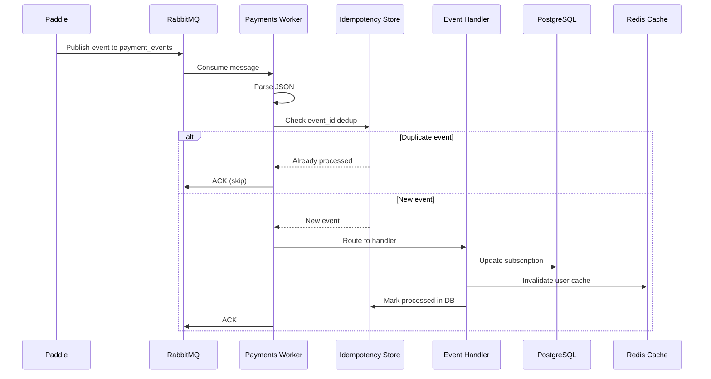
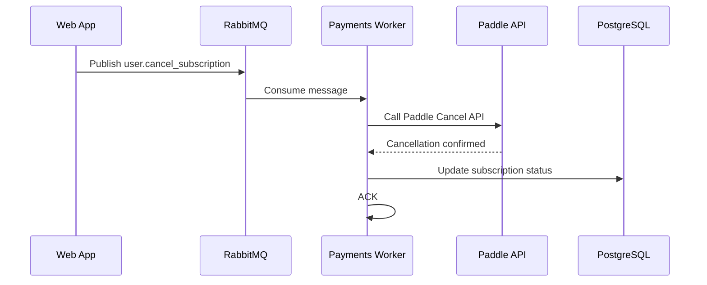
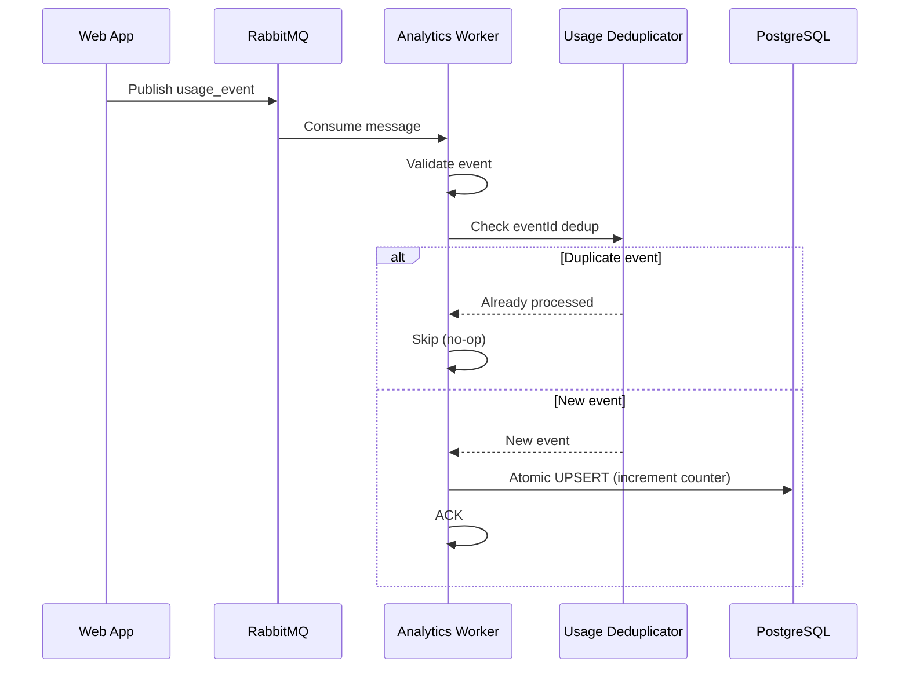
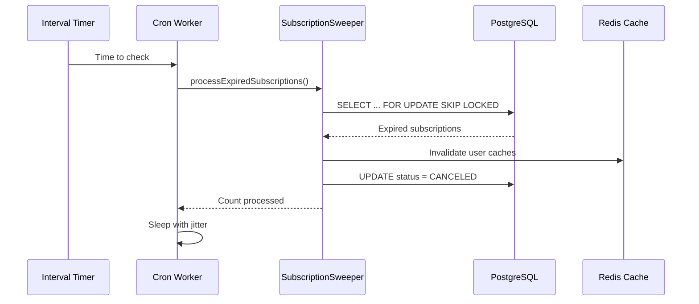
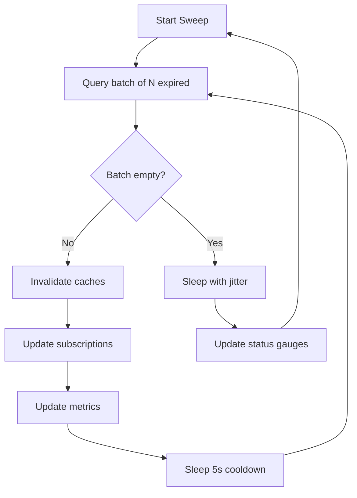
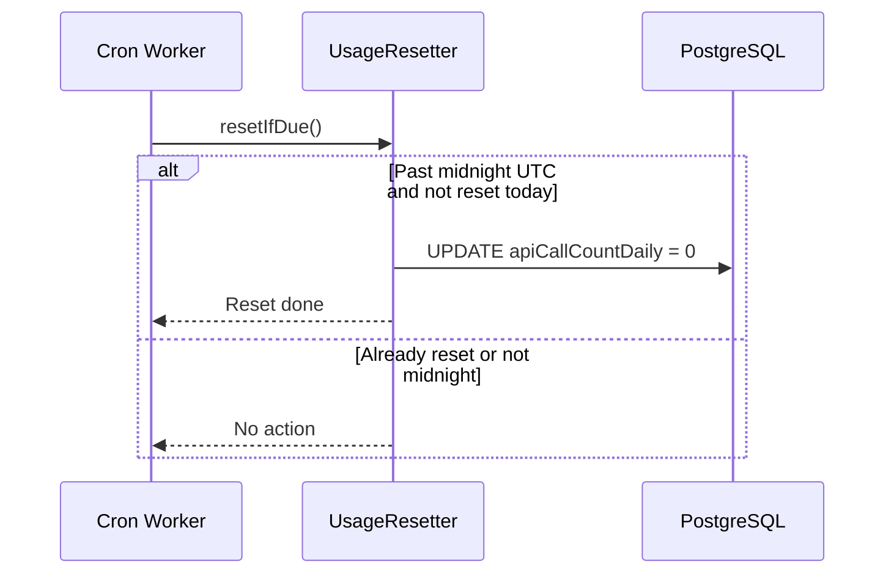

# Message Flows

This document explains how events are processed by each worker. We'll look at each main flow and see what happens step by step.

## Payment Webhook Flow

When Paddle sends a webhook, the Payments worker processes it through a series of steps:

### Step by Step

1. **Paddle sends webhook** — Subscription created, updated, activated, or canceled
2. **RabbitMQ queues message** — Quorum queue ensures durability
3. **Worker consumes message** — JSON parsed, job type resolved
4. **Idempotency check** — `paddle:evt:EVENT_ID` in Redis (7d) + `ProcessedWebhook` in DB (90d)
5. **Event routing** — Handler selected based on `event_type`
6. **State machine validation** — Status transition checked (e.g., ACTIVE -> CANCELED is valid)
7. **Database update** — Subscription status, endsAt, paddle identifiers updated
8. **Cache invalidation** — `user:sub:USER_ID` and `user:basic:USER_ID` keys deleted
9. **Idempotency persistence** — Event ID written to `ProcessedWebhook` table
10. **Message acknowledged** — Removed from queue

### Error Paths

| Error Type | What Happens |
|------------|--------------|
| **Duplicate event** | Silently skipped (idempotent) |
| **Invalid transition** | Sent to DLQ (non-retryable) |
| **Missing userId** | Sent to DLQ (non-retryable) |
| **User not found** | Sent to DLQ (webhook before user row exists) |
| **DB unavailable** | Infra-requeue (nack with requeue, no retry burn) |
| **Transient DB error** | Retry via delayed exchange (5s, up to 5 retries) |
| **Exhausted retries** | Sent to Dead Letter Queue |

### User Cancel Flow

When a user requests cancellation, the flow is slightly different:

**What happens:**
1. Web app publishes a `user.cancel_subscription` event
2. Worker calls the Paddle API to cancel the subscription
3. On success, updates the database with the new status
4. This two-step process ensures the Paddle-side cancellation happens before the local state change

## Analytics Usage Flow

When the web app tracks API usage, the Analytics worker processes the event:

### Step by Step

1. **Web app tracks usage** — API call happens, `usage_event` published
2. **RabbitMQ queues message** — Quorum queue ensures durability
3. **Worker consumes message** — Event validated with Zod schema
4. **Preview events filtered** — `userId` starting with `preview-` is dropped
5. **Deduplication check** — `analytics:usage:event:EVENT_ID` in Redis (7d TTL, SET NX)
6. **Atomic increment** — `Usage.apiCallCountDaily` and `apiCallCountTotal` incremented atomically
7. **Message acknowledged**

### Key Design Decisions

| Decision | Why |
|----------|-----|
| **No cache invalidation** | Usage counters are excluded from cached user blobs |
| **Redis SET NX dedup** | Atomic, fast, fails open on Redis error |
| **Atomic UPSERT** | Prevents race conditions from concurrent increments |
| **Fail-open dedup** | If Redis is down, process anyway (better to over-count than lose data) |

## Cron Sweep Flow

The Cron worker runs on a timer to clean up expired subscriptions:

### Step by Step

1. **Timer fires** — After configurable interval (default 15 minutes)
2. **Query expired subscriptions** — `endsAt < NOW()` and status is not terminal
3. **Lock rows** — `FOR UPDATE SKIP LOCKED` prevents contention with other instances
4. **Invalidate caches** — Delete `user:sub:*` and `user:basic:*` keys
5. **Update subscriptions** — Set `status = CANCELED`, clear paddle identifiers
6. **Update metrics** — Expiry lag, backlog, sweep batch size
7. **Sleep with jitter** — Randomized interval prevents thundering herd

### Batch Processing

The sweeper processes subscriptions in batches:

| Parameter | Default | Description |
|-----------|---------|-------------|
| `CRON_BATCH_SIZE` | 100 | Max subscriptions per batch |
| `CRON_CHECK_INTERVAL_MS` | 900000 (15 min) | Sleep between empty sweeps |
| Batch cooldown | 5000 (5s) | Sleep between non-empty batches |

### Usage Reset Flow

The Cron worker also resets daily usage counters at midnight UTC:

## Summary

| Flow | Trigger | Speed | Reliability |
|------|---------|-------|-------------|
| Payment webhook | Paddle event | Fast (async) | Quorum queue + idempotency |
| User cancel | Web app request | Medium (API call) | Two-step (Paddle + DB) |
| Analytics usage | Web app tracking | Fast (async) | Redis dedup + atomic UPSERT |
| Cron sweep | Timer (15 min) | Slow (batch) | FOR UPDATE SKIP LOCKED |
| Usage reset | Timer (midnight) | Fast | Once-daily safety net |

## Next Steps

- [Payments Worker](../components/payments-worker.md) - Payment processing details
- [Analytics Worker](../components/analytics-worker.md) - Usage tracking details
- [Cron Worker](../components/cron-worker.md) - Background job details
