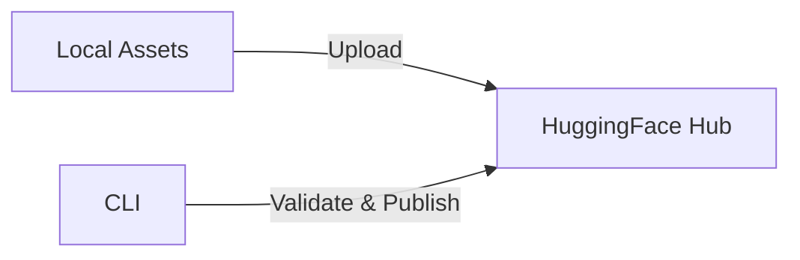
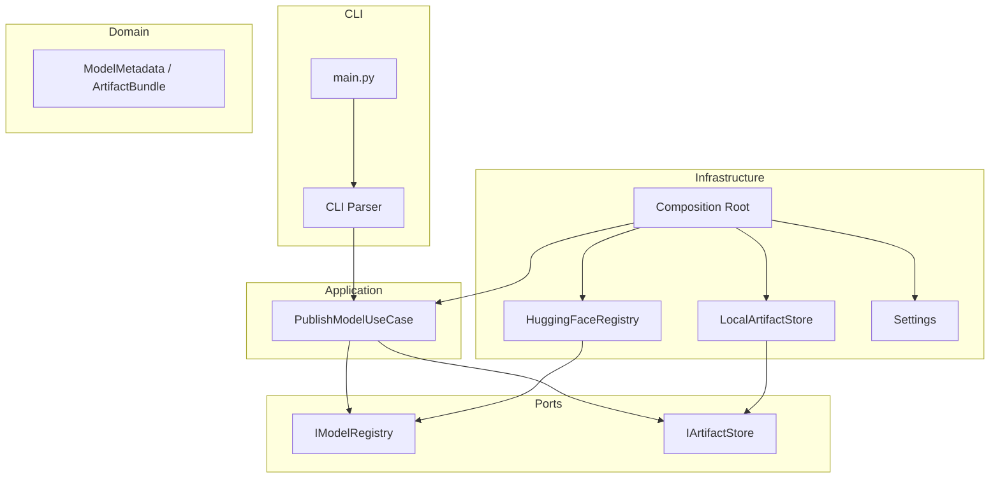
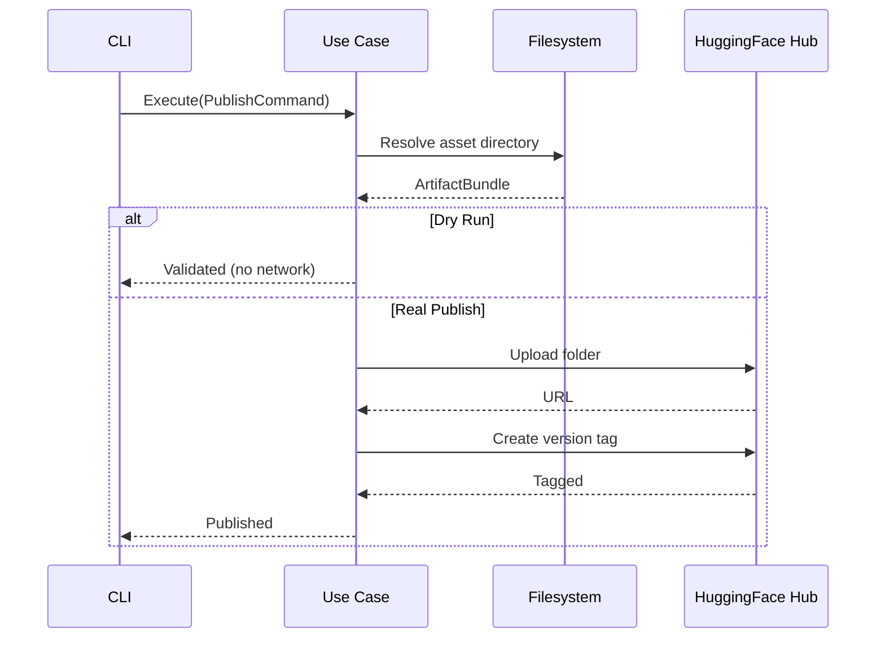

# Model Publisher

Publishes DetectAI model artifacts to [HuggingFace Hub](https://huggingface.co) as versioned model repos. One-shot CLI tool — run it, it publishes, it exits.



## Quick Start

```bash
# 1. Install
poetry -C tools/model-publisher install

# 2. Configure
cd tools/model-publisher && cp .env.example .env
# Edit .env — set HF_TOKEN and HF_USERNAME

# 3. Validate (dry-run, no network)
make -C tools/model-publisher dry-run model=detect-ai-spark v=v1.0.0

# 4. Publish
make -C tools/model-publisher upload-spark v=v1.0.0
```

## Available Models

| Model | Make Command | Description |
|-------|--------------|-------------|
| `detect-ai-spark` | `make upload-spark v=<version>` | DetectAI Spark detection model |
| `detect-ai-flare` | `make upload-flare v=<version>` | DetectAI Flare detection model |
| Any model | `make upload model=<name> v=<version>` | Generic publish |

## CLI Usage

```bash
# Full form
python main.py --model detect-ai-spark --version v1.0.0

# With options
python main.py \
  --model detect-ai-spark \
  --version v1.0.1 \
  --description "Bug fix release" \
  --assets-dir /tmp/assets \
  --dry-run \
  --verbose
```

| Argument | Required | Default | Description |
|----------|----------|---------|-------------|
| `--model` | Yes | — | Model name (e.g., `detect-ai-spark`) |
| `--version` | Yes | — | Version tag (e.g., `v1.0.0`) |
| `--description` | No | `Production release <version>` | Release description |
| `--assets-dir` | No | `assets` | Override assets base directory |
| `--dry-run` | No | `false` | Validate only, no upload |
| `--verbose` | No | `false` | Verbose logging |

## Configuration

| Variable | Required | Default | Description |
|----------|----------|---------|-------------|
| `HF_TOKEN` | Yes | — | HuggingFace write token (min 8 chars, no placeholders) |
| `HF_USERNAME` | Yes | — | HuggingFace username (repo namespace) |
| `PROJECT_ROOT_DIR` | No | `.` | Root directory containing `assets/` |
| `ASSETS_DIR_NAME` | No | `assets` | Assets folder name under root |
| `ENV_FILE` | No | `.env` | Alternative dotenv file path |

```bash
# Example .env
HF_TOKEN=hf_xxxxxxxxxxxxxxxxxxxxxxxx
HF_USERNAME=myuser
PROJECT_ROOT_DIR=.
ASSETS_DIR_NAME=assets
```

## Architecture

Clean architecture with strict dependency rules — domain never imports infrastructure.



```
src/
  core/             exceptions, constants, logging
  domain/           schemas + validation (pure Pydantic, no I/O)
  interfaces/       ports: IModelRegistry, IArtifactStore
  application/      DTOs + use-case (orchestrates ports)
  infrastructure/   adapters: HuggingFace, filesystem, config, wiring
  cli/              argparse parser
main.py             bootstrap: parse → settings → wire → execute
```

## Publishing Flow



**Exit codes:** `0` = success, `1` = runtime error, `2` = usage/config error

## Development

```bash
make -C tools/model-publisher lint       # ruff check
make -C tools/model-publisher test       # unit tests (no network)
make -C tools/model-publisher test-all   # unit + integration
make -C tools/model-publisher test-cov   # unit + coverage (70% gate)
make -C tools/model-publisher clean      # remove caches
```

## CI

GitHub Actions workflow (`.github/workflows/tools-model-publisher.yaml`) runs on `staging`/`main` (path-filtered): ruff lint + pytest with 70% coverage gate. Feature branches targeting `dev` paste local `make lint/test` output in PR.

## Documentation

Detailed docs in [`docs/`](docs/):

| Doc | Description |
|-----|-------------|
| [Quick Start](docs/getting-started/quickstart.md) | Zero-to-running guide |
| [Configuration](docs/getting-started/configuration.md) | All settings and env vars |
| [Architecture](docs/concepts/architecture.md) | Clean architecture deep-dive |
| [Publishing Flow](docs/concepts/publishing-flow.md) | Step-by-step lifecycle |
| [CLI Reference](docs/components/cli.md) | All arguments and examples |
| [Validation](docs/components/validation.md) | Input rules and error messages |
| [Testing](docs/testing/overview.md) | How to run and write tests |
