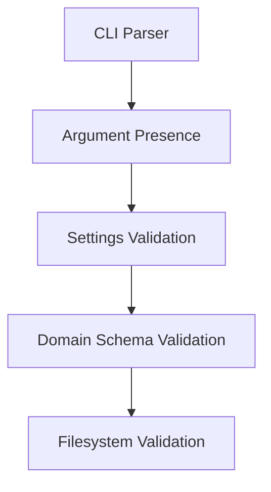
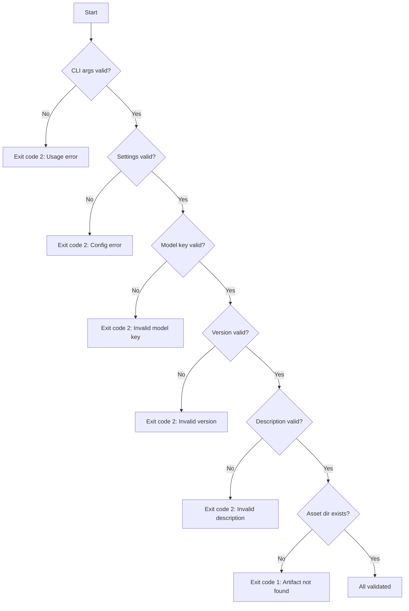

# Validation

This document explains all input validation rules for the Model Publisher. Every input is validated before any action is taken.

## Where Validation Happens

Validation happens at multiple layers:



1. **CLI** — `argparse` checks that required arguments (`--model`, `--version`) are present
2. **Settings** — Pydantic validates `HF_TOKEN` and `HF_USERNAME` (non-empty, not placeholder)
3. **Domain** — `ModelMetadata` validates format via regex patterns
4. **Filesystem** — `LocalArtifactStore` checks the asset directory exists

## Model Key Rules

The `--model` argument must match this pattern:

```
^[a-z0-9][a-z0-9-_]{1,63}$
```

| Rule | Description |
|------|-------------|
| Starts with | Lowercase letter or number |
| Characters | Lowercase letters, numbers, hyphens, underscores |
| Length | 2 to 64 characters |
| Case | Lowercase only |

### Valid Model Keys

| Model Key | Why It's Valid |
|-----------|----------------|
| `detect-ai-spark` | Lowercase, hyphens, 17 characters |
| `detect-ai-flare` | Lowercase, hyphens, 16 characters |
| `my-model` | Lowercase, hyphen, 8 characters |
| `model_v2` | Lowercase, underscore, 8 characters |
| `spark` | Lowercase, 5 characters |

### Invalid Model Keys

| Model Key | Why It's Invalid |
|-----------|------------------|
| `Detect-AI-Spark` | Contains uppercase letters |
| `detect ai spark` | Contains spaces |
| `detect.ai.spark` | Contains dots |
| `d` | Too short (minimum 2 characters) |
| `a` * 65 | Too long (maximum 64 characters) |
| `-model` | Starts with a hyphen |
| `_model` | Starts with an underscore |

### Currently Supported Models

The tool has a list of known models (used for documentation/reference, not hard-enforced):

| Model Key | Description |
|-----------|-------------|
| `detect-ai-spark` | DetectAI Spark detection model |
| `detect-ai-flare` | DetectAI Flare detection model |

> **Note:** The regex allows any valid slug, not just the supported models. This lets you add new models without changing the tool.

## Version Rules

The `--version` argument must match this pattern:

```
^v\d+\.\d+\.\d+(?:[-+][0-9A-Za-z.-]+)?$
```

| Rule | Description |
|------|-------------|
| Prefix | Must start with `v` |
| Format | `vMAJOR.MINOR.PATCH` (semantic versioning) |
| Numbers | Must be integers (no leading zeros) |
| Pre-release | Optional: hyphen or plus followed by alphanumeric/dots/dashes |

### Valid Versions

| Version | Why It's Valid |
|---------|----------------|
| `v1.0.0` | Standard semver |
| `v2.1.3` | Standard semver |
| `v0.1.0` | Standard semver |
| `v1.0.0-alpha` | Pre-release tag |
| `v1.0.0-beta.1` | Pre-release with dot |
| `v1.0.0+build.123` | Build metadata |

### Invalid Versions

| Version | Why It's Invalid |
|---------|------------------|
| `1.0.0` | Missing `v` prefix |
| `v1.0` | Missing patch number |
| `v1.0.0.0` | Too many segments |
| `v1.0.0-` | Empty pre-release |
| `v1.0.0-@#$` | Invalid characters in pre-release |

## Token Rules (`HF_TOKEN`)

| Rule | Description |
|------|-------------|
| Non-empty | Must not be empty or whitespace-only |
| Minimum length | At least 8 characters |
| No placeholders | Rejects common placeholder values |

### Rejected Placeholder Values

| Value | Reason |
|-------|--------|
| `test` | Too short, obviously a placeholder |
| `mock-token` | Contains "mock" |
| `not-configured` | Obvious placeholder |
| `change-me` | Obvious placeholder |
| Anything with `placeholder` | Contains the word "placeholder" |

### Valid Token Format

HuggingFace tokens start with `hf_` followed by a long string:

```
hf_abcdefghijklmnopqrstuvwxyz123456
```

The tool doesn't enforce the `hf_` prefix (in case the format changes), but validates length and rejects obvious dummies.

## Username Rules (`HF_USERNAME`)

| Rule | Description |
|------|-------------|
| Non-empty | Must not be empty or whitespace-only |
| Stripped | Leading/trailing whitespace is removed |

## Description Rules

| Rule | Description |
|------|-------------|
| Non-empty | Must not be empty after stripping whitespace |
| Default | `"Production release <version>"` if not provided |

## Filesystem Validation

The `LocalArtifactStore` performs these checks:

| Check | Error |
|-------|-------|
| `assets/<model>` must exist | `Artifacts not found: Assets not found at <path>` |
| `assets/<model>` must be a directory | `Artifacts not found: Assets path is not a directory: <path>` |

## Path Validation

The `ArtifactBundle` schema validates paths:

| Check | Description |
|-------|-------------|
| Non-empty | Path must not be empty string |
| No null bytes | Path must not contain `\x00` |

> **Note:** Existence (`Path.exists()`) is NOT checked in the domain layer. It's checked by `LocalArtifactStore` in the infrastructure layer. This keeps the domain pure and testable.

## Error Messages and Fixes

| Error Message | Cause | Fix |
|---------------|-------|-----|
| `HF_TOKEN must be non-empty` | Token is missing | Set `HF_TOKEN` in `.env` |
| `HF_TOKEN looks too short` | Token < 8 characters | Copy full token from HuggingFace |
| `HF_TOKEN must not be a placeholder` | Token is a dummy value | Use your real write token |
| `HF_USERNAME must be non-empty` | Username is missing | Set `HF_USERNAME` in `.env` |
| `model_key must match ...` | Bad model name | Use lowercase letters, numbers, hyphens |
| `version must match ...` | Bad version format | Use `vX.Y.Z` (e.g., `v1.0.0`) |
| `description must be non-empty` | Empty description | Provide a description or omit for default |
| `Assets not found at <path>` | Directory doesn't exist | Check path and `--assets-dir` flag |
| `Assets path is not a directory: <path>` | Path is a file, not directory | Point to the correct directory |

## Validation Flow Diagram



## Related Documentation

- [CLI Reference](cli.md) - Command-line arguments
- [Configuration](../getting-started/configuration.md) - Settings and env vars
- [Publishing Flow](../concepts/publishing-flow.md) - What happens after validation
