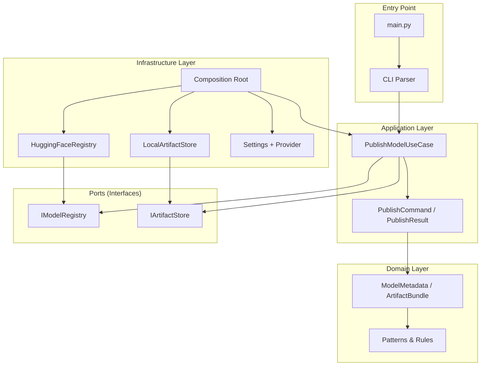

# Architecture

This document explains how the Model Publisher is structured and why it's designed this way.

## Overview

The Model Publisher is a **one-shot CLI tool** (not a running service). It runs once, publishes model artifacts to HuggingFace Hub, and exits. It follows **clean architecture** (also called "hexagonal architecture" or "ports and adapters"):

- **Business logic** is in the center
- **External systems** (filesystem, HuggingFace API) connect through **ports** (interfaces)
- Each external system has an **adapter** that implements the port



**Why this pattern?**
- **Testable** — Business logic can be tested with fake implementations (no real filesystem or network)
- **Swappable** — Want to publish to a different registry? Implement `IModelRegistry` for it
- **No I/O in domain** — The domain layer never touches the filesystem or network, so it's pure and easy to reason about

## Project Structure

```
tools/model-publisher/
├── main.py                          # Thin bootstrap — parse args, wire, run
├── src/
│   ├── core/                        # Shared utilities (no domain imports)
│   │   ├── constants.py             #   Exit codes, regex patterns
│   │   ├── exceptions.py            #   Exception hierarchy
│   │   └── logging.py               #   Structured logging, token redaction
│   │
│   ├── domain/                      # Pure business rules (no I/O)
│   │   ├── constants.py             #   Version & model key patterns
│   │   └── schemas.py               #   ModelMetadata, ArtifactBundle
│   │
│   ├── interfaces/                  # Ports — abstract contracts
│   │   ├── registry.py              #   IModelRegistry (upload, tag)
│   │   └── artifact_store.py        #   IArtifactStore (resolve, locate)
│   │
│   ├── application/                 # Use cases — orchestrate ports
│   │   ├── dto.py                   #   PublishCommand, PublishResult
│   │   ├── use_cases.py             #   PublishModelUseCase
│   │   └── publisher.py             #   Deprecated shim (legacy)
│   │
│   └── infrastructure/              # Adapters — real implementations
│       ├── config/
│       │   ├── settings.py          #   Pydantic Settings (typed config)
│       │   └── provider.py          #   Cached settings loader
│       ├── filesystem/
│       │   └── resolver.py          #   LocalArtifactStore (FS checks)
│       ├── huggingface/
│       │   └── registry.py          #   HuggingFaceRegistry (HfApi)
│       └── composition/
│           └── container.py         #   build_publisher() — sole wiring
│
├── tests/
│   ├── unit/                        # Fast, no network
│   │   ├── test_publish_use_case.py
│   │   ├── test_schemas.py
│   │   ├── test_cli_parser.py
│   │   └── test_config_provider.py
│   └── integration/                 # Mocked HF, real filesystem
│       ├── test_composition_integration.py
│       ├── test_resolver_integration.py
│       └── test_hf_adapter_integration.py
│
├── Makefile                         # Common commands
├── pyproject.toml                   # Poetry config, pytest, ruff, coverage
├── .env.example                     # Environment template
└── docs/                            # This documentation
```

## Dependency Rule

Dependencies flow **inward only**:

```
domain <- application <- infrastructure
main -> composition -> all
```

- **Domain** never imports from infrastructure, application, or core
- **Application** imports from domain (schemas) and interfaces (ports)
- **Infrastructure** imports from domain, interfaces, and implements adapters
- **main.py** only imports from composition (the wiring layer)

This means the domain layer is completely pure — no filesystem access, no network calls, no framework dependencies beyond Pydantic.

## Layers Explained

### Core (`src/core/`)

Shared utilities used across all layers. No domain or infrastructure imports.

| File | Purpose |
|------|---------|
| `constants.py` | Exit codes (`EXIT_CODE_USAGE=2`, `EXIT_CODE_RUNTIME=1`), regex patterns |
| `exceptions.py` | Single exception hierarchy rooted at `MLException` |
| `logging.py` | Structured logging setup, `redact()` function to mask tokens |

### Domain (`src/domain/`)

Pure business rules and data structures. No I/O.

| File | Purpose |
|------|---------|
| `constants.py` | `VERSION_PATTERN`, `MODEL_KEY_PATTERN`, `SUPPORTED_MODEL_KEYS` |
| `schemas.py` | `ModelMetadata` (validates model/version/description), `ArtifactBundle` (metadata + path) |

The domain validates **format** (regex patterns) but not **existence** (filesystem checks happen in infrastructure).

### Interfaces (`src/interfaces/`)

Abstract contracts (ports) that define what the application needs from the outside world.

| Interface | Methods | Purpose |
|-----------|---------|---------|
| `IModelRegistry` | `upload_artifacts()`, `set_version_tag()` | Publish to a remote registry |
| `IArtifactStore` | `resolve()`, `assets_path_for()` | Locate and validate local artifacts |

These are Python ABCs (Abstract Base Classes). The application depends only on these interfaces, not on their implementations.

### Application (`src/application/`)

Use cases that orchestrate the business logic.

| File | Purpose |
|------|---------|
| `dto.py` | `PublishCommand` (input) and `PublishResult` (output) dataclasses |
| `use_cases.py` | `PublishModelUseCase` — the single use case that coordinates everything |

The use case:
1. Resolves the artifact bundle via `IArtifactStore`
2. If dry-run, returns immediately
3. Uploads via `IModelRegistry.upload_artifacts()`
4. Tags via `IModelRegistry.set_version_tag()`
5. Returns `PublishResult`

### Infrastructure (`src/infrastructure/`)

Real implementations of the ports.

| Directory | Implementation | Purpose |
|-----------|----------------|---------|
| `config/` | `Settings` (Pydantic) + `get_settings()` (cached provider) | Load and validate configuration |
| `filesystem/` | `LocalArtifactStore` | Check if asset directories exist on disk |
| `huggingface/` | `HuggingFaceRegistry` | Upload to HuggingFace Hub via `HfApi` |
| `composition/` | `build_publisher()` | Wire everything together (sole dependency injection point) |

### Composition Root (`src/infrastructure/composition/container.py`)

This is the **only place** that knows about all concrete implementations. It:

1. Creates a `HfApi` instance with the token
2. Builds a `HuggingFaceRegistry` (implements `IModelRegistry`)
3. Builds a `LocalArtifactStore` (implements `IArtifactStore`)
4. Injects both into `PublishModelUseCase`

Every other file only knows about interfaces, never concrete classes.

## Data Model

### PublishCommand (Input)

| Field | Type | Description |
|-------|------|-------------|
| `model` | string | Model key (e.g., `detect-ai-spark`) |
| `version` | string | Version tag (e.g., `v1.0.0`) |
| `description` | string \| None | Release description (defaults to `"Production release <version>"`) |
| `assets_dir` | Path \| string \| None | Override assets base directory |
| `dry_run` | bool | If true, validate only, no network calls |

### PublishResult (Output)

| Field | Type | Description |
|-------|------|-------------|
| `model` | string | Model key |
| `version` | string | Version tag |
| `repo_id` | string | Full HuggingFace repo ID (e.g., `username/detect-ai-spark`) |
| `url` | string \| None | URL to the published model (None for dry-run) |
| `dry_run` | bool | Whether this was a dry run |
| `local_path` | Path | Local path to the assets directory |

### ModelMetadata (Domain)

Validates the model key, version, and description using Pydantic field validators.

### ArtifactBundle (Domain)

Wraps `ModelMetadata` with a `local_path` (the filesystem path to the assets). The path is validated for format only — existence is checked by `LocalArtifactStore`.

## Why This Design?

| Benefit | Explanation |
|---------|-------------|
| **Testability** | Use case tests use `FakeRegistry` and `FakeStore` — no network, no real filesystem |
| **Swappability** | Want to publish to S3? Implement `IModelRegistry` for S3 and wire it in the container |
| **No I/O in domain** | Domain schemas validate format (regex), not existence (filesystem) |
| **Single wiring point** | `container.py` is the only place that imports concrete implementations |
| **Clear boundaries** | Each layer has a single responsibility and clear inputs/outputs |

## Legacy Code

`src/application/publisher.py` contains a deprecated `ModelPublisher` class that delegates to `PublishModelUseCase`. It's kept for backward compatibility. New code should use `build_publisher()` from the composition root.

## Next Steps

- [Publishing Flow](publishing-flow.md) - See what happens step-by-step when you publish
- [Configuration](../getting-started/configuration.md) - Learn about settings
- [CLI Reference](../components/cli.md) - Command-line options
- [Testing Overview](../testing/overview.md) - How the architecture enables testing
