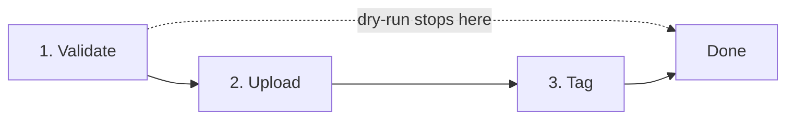
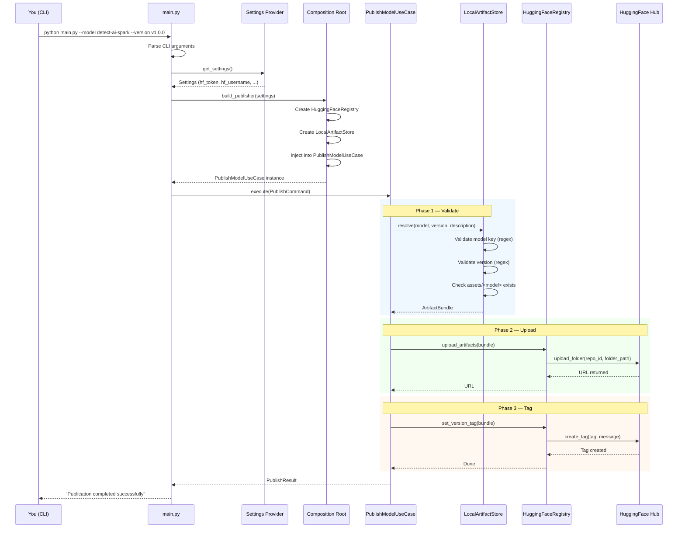
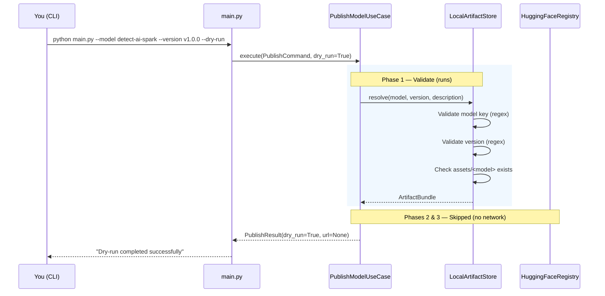
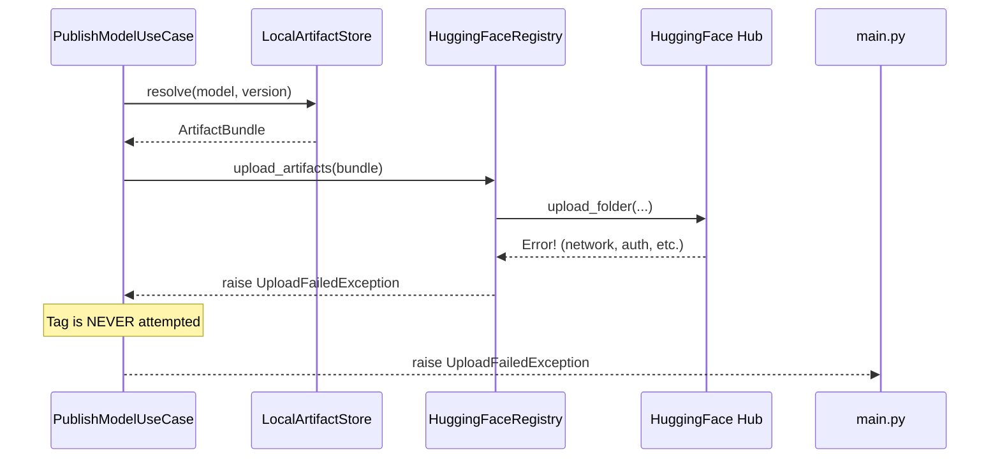
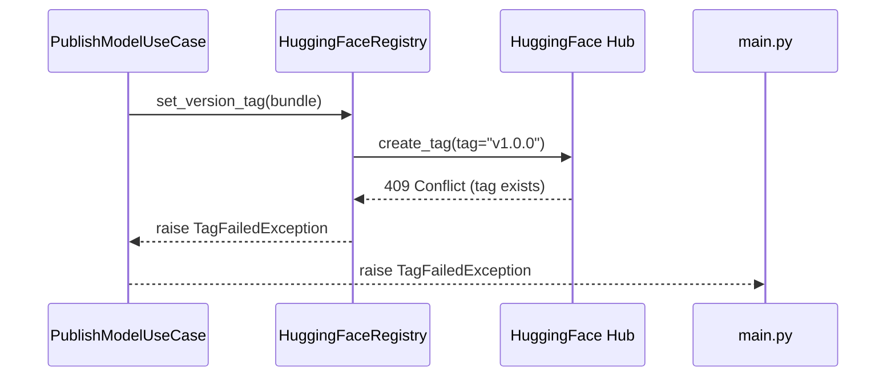
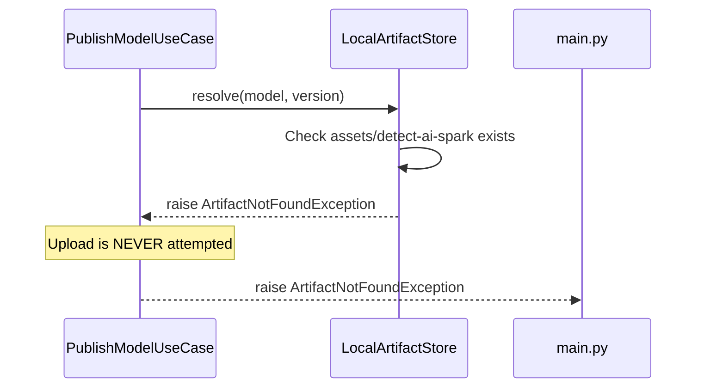

# Publishing Flow

This document explains what happens step-by-step when you publish a model. We'll trace through both a dry-run and a real publish.

## Overview

Publishing a model is a one-shot operation with three phases:

1. **Validate** — Check inputs and locate assets on disk
2. **Upload** — Push asset files to HuggingFace Hub
3. **Tag** — Create a version tag on the repo

In dry-run mode, only phase 1 runs. Phases 2 and 3 are skipped.

## Full Publish Flow

Here's the complete sequence for a real publish:

### What happens at each step:

1. **Parse CLI arguments** — `main.py` reads `--model`, `--version`, `--dry-run`, etc.
2. **Load settings** — Settings provider reads from `.env` and validates `HF_TOKEN` / `HF_USERNAME`
3. **Wire dependencies** — Composition root creates all concrete implementations and injects them
4. **Resolve artifacts** — `LocalArtifactStore` checks the asset directory exists on disk and creates an `ArtifactBundle`
5. **Upload** — `HuggingFaceRegistry` calls `HfApi.upload_folder()` to push files
6. **Tag** — `HuggingFaceRegistry` calls `HfApi.create_tag()` to create a version tag
7. **Return result** — `PublishResult` with the URL and metadata is returned to `main.py`

## Dry-Run Flow

Dry-run validates everything but never touches the network:

**What's validated in dry-run:**
- Model key matches the regex pattern (e.g., `detect-ai-spark`)
- Version matches the version pattern (e.g., `v1.0.0`)
- Description is non-empty
- `assets/<model>` directory exists and is a directory

**What's NOT done:**
- No files are uploaded to HuggingFace
- No tags are created
- No network requests are made

## Error Paths

### Upload Failure Prevents Tagging

If the upload fails, the tag is never attempted:

### Tag Already Exists

If the tag already exists on HuggingFace, a `TagFailedException` is raised:

**How to fix:** Bump the version number (e.g., `v1.0.1`) or delete the existing tag on HuggingFace.

### Artifact Not Found

If the asset directory doesn't exist, the operation fails immediately:

## Exit Codes

| Code | Meaning | When |
|------|---------|------|
| `0` | Success | Publish (or dry-run) completed without errors |
| `1` | Runtime error | Upload failed, tag failed, artifact not found, unexpected error |
| `2` | Usage/config error | Invalid CLI arguments, bad model key/version format, missing config |

## Error Redaction

When HuggingFace returns error messages, the tool redacts any auth material:

| Original | Redacted |
|----------|----------|
| `Token hf_abc123 is invalid` | `HuggingFace error (redacted — contains auth material)` |
| `Bearer authentication required` | `HuggingFace error (redacted — contains auth material)` |
| `Rate limit exceeded` | `Rate limit exceeded` (no redaction needed) |

This prevents tokens from leaking into logs or terminal output.

## Summary

| Phase | What Happens | Network? | Dry-Run? |
|-------|--------------|----------|----------|
| Validate | Check inputs, resolve asset path | No | Yes |
| Upload | Push files to HuggingFace Hub | Yes | No |
| Tag | Create version tag on repo | Yes | No |

## Next Steps

- [Architecture](architecture.md) - How the layers connect
- [CLI Reference](../components/cli.md) - All command-line options
- [Configuration](../getting-started/configuration.md) - Settings and env vars
- [Validation](../components/validation.md) - Input validation rules
