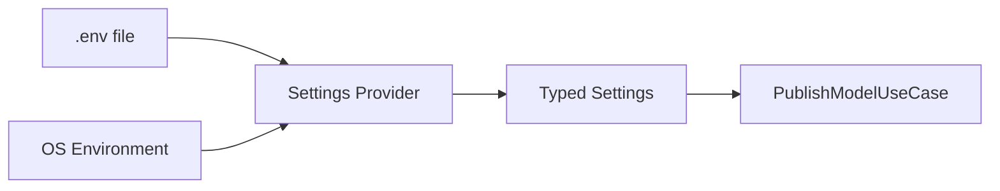

# Configuration

This document explains how to configure the Model Publisher. The tool uses environment variables loaded from a `.env` file.

## How Configuration Works



1. The tool looks for a `.env` file in `tools/model-publisher/`
2. If `ENV_FILE` is set, it loads from that path instead
3. OS environment variables override `.env` values
4. Empty strings are ignored (so Docker Compose `${VAR:-}` passthrough works)
5. Settings are validated by Pydantic before the tool runs

## Required Configuration

| Variable | Type | Default | Description |
|----------|------|---------|-------------|
| `HF_TOKEN` | string | — | HuggingFace write token. Must be at least 8 characters. |
| `HF_USERNAME` | string | — | Your HuggingFace username (the namespace for repos). |

## Optional Configuration

| Variable | Type | Default | Description |
|----------|------|---------|-------------|
| `PROJECT_ROOT_DIR` | string | `.` | Root directory containing the `assets/` folder. |
| `ASSETS_DIR_NAME` | string | `assets` | Name of the assets folder under the root directory. |
| `ENV_FILE` | string | `.env` | Alternative path to the dotenv file. |

## Token Validation Rules

The `HF_TOKEN` is validated strictly on startup:

| Rule | Description |
|------|-------------|
| Non-empty | Token must not be empty or whitespace-only |
| Minimum length | Must be at least 8 characters |
| No placeholders | Rejects values like `test`, `mock-token`, `not-configured`, `change-me`, or anything containing `placeholder` |

These rules prevent accidental use of dummy credentials.

## Username Validation Rules

| Rule | Description |
|------|-------------|
| Non-empty | Must not be empty or whitespace-only |
| Stripped | Leading/trailing whitespace is removed |

## Environment Examples

### Local Development

```bash
# tools/model-publisher/.env
HF_TOKEN=hf_abc123def456ghi789
HF_USERNAME=myuser
PROJECT_ROOT_DIR=.
ASSETS_DIR_NAME=assets
```

### Custom Assets Location

```bash
HF_TOKEN=hf_abc123def456ghi789
HF_USERNAME=myuser
PROJECT_ROOT_DIR=/tmp/build-output
ASSETS_DIR_NAME=trained-models
```

This would look for models at `/tmp/build-output/trained-models/<model>`.

### CI Environment

```bash
# Set via CI secrets, not a .env file
HF_TOKEN=${{ secrets.HF_TOKEN }}
HF_USERNAME=${{ secrets.HF_USERNAME }}
PROJECT_ROOT_DIR=${{ github.workspace }}
```

## Asset Path Resolution

The tool resolves model assets using this formula:

```
<PROJECT_ROOT_DIR>/<ASSETS_DIR_NAME>/<model_key>
```

For example, with defaults:

```
./assets/detect-ai-spark
./assets/detect-ai-flare
```

The `--assets-dir` CLI flag can override this entirely (see [CLI Reference](../components/cli.md)).

## Configuration Validation Errors

| Error Message | Cause | How to Fix |
|---------------|-------|------------|
| `HF_TOKEN must be non-empty` | Token is missing or empty | Set `HF_TOKEN` in `.env` or environment |
| `HF_TOKEN looks too short` | Token is fewer than 8 characters | Check you copied the full token |
| `HF_TOKEN must not be a placeholder` | Token looks like a test value | Use your real HuggingFace write token |
| `HF_USERNAME must be non-empty` | Username is missing or empty | Set `HF_USERNAME` in `.env` or environment |
| `model_key must match ...` | Invalid model name format | Use lowercase letters, numbers, hyphens (e.g., `detect-ai-spark`) |
| `version must match ...` | Invalid version format | Use `vX.Y.Z` format (e.g., `v1.0.0`) |

## Viewing Current Configuration

The tool prints a banner before publishing:

```
Publishing detect-ai-spark @ v1.0.0 ...
  assets-dir: ./assets
  description: Production release v1.0.0
  hf_user: myuser  token: hf_****xxxx
```

The token is always redacted in output. Only the last 4 characters are shown.

## Makefile Commands

| Command | Description |
|---------|-------------|
| `make install` | Install dependencies with Poetry |
| `make lint` | Run ruff linter |
| `make format` | Check code formatting |
| `make test` | Run unit tests (no network) |
| `make test-all` | Run all tests (unit + integration) |
| `make test-cov` | Run tests with coverage report (70% gate) |
| `make dry-run model=<m> v=<v>` | Validate without uploading |
| `make upload-spark v=<v>` | Publish detect-ai-spark model |
| `make upload-flare v=<v>` | Publish detect-ai-flare model |
| `make upload model=<m> v=<v>` | Publish any model |
| `make clean` | Remove cache and coverage files |

## Troubleshooting

### "No such file or directory: .env"

The `.env` file doesn't exist. Create it from the template:

```bash
cd tools/model-publisher
cp .env.example .env
```

### Settings not updating

Settings are cached in memory. If you change `.env`, the changes take effect on the next run. In tests, call `clear_settings_cache()` to reset.

### Empty strings ignored

If you set `HF_TOKEN=` (empty) in your `.env`, the tool ignores it and falls through to the next source. This is intentional so Docker Compose `${HF_TOKEN:-}` passthrough doesn't break validation.

## Related Documentation

- [Quick Start](quickstart.md) - Get up and running
- [CLI Reference](../components/cli.md) - All command-line options
- [Validation](../components/validation.md) - Input validation rules
- [Architecture](../concepts/architecture.md) - How configuration fits in the system
